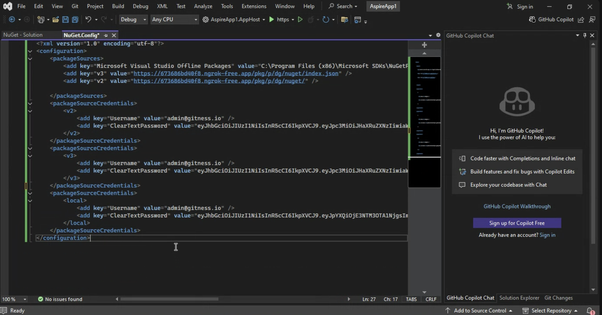

import Tabs from '@theme/Tabs';
import TabItem from '@theme/TabItem';

Learn how to **create a NuGet Artifact Registry**, **configure an upstream proxy**, and **publish or install NuGet packages** using the CLI.

## NuGet Package Management

## Prerequisites
- Ensure you have the **NuGet CLI** (`nuget`) installed on your local machine.
- Access to a Harness account with appropriate permissions to create registries and connectors.

---

## Create a NuGet artifact registry
<Tabs>
<TabItem value="interactive" label="Interactive Guide">
<DocVideo src="https://app.tango.us/app/embed/1bb9ebd1-54c8-4585-87dd-e5e0b828acfb?skipCover=false&defaultListView=false&skipBranding=false&makeViewOnly=true&hideAuthorAndDetails=true" title="Create a NuGet Artifact Registry in Harness" />
</TabItem>
<TabItem value="step" label="Step-by-Step">
1. Navigate to the Artifact Registry module in your Harness project.
2. Click on **New Artifact Registry**.
3. In the Registry Type dropdown, select **NuGet Registry**.
4. Provide a **Registry Name**.

:::info registry name criteria
Your registry name must start with a letter and can include `lowercase alphanumerics`, `_`, `.` and `-`.
:::

5. Optionally, add a Description and Labels for better organization.
6. Click **Create Registry** to finalize.
</TabItem>
</Tabs>

:::info private registry
This registry will serve as your private NuGet registry within Harness.
:::

---

## Configure an Upstream Proxy (Optional)
An upstream proxy allows your registry to fetch NuGet packages from external sources if they are not available locally.

<Tabs>
<TabItem value="interactive" label="Interactive Guides">

<h3> Create an upstream proxy </h3>
<DocVideo src="https://app.tango.us/app/embed/eb26ec8b-6b08-4434-8003-1e9c009f6212?skipCover=false&defaultListView=false&skipBranding=false&makeViewOnly=true&hideAuthorAndDetails=true" title="Create a NuGet Upstream Proxy in Harness" />

<h3> Configure the upstream proxy in your registry </h3>
<DocVideo src="https://app.tango.us/app/embed/bc5364f0-51bc-4b7c-8dd6-8a1bc8d8c03c?skipCover=false&defaultListView=false&skipBranding=false&makeViewOnly=true&hideAuthorAndDetails=true" title="Configure NuGet Upstream Proxy in Harness" />
</TabItem>
<TabItem value="step" label="Step-by-Step">

<h3> Create an upstream proxy </h3>
1. In the Artifact Registry module, click the dropdown next to **New Artifact Registry** and select **Upstream Proxy**.
2. Choose **Nuget Registry** as the proxy type.
3. Click **Create Proxy** to establish the connection.

<h3> Configure the upstream proxy in your registry </h3>
1. In the Artifact Registry module, select an existing Artifact Registry.
2. Select the **Configuration** tab.
3. Under **Advanced (Optional)**, select **Configure Upstream**.
4. Select from the list of compatible proxies to add them to your registry.
5. Click **Save** to save the configuration.
</TabItem>
</Tabs>

:::info upstream proxy caching
If a NuGet package isn’t found in your Harness registry, the upstream proxy can fetch it from an external source like NuGet.org, helping to reduce duplication and ensure reliable access to public packages.
:::

---

## Install and Use NuGet Packages
<Tabs>
<TabItem value="nuget" label="Nuget">

#### Configure Authentication

##### Step 1

Add the Harness Registry as a package source:

```bash
nuget sources add -Name harness -Source https://pkg.harness.io/pkg/<account-id>/<nuget-registry-name>/nuget/index.json -Username john.doe@harness.io -Password <TOKEN>
```

```bash
nuget setapikey <TOKEN> -Source harness
```

:::info
Note: For Nuget V2 Client, use this url: `https://pkg.harness.io/pkg/<account-id>/<nuget-registry-name>/nuget/`
:::

##### Step 2

Generate an identity token for authentication

#### Install Package


Install a package using nuget:

```bash
nuget install <ARTIFACT_NAME> -Version <VERSION> -Source harness
```

#### Publish Package


Publish your package:

```bash
nuget push <PACKAGE_FILE> -Source harness
```

:::info
Note: To publish your package with nested directory, refer below command

```bash
nuget push <PACKAGE_FILE> -Source https://pkg.harness.io/pkg/<account-id>/<nuget-registry-name>/nuget/<SUB_DIRECTORY> -ApiKey <TOKEN>
```
:::

</TabItem>
<TabItem value="dotnet" label="Dotnet">

#### Configure Authentication

##### Step 1

Add the Harness Registry as a package source:

```bash
dotnet nuget add source https://pkg.harness.io/pkg/<account-id>/<nuget-registry-name>/nuget/index.json --name harness --username john.doe@harness.io --password <TOKEN> --store-password-in-clear-text
```

:::info
Note: For Nuget V2 Client, use this url: `https://pkg.harness.io/pkg/<account-id>/<nuget-registry-name>/nuget/`
:::

##### Step 2

Generate an identity token for authentication


#### Install Package


Add a package using dotnet:

```bash
dotnet package add <ARTIFACT_NAME> --version <VERSION> --source harness
```

#### Publish Package


Publish your package:

```bash
dotnet nuget push <PACKAGE_FILE> --api-key <TOKEN> --source harness
```

:::info
Note: To publish your package with nested directory, refer below command

```bash
dotnet nuget push <PACKAGE_FILE> --source https://pkg.harness.io/pkg/<account-id>/<nuget-registry-name>/nuget/<SUB_DIRECTORY> --api-key <TOKEN>
```
:::

</TabItem>
<TabItem value="visual-studio" label="Visual Studio">

#### Configure Nuget Package Source in Visual Studio

##### Step 1

Open your project in Visual Studio, then navigate to the NuGet Package Manager settings:

1. Click on **Tools** in the top menu
2. Select **NuGet Package Manager**
3. Click on **Package Manager Settings**

##### Step 2

In the Options window that appears, click on **Package Sources** in the left panel.

You will see the location of your NuGet.Config file displayed at the top of this window. Take note of this location as you can also directly edit this file if needed.

##### Step 3

In the Package Sources window:

1. Click the **+** button to add a new package source
2. Set the **Name** to `harness`
3. Set the **Source** to `https://pkg.harness.io/pkg/<account-id>/<nuget-registry-name>/nuget/index.json`
4. Click **Update** and then **OK**

##### Step 4

Locate and open your NuGet.Config file (shown at the top of the Package Sources window) and ensure it contains the following configuration:

```xml
<?xml version="1.0" encoding="utf-8"?>
<configuration>
 <packageSources>
     <clear />
     <add key="harness" value="https://pkg.harness.io/pkg/<account-id>/<nuget-registry-name>/nuget/index.json" />
 </packageSources>
 <packageSourceCredentials>
     <harness>
         <add key="Username" value="john.doe@harness.io" />
         <add key="ClearTextPassword" value="<TOKEN>" />
     </harness>
 </packageSourceCredentials>
</configuration>
```



:::info
You can get this configuration from your Harness client setup details.
:::

##### Step 5

Generate an identity token for authentication in the Harness platform and replace `<TOKEN>` in the configuration with your actual token.


</TabItem>
</Tabs>
