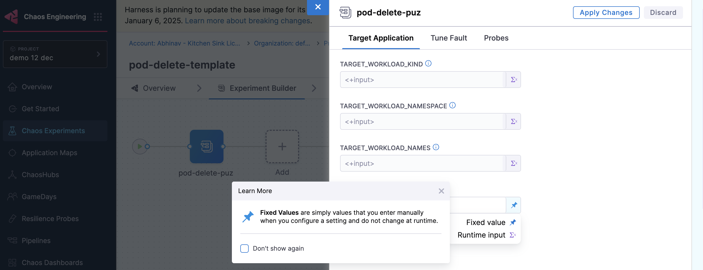

Runtime variables provide flexibility in chaos experiments by allowing you to customize experiment parameters at execution time rather than hardcoding them during creation.

:::info New Chaos Studio Feature
**Runtime input variables** are part of the enhanced **New Chaos Studio** experience. The studio version you see depends on your onboarding date:

- **New Chaos Studio**: Available for customers onboarded on or after August 24, 2025
- **Old Chaos Studio**: Available for customers onboarded before August 24, 2025

If you're an existing customer and want to access the New Chaos Studio features, contact your Harness support representative.
:::

## Create and Run Experiments

You can execute chaos experiments using either static values or dynamic runtime values. 

- **Static variables**: Define them directly in the experiment and use them without any modification.
- **Runtime variables**: Specify them using `<+input>`, allowing customization at [runtime](#use-runtime-variables) or through [saved input sets](#use-pre-defined-input-sets). 

### Use Runtime Variables

To set up an experiment, specify details such as the name, environment, infrastructure, and fault name. In the **Target Application** and **Tune Fault** modals, you can choose between **Fixed value** and **Runtime Input**. Once you choose the input type, **Save** the changes.

    

    

:::tip
- If you don't provide values for certain fields (which are not mandatory), the experiment executes with default values.
- Variables specified as runtime inputs appear as editable fields in the UI, whereas static fields appear as display-only.
:::