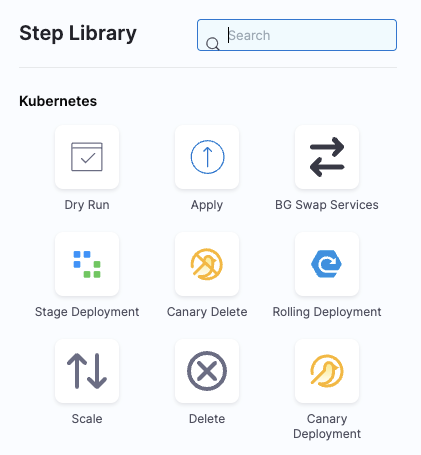
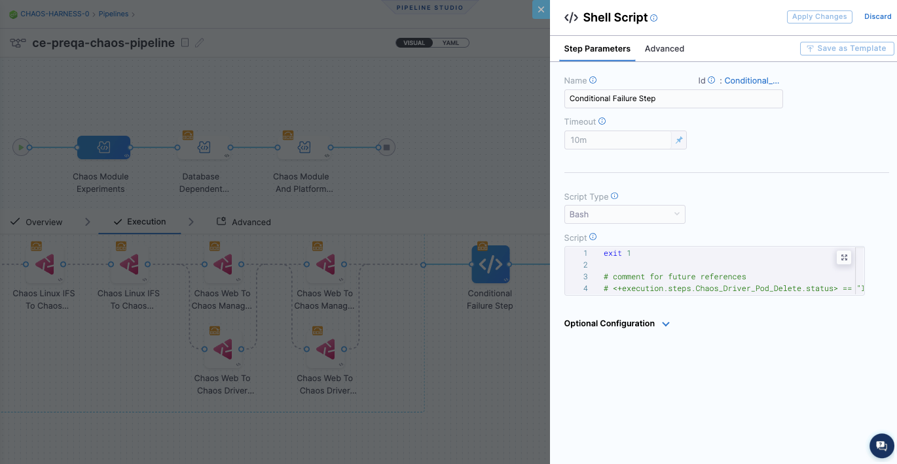

You can add chaos experiments to [Harness Continuous Delivery (CD)](https://harness.io/products/continuous-delivery) pipelines as part of your deployment process. This ensures that you validate your system resiliency with every new deployment. Some benefits include:

* Uncovering resilience unknowns
* Increasing developer efficiency
* Reducing resilience debt

You might use chaos experiments in CD pipelines to validate deployments against:

* Existing resilience conditions
* Newly added resilience conditions
* Changes to the platform on which the target deployments run
* Production incidents and alerts
* Configuration changes

Learn more about these benefits in our [CE/CD integration blog](https://www.harness.io/blog/chaos-experiments-in-harness-cd-pipelines).

## Examples of chaos faults to use in your CD pipeline

You might consider injecting these types of faults as chaos steps in your CD pipeline:

* **Network chaos faults** can be used for verifying service or microservice dependencies on each other when there's latency, or when one of the microservices is down. The pod network latency fault is an example.

* **Stress chaos faults** can be used for verifying how microservices behave when there is a noisy neighbor. The pod CPU hog fault is an example.

* **HTTP chaos faults** can be used for verifying how services or APIs behave when one of the APIs is under chaos. The pod HTTP latency fault is an example.

For more information about Harness CD, go to the [CD tutorials](/docs/continuous-delivery/get-started/tutorials/cd-gitops-tutorials.

## Use HCE with CD in a chaos experiment/s

To use CE with CD using a selected experiment (though you can use many experiments), you need to:

1. [Add a chaos experiment](#step-1-add-a-chaos-experiment-and-run-it) and run it to make sure it completes.
1. [Add this experiment to the CD pipeline](#step-2-add-a-chaos-experiment-to-a-cd-pipeline) as a chaos step.
1. [Choose a failure strategy](#step-3-choose-a-failure-strategy).

### Step 1: Add a chaos experiment and run it

* Create a chaos experiment and run it to make sure it runs to completion.

* In the example below, the relevant probes are added to avoid a false positive or false negative scenario around the resilience score.

	

### Step 2: Add a chaos experiment to a CD pipeline

Pipelines are organized into stages, each of which handles a major segment of the pipeline process. There are several types of stages available, and you can add chaos experiments as steps in these three stage types:

* Feature Flag
* Deploy
* Custom Stage

#### Add a chaos experiment as a step in your CD pipeline

1. In your Harness project, select **Deployments > Pipelines**, and then select the pipeline where you want to add a chaos experiment.
1. In the selected pipeline, select **Add Stage**, and then select a stage type.

	Chaos steps are available for **Feature Flag**, **Deploy**, and **Custom Stage** types.

	

1. Enter a **Stage Name** (and Deployment Type if applicable), and then select **Set Up Stage**.

1. With the stage you want selected, select **Add Step > Add Step**.

	

	The Step Library appears.

	

1. Scroll down the list to find the Chaos step icon, and then select it.

	

1. In the Configure Chaos Experiment screen, enter a **Name** for this step.

1. Select **Select Chaos Experiment** to see the chaos experiments you can add to this stage.

	

	When you select an experiment, the experiment's last resilience score, a preview of the experiment, and its chaos faults, are displayed.

1. (Optional) On this screen you can:
	* Select **New Experiment** to create a new experiment in Chaos Studio.
	* Select **Edit in Chaos Studio** to edit a selected experiment.

	Selecting these options takes you to Chaos Studio without saving your work.

1. Select the experiment you want to run in this step, and then select **Add to Pipeline**.

1. Back in **Configure Chaos Experiment**, enter the **Expected Resilience Score** for this experiment.

	If the resilience score is not met, this chaos step fails and the [stage failure strategy](/docs/platform/pipelines/failure-handling/define-a-failure-strategy-on-stages-and-steps) is initiated.

	For more information, go to Analyze chaos experiments.

1. (Optional) Expand **Optional Configuration**, and enter an assertion (you can enter a fixed value, an expression, or a runtime input).

1. (Optional) Select the **Advanced** tab to configure more settings.

	For more information on these settings, go to [Harness pipelines](/docs/category/pipelines).

1. Select **Apply Changes** to save this step in the pipeline, and then select **Save** to save changes to the pipeline.

#### Using Runtime Inputs in Chaos Experiments

When your chaos experiment has runtime inputs configured, those inputs automatically appear in the **Experiment Inputs** section when you add the chaos step to your pipeline. You can then configure these inputs to be runtime inputs for the pipeline as well, allowing you to provide values when the pipeline runs.

This allows you to:

- Use the same chaos experiment across multiple pipelines with different configurations
- Dynamically provide experiment parameters at pipeline execution time
- Customize chaos validation based on deployment context

**To use runtime inputs with chaos experiments:**

1. **Configure your chaos experiment with runtime inputs**:
   - When creating or editing the experiment, select **Runtime Input** instead of **Fixed value** for fault parameters
   - For more information, see [Runtime variable support in experiments](/docs/chaos-engineering/guides/chaos-experiments/fault-template)

2. **Add the chaos step to your pipeline**:
   - When you select the experiment, the **Experiment Inputs** section automatically displays all runtime inputs configured in the experiment

3. **Configure each experiment input**:
   - For each input, select **Runtime input** to be prompted for values when the pipeline runs
   - Alternatively, select **Fixed value** to provide a static value for this specific pipeline

When you run the pipeline, you'll be prompted to provide values for all runtime inputs before the chaos experiment executes.

#### Using Experiment Templates in Chaos Steps

You can use step-level templates to add chaos experiments to your CD pipeline. This enables you to leverage pre-configured, reusable experiment templates across multiple pipelines, promoting standardization and reducing configuration time.

**To use an experiment template as a chaos step:**

1. In your pipeline's **Execution** tab, click the **+** icon to add a step

2. From the dropdown menu, select **Use template**

	

3. In the **Templates** modal, browse available step and step group templates:
   - Filter by **Scope** (All, Project, Organization, Account)
   - Search for specific templates
   - View template details including version, scope, and inputs

4. Select the experiment template you want to use (templates with chaos experiments will show as **STEP** type)

5. Click **Use Template** to add it to your pipeline

	

6. In the **Configure Chaos Experiment** screen, you'll see:
   - **Template Inputs** section showing all inputs defined in the template
   - **Select Chaos Infrastructure** - Choose the infrastructure to run the experiment
   - **Expected Resilience Score** - Set the passing criteria
   - **Experiment Inputs** - Configure runtime inputs for the experiment (if any were set up in the experiment)

7. Configure the template inputs and experiment settings:
   - All inputs defined in the template will be displayed
   - You can provide **Fixed values**, **Runtime inputs**, or **Expressions** for each input
   - The **Experiment Inputs** section shows any runtime inputs configured in the chaos experiment itself

	

8. Click **Apply Changes** to add the chaos step to your pipeline

**Benefits:**

- **Consistency**: Use standardized, tested chaos steps across all pipelines
- **Efficiency**: Reduce time spent configuring chaos steps with pre-configured templates
- **Best practices**: Leverage proven chaos patterns from your organization
- **Reusability**: Share experiment configurations and step settings across teams and projects
- **Flexibility**: Combine template inputs with experiment runtime inputs for maximum configurability

For more information on creating and managing experiment templates, see [Experiment Templates](/docs/chaos-engineering/guides/templates).

### Step 3: Choose a failure strategy

[A failure strategy](/docs/platform/pipelines/failure-handling/define-a-failure-strategy-on-stages-and-steps.md) specifies the actions to take if pipeline stages or steps fail due to different conditions. You can configure a failure strategy against each chaos step (experiment) in the pipeline, or through a shell script step at the end of the execution of all chaos steps. Below are examples showing these two options.

#### Example 1: Failure strategy for one chaos step

* In this example, the failure strategy is **Rollback** for **All Errors** on a specific chaos step. You can also choose different types of errors and different strategies to use for each.

	

#### Example 2: Conditional failure step at the end of several chaos steps

* In this example, the failure strategy uses a **Shell Script** step after all the chaos steps in the CD pipeline. This step conditionally applies a shell script that specifies actions to take in case of failure. You can configure this step to add the script, and specify the conditions under which it is executed.

	

## What happens when the CD pipeline runs with a chaos step

When the CD pipeline is triggered:

* The chaos step you added to the pipeline triggers the experiment to run on the target application.

* The Chaos Experiments page (**Chaos > Chaos Experiments**) records the experiment run as part of a pipeline, and you can select the experiment to view its execution.

* In the CD pipeline, if the chaos step (the experiment) fails, you can select the failed step to see the log, which includes the resilience score obtained and how many chaos probes passed or failed.
	* You can select **View Detailed Execution** to go to the experiment's execution page in CE.

* Based on the experiment's success or failure, you can decide whether to continue with the deployment. You can automate this by defining a [failure strategy](#step-3-choose-a-failure-strategy) in your pipeline.

	For more information, go to [Define a failure strategy on stages and steps](/docs/platform/pipelines/failure-handling/define-a-failure-strategy-on-stages-and-steps.md).

