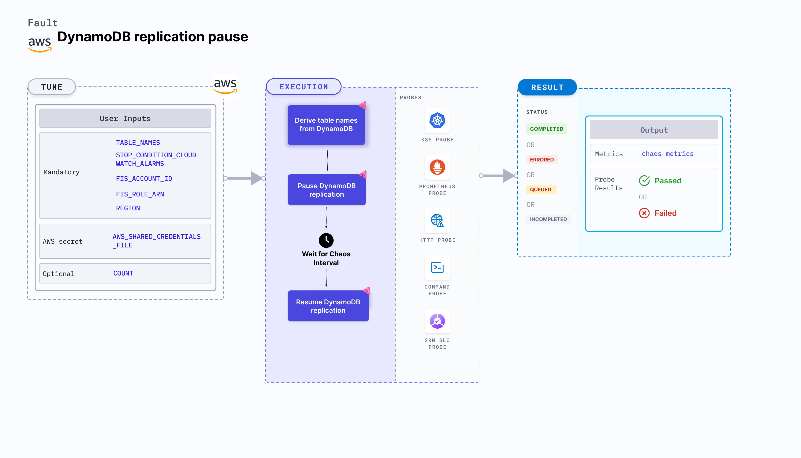

Dynamo DB replication pause fault pauses the data replication in DynamoDB tables over multiple locations for the chaos duration.
- When chaos experiment is being executed, any changes to the DynamoDB table will not be replicated in different regions, thereby making the data in the DynamoDB inconsistent.
- You can execute this fault on a DynamoDB table that is global, that is, there should be more than one replica of the table.



## Use cases
Dynamo DB replication pause determines the resilience of the application when data (in a database) that needs to be constantly updated is disrupted.

### Prerequisites
- Kubernetes >= 1.17
- DynamoDB should be up and running.
- The derived table name should be a global table.
- The Kubernetes secret should have AWS access configuration (key) in the `CHAOS_NAMESPACE`. A sample secret file looks like:
  ```yaml
  apiVersion: v1
  kind: Secret
  metadata:
    name: cloud-secret
  type: Opaque
  stringData:
    cloud_config.yml: |-
      # Add the cloud AWS credentials respectively
      [default]
      aws_access_key_id = XXXXXXXXXXXXXXXXXXX
      aws_secret_access_key = XXXXXXXXXXXXXXX
  ```

:::tip
HCE recommends that you use the same secret name, that is, `cloud-secret`. Otherwise, you will need to update the `AWS_SHARED_CREDENTIALS_FILE` environment variable in the fault template and you won't be able to use the default health check probes.
:::

Below is an example AWS policy to execute the fault.

```json
{
    "Version": "2012-10-17",
    "Statement": [
        {
            "Effect": "Allow",
            "Action": [
                "fis:CreateExperimentTemplate",
                "fis:StartExperiment",
                "fis:StopExperiment",
                "fis:GetExperiment",
                "fis:ListExperiments"
            ],
            "Resource": "*"
        },
        {
            "Effect": "Allow",
            "Action": [
                "dynamodb:DescribeTable"
            ],
            "Resource": [
                "arn:aws:dynamodb:*:*:table/*"
            ]
        },
        {
            "Effect": "Allow",
            "Action": [
                "cloudwatch:DescribeAlarms"
            ],
            "Resource": "*"
        }
    ]
}
```

:::info note
- Go to [AWS named profile for chaos](/docs/chaos-engineering/use-harness-ce/chaos-faults/aws/security-configurations/aws-switch-profile) to use a different profile for AWS faults and [superset permission or policy](/docs/chaos-engineering/use-harness-ce/chaos-faults/aws/security-configurations/policy-for-all-aws-faults) to execute all AWS faults.
- Go to the [common tunables](/docs/chaos-engineering/use-harness-ce/chaos-faults/common-tunables-for-all-faults) and [AWS-specific tunables](/docs/chaos-engineering/use-harness-ce/chaos-faults/aws-fault-tunables) to tune the common tunables for all faults and AWS-specific tunables.
:::

### Mandatory tunables

   <table>
      <tr>
        <th> Tunable </th>
        <th> Description </th>
        <th> Notes </th>
      </tr>
      <tr>
        <td> TABLE_NAMES </td>
        <td> Name of the table (or comma-separated name of tables) in the DynamoDB on which you apply chaos. </td>
        <td> For example, "table-name1,table-name-2,..".</td>
      </tr>
      <tr>
        <td> COUNT </td>
        <td> Number of iterations of the chaos experiment to run. </td>
        <td> For example: 2. </td>
      </tr>
      <tr>
        <td> STOP_CONDITION_CLOUDWATCH_ALARMS </td>
        <td> Comma-separated ARN (Amazon Resource Names) ARN of the cloudwatch alarm that is used as the stop condition by the fault. </td>
        <td> For example, "arn-1,arn-2,..".</td>
      </tr>
      <tr>
        <td> FIS_ACCOUNT_ID </td>
        <td> Amazon FIS account used by DynamoDB. </td>
        <td> </td>
      </tr>
      <tr>
        <td> FIS_ROLE_ARN </td>
        <td> Provide the role ARN that you want to update. </td>
        <td> For example: "arn:aws:iam:234567901244:role/CustomFISRole"</td>
      </tr>
      <tr>
        <td> REGION </td>
        <td> Region name for the target volumes</td>
        <td> For example, <code>us-east-1</code>. </td>
      </tr>
    </table>

### Optional tunables
  <table>
    <tr>
      <th> Tunable </th>
      <th> Description </th>
      <th> Notes </th>
    </tr>
    <tr>
      <td> TOTAL_CHAOS_DURATION </td>
      <td> Time duration for chaos insertion (sec) </td>
      <td> Default: 30 s. For more information, go to <a href="/docs/chaos-engineering/use-harness-ce/chaos-faults/common-tunables-for-all-faults#duration-of-the-chaos"> duration of the chaos. </a></td>
    </tr>
    <tr>
      <td> CHAOS_INTERVAL </td>
      <td> The time duration between the attachment and detachment of the volumes (sec) </td>
      <td> Default: 30 s. For more information, go to <a href="/docs/chaos-engineering/use-harness-ce/chaos-faults/common-tunables-for-all-faults#chaos-interval"> chaos interval.</a></td>
    </tr>
    <tr>
      <td> RAMP_TIME </td>
      <td> Period to wait before and after injection of chaos in sec </td>
      <td> For example, 30 s. For more information, go to <a href="/docs/chaos-engineering/use-harness-ce/chaos-faults/common-tunables-for-all-faults#ramp-time"> ramp time. </a></td>
    </tr>
    <tr>
      <td> AWS_SHARED_CREDENTIALS_FILE </td>
      <td> Path to the AWS secret credentials. </td>
      <td> Default: <code>/tmp/cloud_config.yml</code>. </td>
      </tr>
  </table>

### Table names

Name of the DynamoDB **global** table on which you apply chaos. You can provide multiple table names as comma-separated values. Tune it using the `TABLE_NAMES` environment variable.

The following YAML snippet illustrates the use of this environment variable:

[embedmd]:# (./static/manifests/dynamo-db-replication-pause/table-names.yaml yaml)
```yaml
kind: Workflow
apiVersion: argoproj.io/v1alpha1
metadata:
  name: fis-dynamodb-replication-pause
  namespace: hce
spec:
  - name: fis-dynamodb-replication-pause
      components:
        env:
          - name: TOTAL_CHAOS_DURATION
            value: "60"
          - name: TABLE_NAMES
            value: "name-1,name-2"
          - name: REGION
            value: "us-east"
          - name: AWS_SHARED_CREDENTIALS_FILE
            value: /tmp/cloud_config.yml
        secrets:
          - name: cloud-secret
            mountPath: /tmp/
```

### Count

Number of iterations of the chaos experiment to execute. The DynamoDB replication is paused these many times. Tune it using the `COUNT` environment variable.

The following YAML snippet illustrates the use of this environment variable:

[embedmd]:# (./static/manifests/dynamo-db-replication-pause/count.yaml yaml)
```yaml
kind: Workflow
apiVersion: argoproj.io/v1alpha1
metadata:
  name: fis-dynamodb-replication-pause
  namespace: hce
spec:
  - name: fis-dynamodb-replication-pause
      components:
        env:
          - name: TOTAL_CHAOS_DURATION
            value: "60"
          - name: COUNT
            value: 3
          - name: AWS_SHARED_CREDENTIALS_FILE
            value: /tmp/cloud_config.yml
        secrets:
          - name: cloud-secret
            mountPath: /tmp/
```

### Stop condition cloudwatch alarms

Comma-separated ARN (Amazon Resource Names) of the cloudwatch alarm that is used as the stop condition by the fault. Tune it by using the `STOP_CONDITION_CLOUDWATCH_ALARMS` environment variable.

The following YAML snippet illustrates the use of this environment variable:

[embedmd]:# (./static/manifests/dynamo-db-replication-pause/stop-conditions.yaml yaml)
```yaml
kind: Workflow
apiVersion: argoproj.io/v1alpha1
metadata:
  name: fis-dynamodb-replication-pause
  namespace: hce
spec:
  - name: fis-dynamodb-replication-pause
      components:
        env:
          - name: TOTAL_CHAOS_DURATION
            value: "60"
          - name: STOP_CONDITION_CLOUDWATCH_ALARMS
            value: "arn-1,arn-2,.."
          - name: AWS_SHARED_CREDENTIALS_FILE
            value: /tmp/cloud_config.yml
        secrets:
          - name: cloud-secret
            mountPath: /tmp/
```

### FIS details

* **FIS account ID**: Amazon FIS account used by DynamoDB. Tune it by using the `FIS_ACCOUNT_ID` environment variable.
* **FIS role ARN**: Role ARN that you want to update. Tune it by using the `FIS_ROLE_ARN` environment variable.

The following YAML snippet illustrates the use of this environment variable:

[embedmd]:# (./static/manifests/dynamo-db-replication-pause/fis-details.yaml yaml)
```yaml
kind: Workflow
apiVersion: argoproj.io/v1alpha1
metadata:
  name: fis-dynamodb-replication-pause
  namespace: hce
spec:
  - name: fis-dynamodb-replication-pause
      components:
        env:
          - name: TOTAL_CHAOS_DURATION
            value: "60"
          - name: FIS_ACCOUNT_ID
            value: "jane-doe"
          - name: FIS_ROLE_ARN
            value: "arn:aws:iam:234567901244:role/CustomFISRole"
          - name: AWS_SHARED_CREDENTIALS_FILE
            value: /tmp/cloud_config.yml
        secrets:
          - name: cloud-secret
            mountPath: /tmp/
```