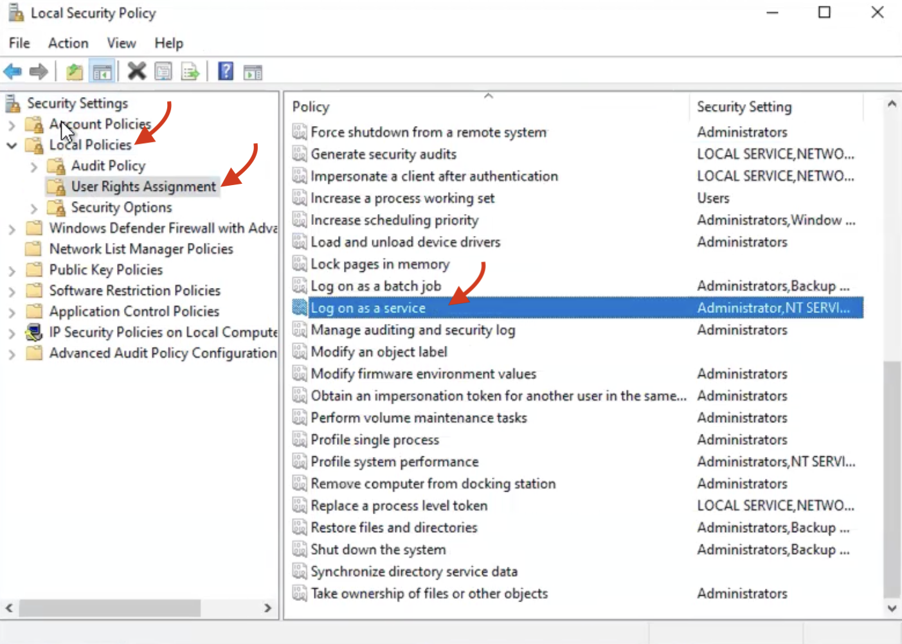
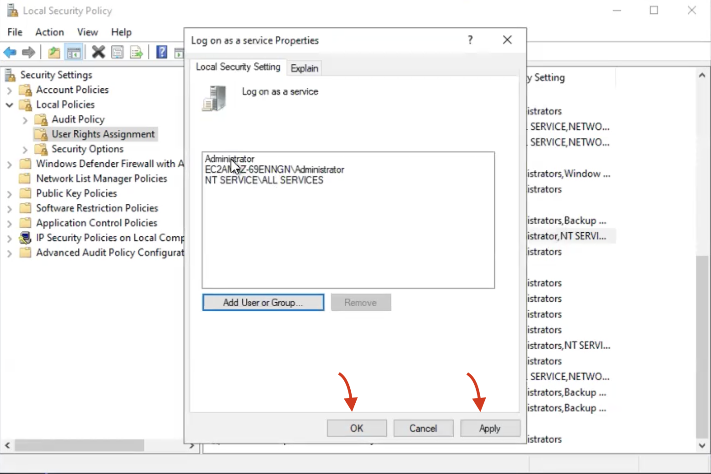
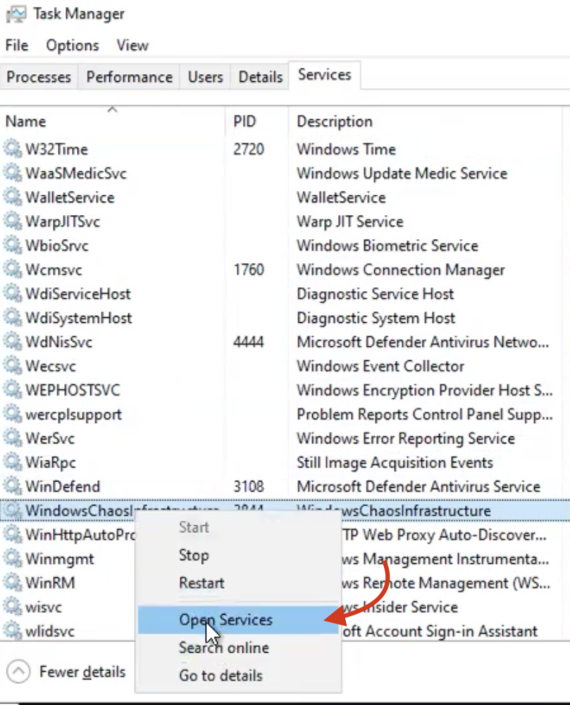
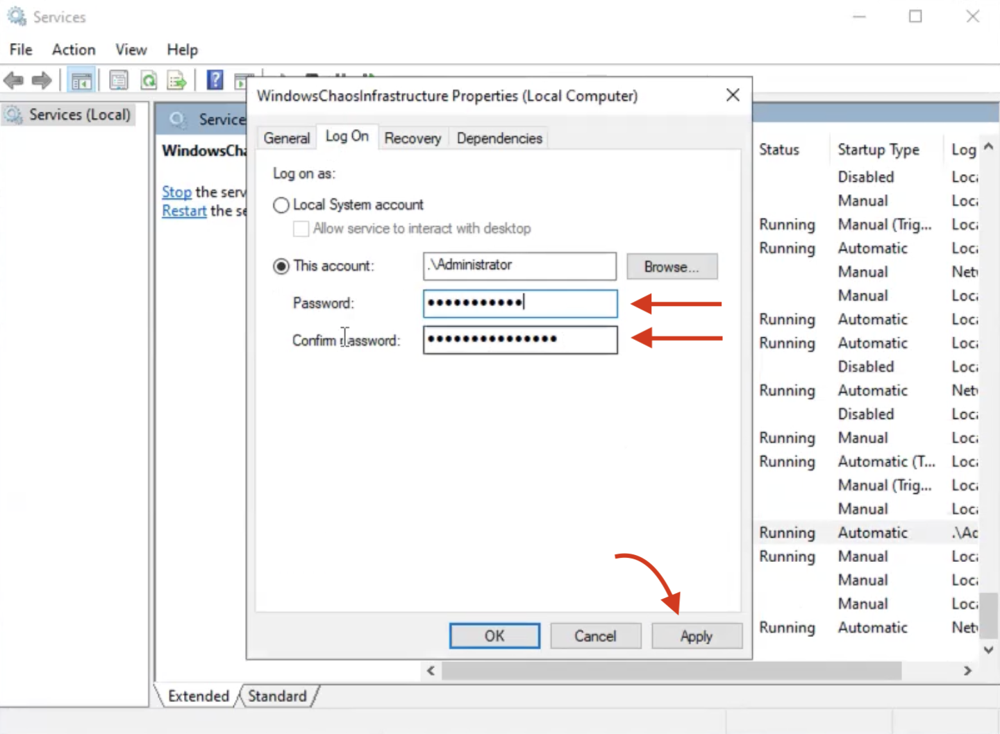

Windows chaos faults disrupt the resources of an application running on a Windows virtual machine. To execute these faults, you need to [install a chaos infrastructure in the Windows VM](/docs/chaos-engineering/concepts/featureschaosinfrastructure).

:::info note
HCE doesn't support injecting Windows faults on Bare metal server.
:::

This section describes the interoperability matrix and the prerequisites to execute Windows chaos faults.

### Interoperability matrix to determine compatibility

| Platform | Windows Server 2022 | Windows Server 2019 | Windows Server 2016 |
|----------|---------------------|---------------------|---------------------|
| AWS      | Yes                 | Yes                 | Yes                 |
| VMware   | Yes                 | NA                  | NA                  |
| Azure    | Yes                 | Yes                 | Yes                 |
| GCP      | Yes                 | NA                  | NA                  |


Before the installation, you need to fulfill a set of prerequisites, described below.

### Step 1. Use a password to connect to the Windows VM

If you don't already have a password, you can configure one using the steps below.
  1. Open your command prompt as an 'admin' and execute the following command.

      ```
      C:\Users\Administrator>net user Administrator <your-password>
      ```
If the command execution is successful, it displays the message
`The command completed successfully.`

### Step 2. Verify that the Windows VM has service log on access

If the Windows VM has service log on access, it means the VM has the required permissions to create and manage services.

1. To verify this, navigate to **Local security policy** -> **Local Policies** -> **User Rights Agreement** -> **Log on as a service**.



2. Double click on **Log on as a service**.


3. If you don't have the 'Administrator' added, click **Add User or Group**. Add the admin name and click **OK**.


4. Click **Apply** and **OK**. This will give you the permissions to log on as a service.



:::tip
Your Windows chaos infrastructure was installed successfully but it may fail to start because you don't have log on access to the infrastructure service.
1. To resolve this, navigate to **Task Manager** from your command prompt (run as admin) and right click **WindowsChaosInfrastructure** and click **Open Services**.



* Instead of **Open Services**, you can right click and click **Start** to start the service.

2. The **Services** tab is opened. Navigate to **WindowsChaosInfrastructure**. Choose the **Log on** tab at the top of the window and enter a password and confirm it. Click **Apply** and **Ok**.



3. Click the **Start** button the left-hand side, which will provide log on access to Windows VM. This method serves as an alternative to provide log on access to Windows VM.
:::