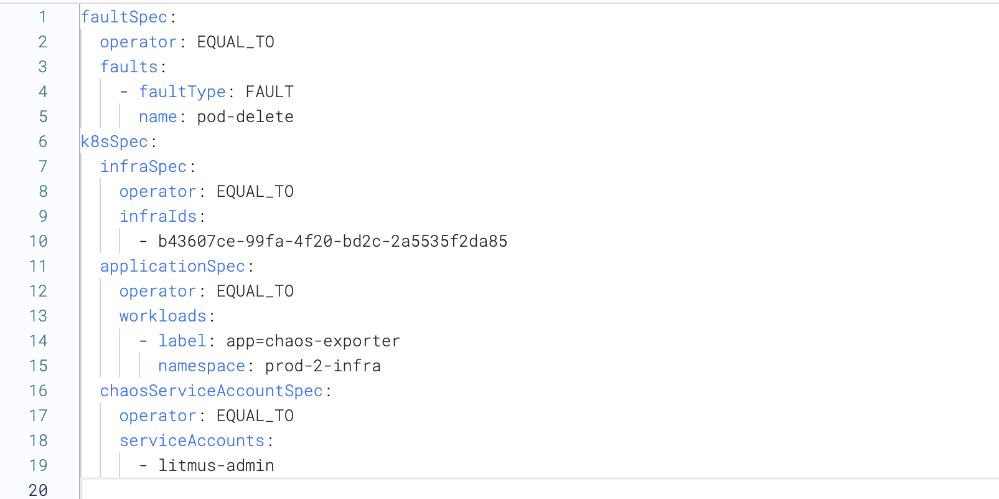
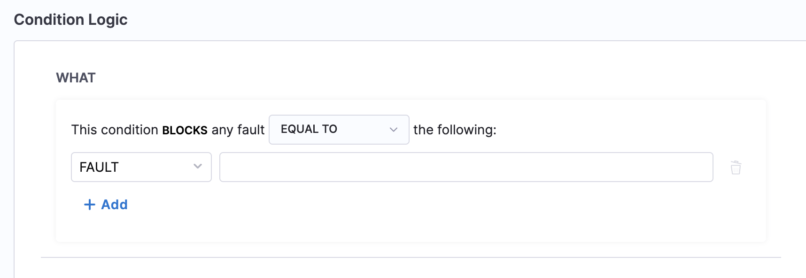
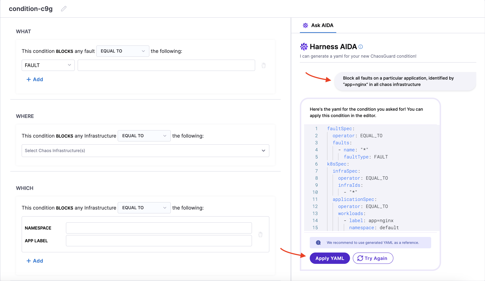
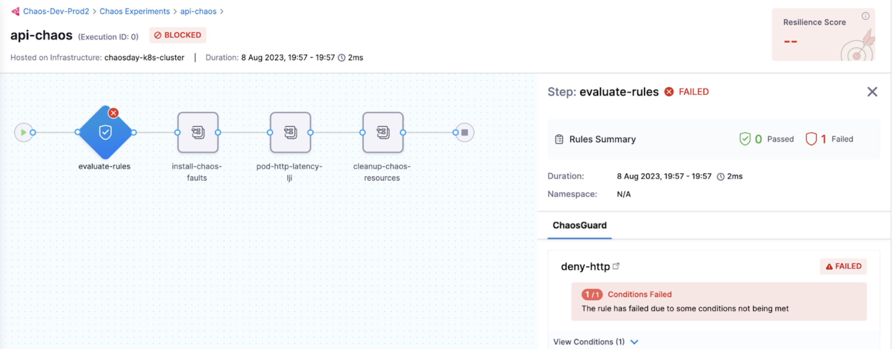

This topic describes how HCE governs chaos experiments during execution. You can add an additional layer of security that is executed before running a chaos experiment. This layer is known as [ChaosGuard](/docs/chaos-engineering/use-harness-ce/governance/governance-in-execution/).

To watch a video on configuring the rules and conditions in ChaosGuard, go to [ChaosGuard- rules and conditions](https://youtu.be/cHFiBvQPCLU).

## Configure conditions
Conditions describe a set of constraints that are applied to an execution context. You can use both **'EQUAL'** and **'NOT EQUAL TO'** operators in conditions. You can also use wildcards within the condition entities, which offers flexibility and control in defining conditions.

To configure a condition,

1. In the **Chaos** module, select **ChaosGuard**, and then select **Conditions**. The **Conditions** page lists your existing conditions. You can use the existing conditions or create a new condition.

	

2. To create a condition, click **New condition**.

	

3. Provide a name, a description (optional), and tags (optional). Click **Save**.

	

This creates a blank canvas, and you can define the constraints for the condition using a **YAML manifest** or using the **visual editor** or **Harness AIDA**.

### Define constraints using YAML

1. You can add conditions using the YAML too.

	

2. Click **YAML** and specify the relevant values corresponding to the respective names.

	

### Define constraints using the visual editor

1. To add conditions using a visual editor, navigate to the **visual** tab of the condition you created earlier.

	

2. Add the **WHAT** clause. In this case, the condition blocks a fault that is **equal to** (or matches) or **not equal to** (everything else apart from the given value) pod delete.

	

3. Add the **WHERE** clause. In this case, the condition blocks an infrastructure that is **equal to** `prod-2-infra` infrastructure.

	

4. Add the **WHICH** clause. In this case, the condition blocks the infrastructure that has the `prod-2-infra` namespace and `app=chaos-exporter` app label.

	

5. Add the **USING** clause. In this case, the condition blocks the `litmus-admin` service account.

	

### Define constraints using AIDA

1. Instead of selecting the required parameters, you can generate conditions with the help of Harness AIDA. AIDA assistant shows up when you are configuring a condition. You can choose one of the suggestions provided by Harness AIDA by clicking on it or writing something along the same lines as the suggestions.

    

2. When you type a condition, you will see that AIDA generates a YAML corresponding to your condition. If the YAML generated meets the conditions, you can click **Apply YAML**.

    

3. If the generated YAML does not meet your conditions, click **Try again**. In the snippet below, you will see that AIDA applies the YAML generated to the editor.

    

## Save condition

After you define the constraints of a condition either using [YAML](#define-constraints-using-yaml), [visual editor](#define-constraints-using-the-visual-editor), or [AIDA](#define-constraints-using-aida), select **Save**.

    

## Configure rules

Rules consist of one or more **conditions** that are evaluated as a first step in the experiment run. To configure a rule,

1. Click **New rule**.

	

2. Specify parameters such as name, description (optional), tags (optional), user group to apply the rule (you can apply the rule to multiple user groups), and time window to apply the rule. You can apply multiple time windows to apply the rule. Click **Next**.

	

3. Select user groups. Click **Apply Selected**.

	

4. Select a condition (or multiple conditions) that you wish to apply. Click **Done**.

	

	:::info note
	* Below is a snap that shows a successful evaluation of all the rules in a chaos experiment.

		

	* Below is a snap that shows a failed evaluation of some (or all) rules in a chaos experiment.

		
	:::

## Enable and disable rules

* The image below shows the two different states of a rule (enable and disable).

	
