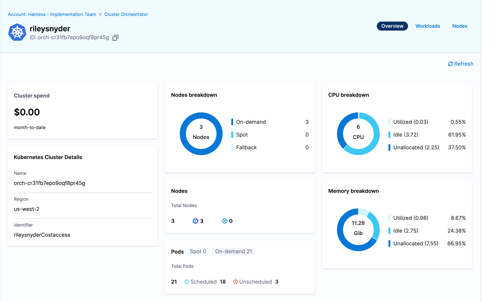

# Prereq

[Follow this guide](https://developer.harness.io/kb/cloud-cost-management/articles/onboarding/k8s#delegate-architecture) to get a delegate installed in your cluster, with a cooresponding k8s and ccm k8s connector in Harness. 

# Preparing your cluster for orchestrator

## Subnets

The subnet(s) your nodegroups are using must be tagged with the following key/value pair:

- key: `harness.io/<cluster name>`
- value: `owned`

If you are using the [aws vpc terraform module](https://registry.terraform.io/modules/terraform-aws-modules/vpc/aws/latest) you can set these via the `private_subnet_tags` input:
```
  private_subnet_tags = {
    "harness.io/ourclustername" = "owned"
  }
```

## Security Groups

The security group(s) your nodegroups are using must be tagged with the following key/value pair:

- key: `harness.io/<cluster name>`
- value: `owned`

If you are using the [aws eks terraform module](https://registry.terraform.io/modules/terraform-aws-modules/eks/aws/latest) you can set these via the `node_security_group_tags` input:
```
  node_security_group_tags = {
    "harness.io/ourclustername" = "owned"
  }
```

## Instance profiles

The following IAM policies must be attached to the IAM role you are using for your node instance profiles:

- [AmazonEC2ContainerRegistryReadOnly](https://docs.aws.amazon.com/aws-managed-policy/latest/reference/AmazonEC2ContainerRegistryReadOnly.html)
- [AmazonEKS_CNI_Policy](https://docs.aws.amazon.com/aws-managed-policy/latest/reference/AmazonEKS_CNI_Policy.html)
- [AmazonEKSWorkerNodePolicy](https://docs.aws.amazon.com/aws-managed-policy/latest/reference/AmazonEKSWorkerNodePolicy.html)
- [AmazonEKSClusterPolicy](https://docs.aws.amazon.com/aws-managed-policy/latest/reference/AmazonEKSClusterPolicy.html)
- [AmazonSSMManagedInstanceCore](https://docs.aws.amazon.com/aws-managed-policy/latest/reference/AmazonSSMManagedInstanceCore.html)

If you are using the [aws eks terraform module](https://registry.terraform.io/modules/terraform-aws-modules/eks/aws/latest) you can set these via the `iam_role_additional_policies` value in your `eks_managed_node_groups`:
```
  eks_managed_node_groups = {
    mynodegroup = {
      # ...other config

      iam_role_additional_policies = {
        CCMClusterOrchClu = "arn:aws:iam::aws:policy/AmazonEKSClusterPolicy"
        CCMClusterOrchSSM = "arn:aws:iam::aws:policy/AmazonSSMManagedInstanceCore"
      }
    }
  }
```
The first three policies mentioned above come default in node groups created via this module, so those are left out.

## IRSA role for cluster orchestrator

The controller deployed into your cluster that orchestrates nodes needs some baseline AWS access.

```
ec2:CreateLaunchTemplate
ec2:CreateFleet
ec2:RunInstances
ec2:CreateTags
iam:PassRole
ec2:TerminateInstances
ec2:DeleteLaunchTemplate
ec2:DescribeLaunchTemplates
ec2:DescribeInstances
ec2:DescribeSecurityGroups
ec2:DescribeSubnets
ec2:DescribeInstanceTypes
ec2:DescribeInstanceTypeOfferings
ec2:DescribeAvailabilityZones
ssm:GetParameter
pricing:GetProducts
ec2:DescribeSpotPriceHistory
ec2:DescribeImages
```

You will need to create an IRSA role for the controller to use to gain this access.

An example how to create such a role in Terraform is below:

```
variable "oidc_provider_arn" {
  type = string
}

data "aws_iam_policy_document" "ccm_comm_orch_controller_assume" {
  statement {
    principals {
      type = "Federated"
      identifiers = [
        var.oidc_provider_arn
      ]
    }

    actions = [
      "sts:AssumeRole",
      "sts:AssumeRoleWithWebIdentity"
    ]
  }
}

resource "aws_iam_role" "ccm_comm_orch_controller" {
  name                 = "ccm_comm_orch_controller"
  assume_role_policy   = data.aws_iam_policy_document.ccm_comm_orch_controller_assume.json
  max_session_duration = 28800
}

data "aws_iam_policy_document" "ccm_comm_orch_controller" {
  statement {
    effect = "Allow"

    actions = [
      "ec2:CreateLaunchTemplate",
      "ec2:CreateFleet",
      "ec2:RunInstances",
      "ec2:CreateTags",
      "iam:PassRole",
      "ec2:TerminateInstances",
      "ec2:DeleteLaunchTemplate",
      "ec2:DescribeLaunchTemplates",
      "ec2:DescribeInstances",
      "ec2:DescribeSecurityGroups",
      "ec2:DescribeSubnets",
      "ec2:DescribeInstanceTypes",
      "ec2:DescribeInstanceTypeOfferings",
      "ec2:DescribeAvailabilityZones",
      "ssm:GetParameter",
      "pricing:GetProducts",
      "ec2:DescribeSpotPriceHistory",
      "ec2:DescribeImages"
    ]

    resources = ["*"]
  }
}

resource "aws_iam_policy" "ccm_comm_orch_controller" {
  name        = "ccm_comm_orch_controller"
  description = "access needed for ccm commitment orchestrator"
  policy      = data.aws_iam_policy_document.ccm_comm_orch_controller.json
}

resource "aws_iam_role_policy_attachment" "ccm_comm_orch_controller" {
  role       = aws_iam_role.ccm_comm_orch_controller.name
  policy_arn = aws_iam_policy.ccm_comm_orch_controller.arn
}
```

# Creating an orchestrator for your cluster

Next we need to create an orchestrator in the CCM tool for your cluster. This is done with the following API call:

```
HARNESS_ACCOUNT_ID="<harness account id>"
HARNESS_PLATFORM_API_KEY="<harness api key>"

url="https://app.harness.io/gratis/lw/api/accounts/$HARNESS_ACCOUNT_ID/clusters/orchestrator?accountIdentifier=$HARNESS_ACCOUNT_ID"

json_payload='{
  "name": "<cluster name>",
  "user_config": {
    "cluster_endpoint": "<eks cluster endpoint>"
  },
  "k8s_connector_id": "<harness ccm k8s connector id>"
}'

curl -s -X POST "$url" \
  -H "Content-Type: application/json"  \
  -H "x-api-key: $HARNESS_PLATFORM_API_KEY" \
  -d "$json_payload"
```

You will need an [API key](https://developer.harness.io/docs/platform/automation/api/add-and-manage-api-keys/) with CCM:admin permissions.

The API call will return JSON, in the payload we need to extract the key under `response.id` which should be in the format `orch-xxx`

# Deploy the orchestrator operator

At this point we can finally deploy the orchestrator into the cluster.

There is a [helm chart provided here](https://github.com/rssnyder/charts/tree/main/charts/harness-ccm-autostopping).

The following values are needed for the deployment:

- clusterName: the name of the EKS cluster as it appears in AWS
- clusterRegion: the AWS region the cluster is deployed in
- remoteAccountID: the Harness account id where you are configuring the orchestrator
- connectorID: the Harness CCM K8s connector id for the cluster
- clusterID: the Harness CCM orchestrator id, this is from the response JSON in the API call made above
- harnessAPI: the Harness URL for your account, `https://app.harness.io/lw/api` if your account is in prod-1, `https://app.harness.io/gratis/lw/api` if prod-2, and `https://app3.harness.io/lw/api` if prod-3
- clusterEndpoint: the EKS cluster endpoint
- awsDefaultInstanceProfile: the instance profile used in your EKS nodegroups
- awsNodeRoleARN: the ARN for the node role to use for orchestrated instances
- controllerRoleArn: the ARN for the role created for the controller
- apiToken: a Harness API token with account:admin, you should use a [service account](https://developer.harness.io/docs/platform/role-based-access-control/add-and-manage-service-account/) for this

# Configure cluster orchestration

Once your cluster has been set up with all orchestrator components you can enable orchestration in the UI.

Navigate to the CCM module, and select `Cluster Orchestrator` from the side menu. You should see a list of clusters that have been set up or are pending. Find the cluster you are onboarding and click `Resume Setup`.


On the first page we can set a base on-demand capacity, split of spot vs on-demand compute, and the distribution strategy.


When you have set the configuration according to your needs, select `Complete Enablement`.

Now you can click on your cluster again in the menu and browse the cluster resources and current compute setup.


