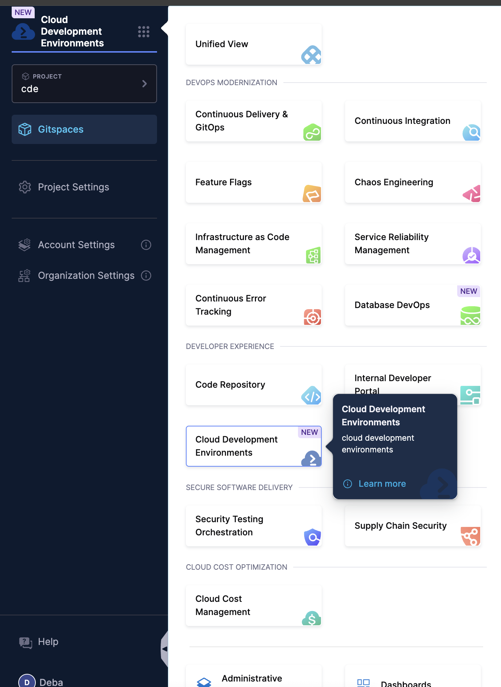
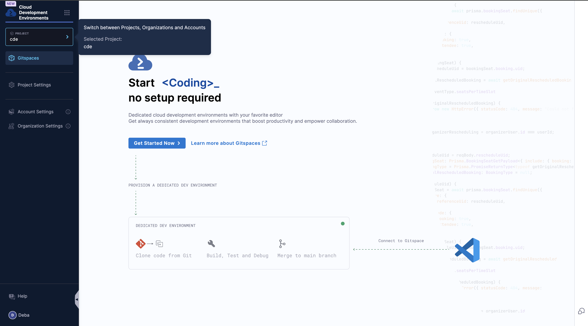

:::info

Harness CDE is now available in public beta. To enable it on your account, contact your sales representative or reach out to the team at cde-interest@harness.io 

:::

Harness CDE (also known as Gitspaces) are on-demand remote development environments that can be instantly spun up with just a click. These environments come pre-configured with everything you need to start coding, including your dependencies, tools, libraries, and even your favorite IDE, enabling you with an instant ready-to-use development setup.

This document provides a Quickstart guide to help users get started with Gitspaces. 

Please ensure that the CDE module is enabled in your Harness account before you start with these instructions. 

Watch this video to get started with Harness Cloud Development Environments:

[](https://youtu.be/73eGzg3qs8w?si=32qGSyxMDWlN-UfL)


:::info

To use VS Code Desktop, you need to [install and configure](#install-gitspace-vs-code-extension-for-vs-code-desktop) the Gitspaces extensions.  

:::

## Sample application

Let us go through the flow of creating a CDE for our sample application, which is available in our public GitHub repository at [demo node.js app](https://github.com/harness-community/demo-repo-nm). Fork the repository if you want to make changes to it as part of this exercise. 

### Create a Gitspace

1. Select the **Cloud Development Environments** module from the side nav. You will be redirected to the **Getting Started** wizard if there are no existing Gitspaces. 



2. Select the Project where you want to create a new Gitspace. 



3. Now on the Create Gitspace page, select the Git Provider, by default we select the **Harness Code**. In case you select any other git provider, you need to [configure the oauth](https://developer.harness.io/docs/platform/git-experience/oauth-integration/#configure-oauth-for-git-provider) to access the **Private** Repositories, since in this example we are using a public repository you can directly start by adding the Repository URl.

4. For this quickstart, we will use a GitHub public repository. Repository URL is `https://github.com/harness-community/demo-repo-nm` (enter URL of your fork if you forked it), make sure the URL is the clone URL strictly of the format `https://git-provider.com/organisation/repository` any extra string post this might cause an error. 


5. Leave the default branch **main** selected.

6. Select the IDE.  

    - Choosing VS Code Browser will open up the Gitspace in a new browser tab

    - Choosing VS Code Desktop will open the Gitspace in your desktop VS Code application. You will need to install the [Gitspaces vscode plugin from Harness Inc](https://marketplace.visualstudio.com/items?itemName=harness-inc.gitspaces).

7. Now select the **Region** and **Machine Type** (Standard: 2 Core CPU, 8GB RAM, Disk Space: 30GB; Large: 4 Core CPU, 16GB RAM, Disk Space: 30GB ) and click on **Create Gitspace**.


8. After clicking on **Create Gitspace**, you’ll be redirected to the **Gitspace Details** page, where you can view the events and logs as the Gitspace is being created. Once it is ready, you can open the Gitspace by clicking the **Open VS Code Online** or **Open VS Code Desktop** button at the top right of the page.If you're using VS Code Desktop, you'll need to install the plugin to view and connect to your Gitspace. (Follow the steps outlined in the followingsection to install the plugin.)


8. This will open the **Gitspace**. Click on **Yes, I trust the authors** and **Mark Done** to get started. You can then start coding in the IDE as you normally would.

## Develop in the Gitspace

Now, let’s install dependencies for the sample app and run it. We will also make changes to it and commit back to our fork.

1. First, open a new terminal.

2. All dependencies, packages, tools and libraries needed for this application were installed while provisioning the Gitspace based on the config in [`devcontainer.json`](https://github.com/harness-community/demo-repo-nm/blob/main/.devcontainer/devcontainer.json). To run the sample app, run the following command in the terminal:

```sh
npm run dev
```

3. Your application will be available at proxy host 3000. You will see a message at the bottom right of your IDE with a link to open the app in browser. 

    If you're unable to see the pop-up, it's because the application is running inside the development container. To access this application, we'll need to set up port forwarding. 
    
    Watch this video to learn more about port forwarding:
    
    [](https://youtu.be/MGcNbaEOgR4?si=qGvdhMoQ2gDzfOfB)

 

    1. Go to the **Ports** section in your VS Code desktop and click **Forward a Port**.  
        

    2. Enter "3000" in the port field and press **Enter**.
    3. Open [https://localhost:3000](https://localhost:3000) to view your app live.

4. The application shows the Harness canary in a variety of fun situations and poses.


:::info

The sample app contains a package called nodemon which has issues when we try to stop the server on VS Code IDE, so you might need to kill the process using `sudo lsof -i :<port_number>` and then `kill -9 [PID]`, to stop the server on port. 

:::

#### Making changes to sample app

1. To make changes to the application, you should  have forked it first and then created a Gitspace for the fork.

- You can make some changes to haiku.json such as delete one of the canary sections below. Save the file.

```json
    {
        "text": "traffic in bangalore,\ncondiser fying to work",
        "image": "canary-flying.png"
    },
```

2. In the Terminal, configure your GitHub credentials, **in-case you have already configured the OAuth you can skip this step for all the git providers**. 

```sh
git config --global user.email "you@example.com" 

git config --global user.name "Your Name"
```

3. Now that you've made a few changes, you can use the integrated terminal or the source view to commit your work. We will use the **Source Control** view for this example.

4. To stage your changes, click `+` next to the `haikus.json` file, or next to **Changes** if you've changed multiple files and you want to stage them all.

5. To commit your staged changes, type a commit message describing the change you've made, then click **Commit**.

6. Now **Sync Changes**, it will redirect you to login and authorize to your GitHub. After authorization, your changes will be committed to your fork.

7. And that’s it! You have successfully used CDE for development

