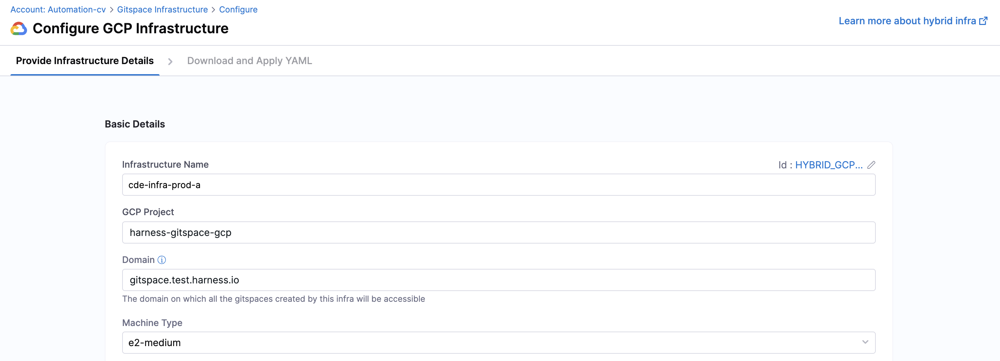
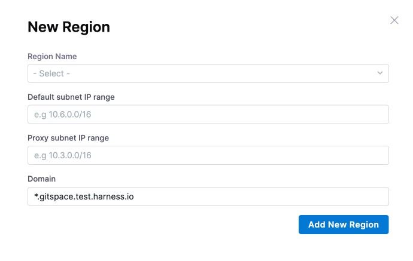
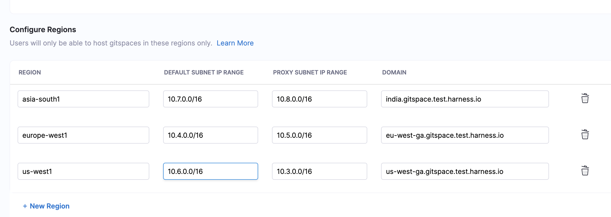
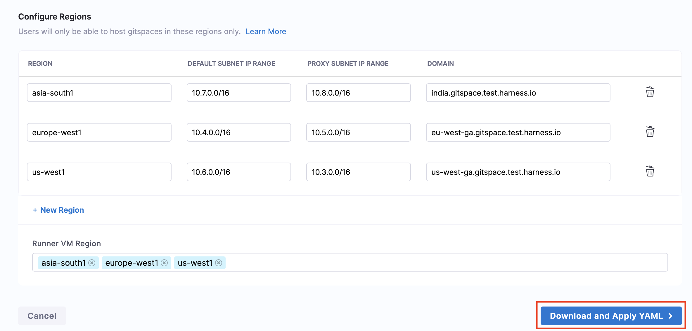
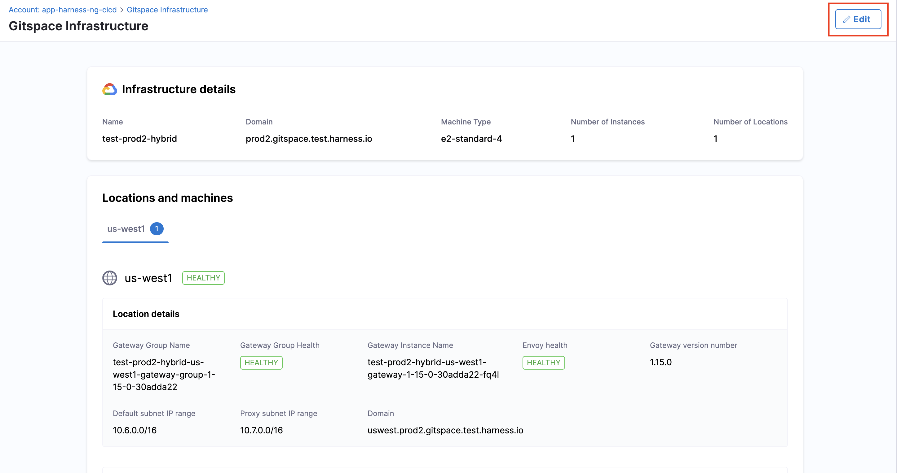
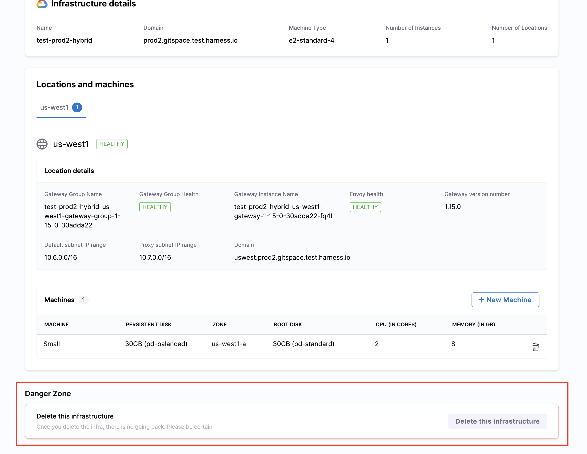
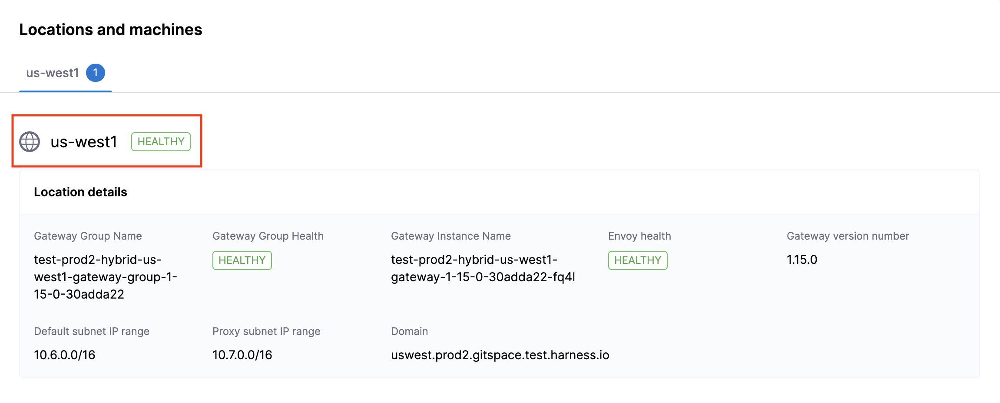

import RedirectIfStandalone from '@site/src/components/DynamicMarkdownSelector/RedirectIfStandalone';

<RedirectIfStandalone label="GCP" targetPage="/docs/cloud-development-environments/self-hosted-gitspaces/steps/gitspace-infra-ui" />

This is your **first step** in configuring **Self Hosted Gitspaces** on **GCP Cloud Infrastructure**. 

In order to get started with Self Hosted Gitspaces, you'll first need to **configure your infrastructure**. This infrastructure is where your Gitspaces will be hosted, so you must **define and configure it from Harness UI**. This guide will take you through the detailed steps to configure your infrastructure using the Harness UI.

## Prerequisites

1. Ensure you’ve read through the [Fundamentals and Prerequisites](/docs/cloud-development-environments/self-hosted-gitspaces/fundamentals.md) of Self Hosted Gitspaces. This will help you gain a deeper understanding of the basic concepts and setup steps.
2. Only users with **Account-level access** can configure Gitspace infrastructure for now. Read more about the [Permissions Hierarchy](https://developer.harness.io/docs/platform/role-based-access-control/rbac-in-harness#permissions-hierarchy-scopes). 
3. Ensure that your GCP project (as defined in your infra config) has the following APIs enabled, here's a quick [reference guide](https://cloud.google.com/endpoints/docs/openapi/enable-api) to learn more about enabling APIs in your GCP project: 
      <ul>
        <li>[Cloud Resource Manager API](https://cloud.google.com/resource-manager/reference/rest) – `api/cloudresourcemanager.googleapis.com`</li>
        <li>[Compute Engine API](https://cloud.google.com/compute/docs/reference/rest/v1) – `api/compute.googleapis.com`</li>
        <li>[Certificate Manager API](https://cloud.google.com/certificate-manager/docs/reference/certificate-manager/rest) – `api/certificatemanager.googleapis.com`</li>
        <li>[Identity and Access Management (IAM) API](https://cloud.google.com/iam/docs/reference/rest) – `api/iam.googleapis.com`</li>
        <li>[Cloud DNS API](https://cloud.google.com/dns/docs/reference/rest/v1) – `api/dns.googleapis.com`</li>
      </ul>

## Configure GCP Cloud Infrastructure in Harness UI

Configuring your Gitspace Infrastructure involves adding your infrastructure details in the Harness UI using the steps below. This process generates an **Infra Config YAML** — a YAML file that captures your entire infrastructure configuration. This YAML is a required input when running the Harness Gitspace Terraform Module to provision the necessary GCP VM infrastructure.

### Access Gitspace Infrastructure

1. Only users with the **Account-level access** can configure Gitspace Infrastructure.
2. Navigate to the **Cloud Development Environments** module and open your **Account Settings**.
3. In the side navbar under Account Settings, select **Gitspace Infrastructure**.


### Provide Basic Infrastructure Details

1. **Infrastructure Name**: Provide a **name** for your **Gitspace infrastructure**. This name will be used while referencing your infrastructure for creating Gitspaces.
2. **GCP Project**: Enter the name of your **GCP project**. This is where the GCP VM Instance hosting your Gitspaces will reside.
3. **Domain**: Provide the **domain** under which all Gitspaces created in this infrastructure will be accessible.
4. **Gateway Machine Type**: Specify the **VM machine type** for your Gateway.



### Configure Regions

You can add and configure regions for Gitspaces. Note that users will only be able to host Gitspaces in these defined regions. Click on **New Region** to add a new region.


:::info
You can create and manage Self Hosted Gitspaces only if your infrastructure has at least one region added. 
:::

Use the following input parameters:
1. **Region Name**: Enter the **region name**. Refer to the [GCP documentation](https://cloud.google.com/compute/docs/regions-zones) to view available regions.
2. **IP Details**: Provide the **IP configuration** for each region. 
    - **Default Subnet IP Range**: This is the primary IP range of the subnet and is used to assign internal IPs to your resources. 
    - **Proxy IP Range**: This is a special subnet created specifically for certain Google-managed services and is used by Google's proxies for internal LB traffic routing. 
3. **Sub-Domain**: Enter the **domain** for each region. This field consists of a sub-domain and a root-domain. The root-domain is the same domain entered above in the basic details. 


Here's how **all the added regions** will look for your infrastructure.


### Download the Infrastructure Config YAML

Once all details have been entered, click on **Download and Apply YAML**. This will generate the **Infra Config YAML**, which contains the entire Gitspace Infra configuration. This YAML is a mandatory input for [configuring and setting up the Harness Gitspaces Terraform Module](/docs/cloud-development-environments/self-hosted-gitspaces/steps/gitspace-infra-terraform.md), which provisions the GCP infrastructure in your selected project.



This is what a **sample Infrastructure Config YAML** looks like: 
```YAML
account_identifier: <ACCOUNT_IDENTIFIER>
infra_provider_config_identifier: <INFRA_PROVIDER_CONFIG_IDENTIFIER>
name: <INFRA_NAME>
gitspace_vm_tags:
- gcp-gitspace
project:
  id: <PROJECT_ID>
  service_account: cde-provisioner
domain: <DOMAIN>
delegateselectors:
- selector: gitspaces
  origin: ""
gateway:
  instances: 1
  machine_type: e2-standard-4
  vm_tags:
  - gateway
  vm_image:
    family: debian-11
    project: debian-cloud
  shared_secret: <SHARED_SECRET>
  cde_manager_url: https://app.harness.io/gateway/gratis/cde
  version: 1.15.0
runner_vm_region:
- us-west1
runner:
  vm_image: projects/ubuntu-os-cloud/global/images/ubuntu-2004-focal-v20250213
region_configs:
  us-west1:
    region_name: us-west1
    default_subnet_ip_range: 10.6.0.0/16
    proxy_subnet_ip_range: 10.7.0.0/16
    certificates:
      contents:
      - domain: <DOMAIN>
```

## Manage Gitspace Infrastructure

### Edit Gitspace Infrastructure
Once your infrastructure is configured, you also have the option to **edit and update it**. Please note that only **Gitspace Admins** with **Account-level access** are permitted to make changes.

Here's how you can edit your infrastructure: 
1. Go to your **Gitspace Infrastructure UI**. 
2. Click on the **Edit** button on the top-right corner. 

3. Whenever you make changes to your infrastructure configuration, you’ll need to **download the updated Infra Config YAML**.
Use this updated YAML to [reapply your Terraform module](/docs/cloud-development-environments/self-hosted-gitspaces/steps/gitspace-infra-terraform.md) to reflect the changes. You can learn more about this process in the [next steps](/docs/cloud-development-environments/self-hosted-gitspaces/steps/gitspace-infra-ui.md#next-steps).

### Delete Gitspace Infrastructure
:::warning **Warning: Irreversible Action**

Deleting your infrastructure is **permanent** and **cannot be undone**. This action will permanently remove your entire infrastructure configuration. 

Please proceed **only if you are absolutely certain** you want to delete this infrastructure.
:::

You can **delete your infrastructure** from the **Gitspace Infrastructure UI**. Please note that only users with **account-level access** are permitted to perform this action.

You can delete the **Gitspace Infrastructure** only if the following conditions are met:

* All **Gitspaces** associated with this infrastructure have been deleted.
* All **Machines** associated with this infrastructure have been deleted.

If these conditions are not met, you will not be able to delete the Gitspace Infrastructure.

#### Deleting Gitspaces
You can **delete Gitspaces** (created within a specific infrastructure) using the Harness UI. Refer to the [documentation](/docs/cloud-development-environments/manage-gitspaces/delete-gitspaces.md) for detailed steps on deleting a Gitspace.

#### Deleting Machines
Follow this [documentation](/docs/cloud-development-environments/self-hosted-gitspaces/steps/manage-self-hosted.md#delete-machines-from-gitspace-infrastructure) to get detailed instructions on how to **delete Machines** from your Gitspace Infrastructure. 

#### Deleting Infrastructure
Here's how you can delete your infrastructure: 
1. Go to your **Gitspace Infrastructure UI**. 
2. Scroll down to the bottom of the page. You’ll find the option to **Delete Infrastructure**. Click this button to permanently delete the selected infrastructure.



### Assess Gateway Group Health for Gitspace Infrastructure
You can assess the **Gateway Group Health** for your Gitspace infrastructure from the Infra Details UI. Go to **Locations and Machines**, and click on the region for which you want to assess the Gateway health. In case the Gateway is **Unhealthy**, you will not be able to create any Gitspaces since no requests will be routed forward. You can find the following details:

* **Gateway Group Name**: System-generated name of the Gateway Group
* **Gateway Group Health**: Health status of the Gateway Group
* **Gateway Instance Name**: System-generated name of the Gateway Group instance
* **Envoy Health**: Health status of Envoy
* **Gateway Version Number**: Gateway image version number



## Next Steps
Now that you have the [Infra Config YAML](/docs/cloud-development-environments/self-hosted-gitspaces/steps/gitspace-infra-ui.md#download-the-infra-config-yaml) downloaded, proceed to [configure and apply the Terraform module](/docs/cloud-development-environments/self-hosted-gitspaces/steps/gitspace-infra-terraform.md) to provision your self-hosted Gitspaces. 