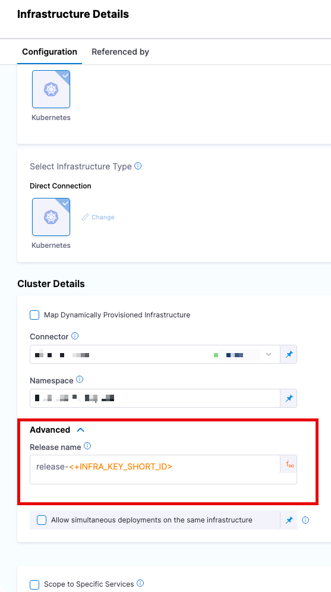

This topic describes how Harness tracks releases and versions for Kubernetes deployments.

Every Harness deployment creates a new release with an incrementally increasing number. Release history is stored in the Kubernetes cluster in a ConfigMap or Secret. ConfigMap or Secret are essential for release tracking, versioning, and rollback.

By default, all ConfigMaps and Secrets are versioned by Harness. The corresponding references for these ConfigMaps and Secrets in other manifest objects are also updated (for example, managed workloads like Deployment, and so on).
Versioning does not change how you use ConfigMaps or Secrets. You need not reference the release numbers when using ConfigMaps or Secrets. 

You can see the use of release numbers and versioning in the **Deployments** page details in Harness First Gen,  (`Current release number is`, `Previous Successful Release is 4`):


```bash
INFO   2019-02-15 10:53:33    Kind                Name                                    Versioned   
INFO   2019-02-15 10:53:33    Namespace           default                                 false       
INFO   2019-02-15 10:53:33    Secret              image-pull-secret                       false       
INFO   2019-02-15 10:53:33    Secret              sample                                  true        
INFO   2019-02-15 10:53:33    Deployment          nginx-deployment                        false       
INFO   2019-02-15 10:53:33      
INFO   2019-02-15 10:53:33      
INFO   2019-02-15 10:53:33    Current release number is: 5  
INFO   2019-02-15 10:53:33      
INFO   2019-02-15 10:53:33    Previous Successful Release is 4
```


And in the logs of the **deployment** in the **prepare** section of the logs in Next Gen, (`Current release number is 7`, `Previous Successful Release is 6`):
```
Manifests processed. Found following resources: 

Kind                Name                                    Versioned 
Secret              harness-v1                              true      
Secret              harness-v1-dckrcfg                      false     
ConfigMap           harness-v1                              true      
Service             harness-v1-svc                          false     
Deployment          harness-v1-deployment                   false     
Ingress             harness-v1-ingress                      false     
IngressRoute        harness-v1-ingress-rt                   false     

Current release number is: 7

Previous Successful Release is 6
```

In some cases, you might want to skip versioning. For example, skip versioning for: 
- ImagePullSecret because it never changes.
- TLS certs if they are referred in a Kubernetes container command or arguments.

For cases where versioning is not required, it can be skipped by using these two ways: 
- Annotate the manifest provided in the Harness service's **Manifests** section with `harness.io/skip-versioning: "true"`.
- In the Harness service's **Manifest Configuration** page, select **Manifests** > **Advanced**, and then select the **Skip Versioning** checkbox.

:::note info

Versioning is not done when declarative rollback is enabled.

:::

## Release Name

Harness also uses a release name for tracking releases.  These release names should be unique for your deployments and pipelines.

:::Important
Do not change the **release name value** between deployments unless absolutely necessary. The release name is used by Harness for tracking releases of app versions and rollback. If you change the release name value between deployments, this will reset the versioning number and will stop rollbacks up to that point (breaking the versioning chain)
:::

You can supply a release name in a stage's infrastructure **Release Name** setting.



During deployment Harness creates a ConfigMap listing the resources of the release and uses the Release name for tracking them.  You can see this within your Kubernetes cluster, in the namespace if you run `kubectl get configmap`

```
> $ kubectl get configmap
NAME                    DATA   AGE
kube-root-ca.crt        1      176d
release-78a47e          2      176d
release-05ea23          7      176d
```

Harness suggests utilizing a Release Name which is formed from a combination of `release-` and a unique string created using the Harness expression `<+INFRA_KEY>`.

The release name must be unique across the cluster. `release-<+INFRA_KEY>` ensures a unique name.

If the name is not defined properly, and is not unique across the cluster, there is a danger of collision  in the versioning between the two different deployments. 

For example, Pipeline A can increment the versioning of Pipeline B's configmap/secrets and add its own versions to the same series if the release name is not unique.  This will cause a break in the versions and will cause issues in rollbacks.  


:::note info

When declarative rollback is enabled, the corresponding Secret name format is `harness.release.<release-name>.<release-number>`.

:::

Release name is used to create the corresponding Harness release ConfigMap or Secret. Therefore, the provided release name should be a valid [DNS subdomain name](https://kubernetes.io/docs/concepts/overview/working-with-objects/names/#dns-subdomain-names).