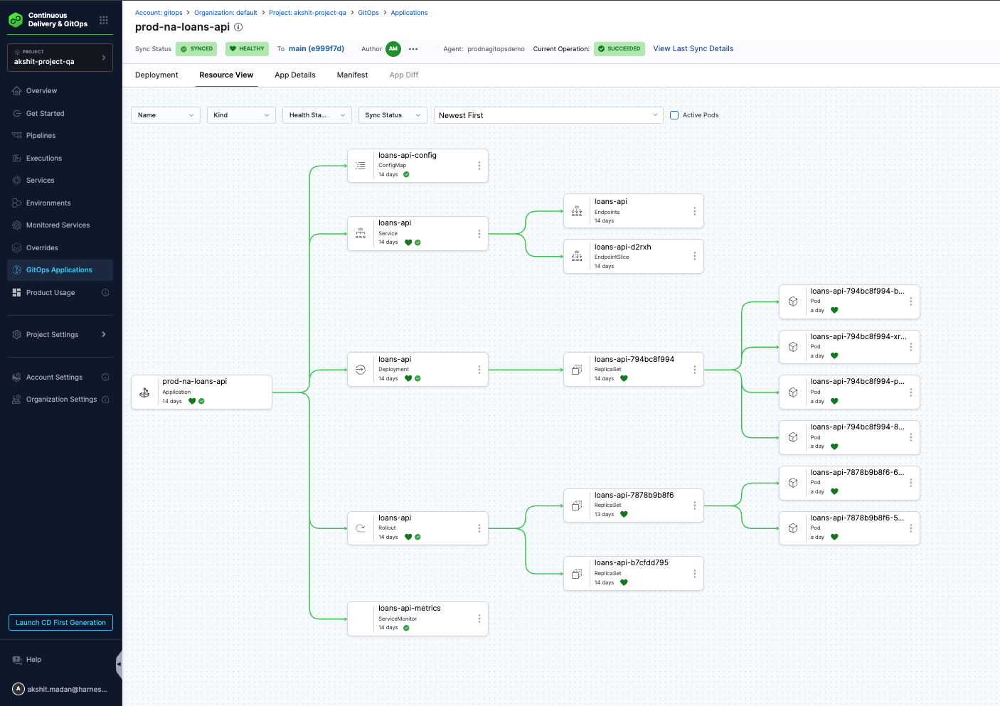
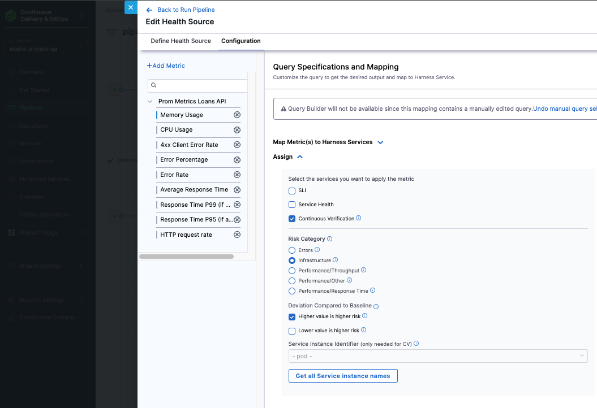
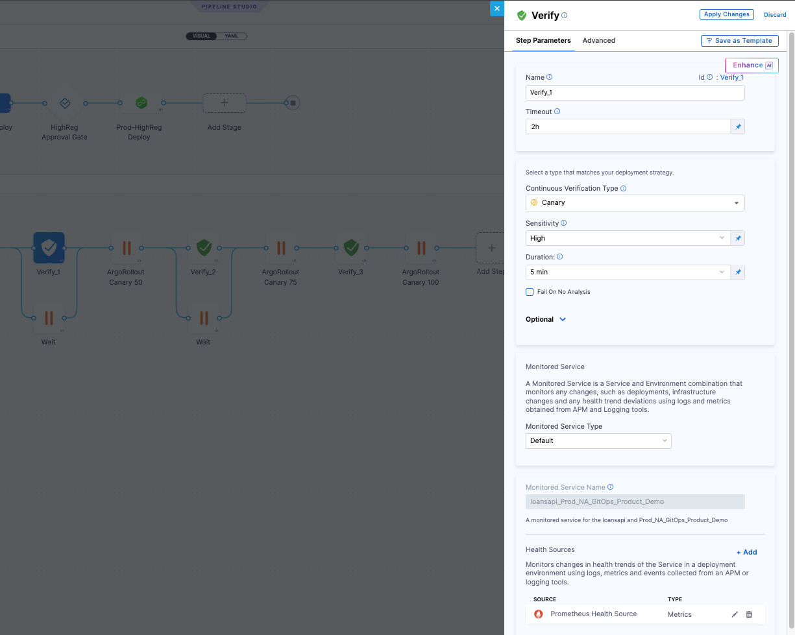
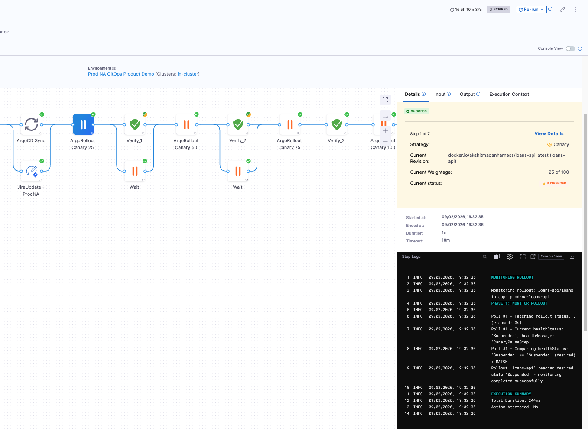

Continuous Verification (CV) validates deployments by analyzing metrics and logs from your monitoring tools. When combined with Argo Rollouts canary deployments, CV ensures each canary stage is healthy before promoting to the next stage, providing automated safety checks throughout the progressive rollout.

## Overview

Argo Rollouts with Continuous Verification enables you to:

- **Validate each canary stage:** CV analyzes metrics and logs at each canary percentage (10%, 25%, 50%, 100%) before promotion
- **Automated rollback:** If CV detects anomalies, it can automatically trigger rollback before the issue affects more users
- **Machine learning-based analysis:** Harness uses ML algorithms to identify normal behavior and detect anomalies
- **Multi-stage validation:** Each canary stage is independently validated before traffic increases

### How CV Works with Canary Deployments

In a canary deployment with CV:

1. **Traffic Split:** Argo Rollouts shifts a percentage of traffic to the new version (e.g., 10%)
2. **CV Analysis:** The Verify step analyzes metrics and logs from the canary pods for the configured duration
3. **Health Decision:** CV determines if the canary is healthy based on sensitivity settings
4. **Promotion or Rollback:** If healthy, the rollout promotes to the next stage. If unhealthy, CV can trigger rollback
5. **Repeat:** This process repeats for each canary stage (10% → 25% → 50% → 100%)

## Prerequisites

Before setting up Argo Rollouts with Continuous Verification, ensure you have:

- **Argo Rollouts installed** in your cluster (see [Argo Rollouts Overview](./argo-rollouts-overview.md))
- **Harness GitOps Agent** configured and connected to your cluster
- **GitOps Application** with a Rollout resource configured for canary deployment
- **Monitored Service** configured in Harness with health sources (APM or logging tools)
- **Health sources connected:** Prometheus, Datadog, New Relic, or other supported monitoring tools
- **Pipeline created** with deployment stage configured (see [Managing Rollouts in Harness Pipeline](./managing-rollouts-in-harness-pipelines.md))

For more information about setting up Continuous Verification, see [Verify Overview](/docs/continuous-delivery/verify/verify-deployments-with-the-verify-step).

## Step-by-Step Guide

This guide walks you through the complete setup from creating a GitOps Application to running a pipeline with Continuous Verification.

### Step 1: Prepare Your Git Repository

First, prepare your Git repository with the Rollout manifest and related Kubernetes resources.

#### 1.1 Create the Rollout Manifest

Create a Rollout manifest file (e.g., `rollout.yaml`) in your Git repository. Your Argo Rollout manifest should define a canary strategy with pause steps. Here's a production-ready example:

<details>
<summary>Rollout manifest example</summary>

```yaml
apiVersion: argoproj.io/v1alpha1
kind: Rollout
metadata:
  name: loans-api
  labels:
    app: loans-api
    strategy: canary
spec:
  replicas: 2
  selector:
    matchLabels:
      app: loans-api
  template:
    metadata:
      labels:
        app: loans-api
      annotations:
        prometheus.io/scrape: 'true'
        prometheus.io/port: '8083'
        prometheus.io/path: /metrics
    spec:
      containers:
      - name: loans-api
        image: docker.io/akshitmadanharness/loans-api:latest
        ports:
        - containerPort: 8083
        env:
        - name: ENVIRONMENT
          value: prod-na
        resources:
          requests:
            memory: 512Mi
            cpu: 400m
          limits:
            memory: 1Gi
            cpu: 800m
        livenessProbe:
          httpGet:
            path: /health
            port: 8083
          initialDelaySeconds: 30
          periodSeconds: 10
        readinessProbe:
          httpGet:
            path: /ready
            port: 8083
          initialDelaySeconds: 5
          periodSeconds: 5
  minReadySeconds: 30
  revisionHistoryLimit: 3
  strategy:
    canary:
      maxSurge: 25%
      maxUnavailable: 0
      steps:
      - setWeight: 10
      - pause: {}
      - setWeight: 25
      - pause: {}
      - setWeight: 50
      - pause: {}
      - setWeight: 100
```

</details>

**Key configuration elements:**

- **`replicas: 2`:** Number of pod replicas for the stable version. During canary, additional pods are created for the new version.

- **`strategy.canary.steps`:** Defines the canary progression stages:
  - **`setWeight: 10`** → Shifts 10% of traffic to canary (initial validation stage)
  - **`setWeight: 25`** → Increases to 25% traffic
  - **`setWeight: 50`** → Increases to 50% traffic
  - **`setWeight: 100`** → Full promotion to 100% traffic
  - **`pause: {}`:** Pauses the rollout at each stage, waiting for CV validation or manual promotion

- **`maxSurge: 25%`:** Allows up to 25% additional pods during rollout (beyond the replica count). This ensures capacity for both stable and canary versions.

- **`maxUnavailable: 0`:** Ensures zero downtime by preventing any pods from being unavailable during the rollout.

- **`minReadySeconds: 30`:** Waits 30 seconds after a pod becomes ready before considering it available. This helps ensure pods are truly ready before receiving traffic.

- **`revisionHistoryLimit: 3`:** Keeps the last 3 rollout revisions for rollback purposes.

- **Prometheus annotations:** The `prometheus.io/scrape`, `prometheus.io/port`, and `prometheus.io/path` annotations enable Prometheus to scrape metrics from the pods. This is essential for CV to collect metrics during canary validation.

- **Health probes:**
  - **`livenessProbe`:** Checks if the container is running (restarts if unhealthy)
  - **`readinessProbe`:** Checks if the container is ready to receive traffic

- **Resource limits:** Defines CPU and memory requests and limits to ensure proper resource allocation and prevent resource contention.

**CV Integration Points:**
- Each `pause: {}` step is where your Verify step will validate the canary
- Prometheus annotations enable CV to collect metrics for analysis
- Health probes ensure pods are healthy before CV analysis begins

#### 1.2 Commit and Push to Git

1. Save the Rollout manifest to your Git repository
2. Commit the changes
3. Push to your repository (e.g., `main` branch)

Your repository structure should look similar to this:

```
my-gitops-repo/
├── apps/
│   └── loans-api/
│       ├── rollout.yaml          # Rollout manifest
│       ├── service.yaml          # Service for traffic routing (optional)
│       └── kustomization.yaml    # Kustomize configuration (if using Kustomize)
└── README.md
```

### Step 2: Create a Harness GitOps Application

You must create a GitOps Application before you can use it in a pipeline. The GitOps Application connects your Git repository to your Kubernetes cluster.

#### 2.1 Navigate to GitOps Applications

1. In Harness, navigate to **Deployments > GitOps > Applications**
2. Click **+ New Application**

#### 2.2 Configure Application Basic Settings

Configure the application basic information:

- **Name:** Enter a name for your application (e.g., `loans-api-gitops`)
- **GitOps Agent:** Select the GitOps Agent connected to your cluster
- **Service (optional):** Create or select a service to track this deployment (e.g., `loans-api`)
- **Environment (optional):** Create or select an environment (e.g., `prod-na`)

Click **Continue**.

#### 2.3 Configure Application Source

On the **Source** page, configure where your Rollout manifests are located:

- **Repository Type:** Git
- **Repository URL:** Your Git repository URL (e.g., `https://github.com/org/my-gitops-repo`)
- **Target Revision:** Branch or tag (e.g., `main`, `master`)
- **Path:** Path to your Rollout manifests (e.g., `apps/loans-api/`)

If using Kustomize:
- Leave **Kustomize** options at their defaults, or configure as needed

Click **Continue**.

#### 2.4 Configure Application Destination

Configure where the Rollout will be deployed:

- **Cluster:** Select your target cluster
- **Namespace:** Enter the namespace where the Rollout will be deployed (e.g., `default`)

Click **Create**.

#### 2.5 Sync the Application

After creating the application, sync it to deploy the Rollout to your cluster:

1. In the application details page, click **Sync**
2. Configure sync options if needed:
   - Select **Target Revision** if needed (default is usually correct)
   - Leave other options at defaults
3. Click **Synchronize**

Wait for the sync to complete and the application to reach **Healthy** state.

#### 2.6 Verify Rollout is Deployed

1. Navigate to the application's **Resources** tab
2. Verify the following resources appear:
   - **Rollout** resource (e.g., `loans-api`)
   - **Service** resources (if configured)
   - **ReplicaSet** created by the Rollout
   - **Pods** managed by the Rollout

All resources should show as **Healthy**.



**Your GitOps Application is now ready!** The Rollout is deployed and synced to your cluster.

### Step 3: Create a Monitored Service

Before adding Verify steps, create a Monitored Service that connects to your health sources:

1. Navigate to **Service Reliability Management > Monitored Services**
2. Click **+ New Monitored Service**
3. Configure:
   - **Service:** Select the service associated with your GitOps Application
   - **Environment:** Select the environment where the rollout is deployed
   - **Name:** Enter a descriptive name (e.g., `loansapi_Prod_NA_GitOps_Product_Demo`)
4. Add **Health Sources:**
   - Click **+ Add New Health Source**
   - Select your monitoring tool (e.g., Prometheus, Datadog)
   - Configure metrics and queries
   - Save the health source

   
5. Click **Save**

For detailed instructions, see [Create a Monitored Service](/docs/service-reliability-management/monitored-service/create-monitored-service).

### Step 4: Create Your Pipeline

Now that your GitOps Application and Monitored Service are configured, create a pipeline to orchestrate the canary deployment with CV validation.

#### 4.1 Create a New Pipeline

1. Navigate to **Deployments > Pipelines**
2. Click **+ New Pipeline**
3. Enter a pipeline name (e.g., `deploy-loans-api-canary`)
4. Select your project and organization

#### 4.2 Add a Deployment Stage

1. Click **+ Add Stage**
2. Select **Deploy** stage type
3. Configure the stage:

**Stage Configuration:**
- **Name:** Give your stage a name (e.g., `Deploy Canary`)
- **Service:** Select the service that matches your GitOps Application (e.g., `loans-api`)
- **Environment:** Select the environment that matches your GitOps Application (e.g., `prod-na`)
- **Infrastructure:** Select the cluster/infrastructure

:::important

**Critical:** The service, environment, and cluster must match what you configured in your GitOps Application. This is required for the GitOps Rollout step to find and manage your rollout.

:::

#### 4.3 Configure Stage Execution

1. Go to the **Execution** tab in your stage
2. You'll see default steps (Service, GitopsClusters) - these are fine
3. You can optionally add a **GitOps Sync** step if you want to sync changes before managing the rollout

**Note:** If your Rollout is already synced and healthy, you can skip the Sync step and go directly to the Rollout step.

#### 4.4 Add GitOps Sync Step (Optional)

If you want to sync new changes from Git before managing the rollout:

1. Click **Add Step**
2. Search for and select **GitOps Sync**
3. Configure the step:
   - **Agent:** Select your GitOps Agent
   - **Application:** Select your GitOps Application
   - **Wait until healthy:** Check this to wait until the application is healthy
   - **Fail If Step Times Out:** Check if you want the step to fail on timeout
   - **Timeout:** Set appropriate timeout (e.g., `10m`)

### Step 5: Add GitOps Rollout and Verify Steps

Add GitOps Rollout steps for each canary stage, followed by Verify steps for CV validation.


#### 5.1 Add First Canary Stage (10%)

1. Click **Add Step**
2. Search for and select **GitOps Rollout**
3. Configure the step:

**Step Parameters:**
- **Name:** `ArgoRollout Canary 10`
- **Timeout:** `10m`
- **Agent:** Select your GitOps Agent
- **Application:** Select your GitOps Application (e.g., `loans-api-gitops`)
- **Rollout Name:** Select your Rollout resource (e.g., `loans-api`)
- **Namespace:** Enter the namespace (e.g., `default`)

**Rollout Configuration:**
- **Wait until Health Status:** Select `Suspended`
- **Health Message:** Enter `CanaryPauseStep` (or use regex pattern like `Canary.*`)
- **Auto Action for Rollouts:** Leave empty (CV will validate first)
- **Fail On Timeout:** Check this box

This step will wait until the rollout is paused at the 10% canary stage.

1. In your pipeline, go to the **Execution** tab
2. Click **Add Step**
3. Search for and select **GitOps Rollout**
4. Configure the step:

**Step Parameters:**
- **Name:** `ArgoRollout Canary 10`
- **Timeout:** `10m`
- **Agent:** Select your GitOps Agent
- **Application:** Select your GitOps Application
- **Rollout Name:** Select your Rollout resource (e.g., `loans-api`)
- **Namespace:** Enter the namespace

**Rollout Configuration:**
- **Wait until Health Status:** Select `Suspended`
- **Health Message:** Enter `CanaryPauseStep` (or use regex pattern like `Canary.*`)
- **Auto Action for Rollouts:** Leave empty (CV will validate first)
- **Fail On Timeout:** Check this box

This step will wait until the rollout is paused at the 10% canary stage.

#### 5.2 Add Verify Step After First Canary Stage

1. Click **Add Step** after the first GitOps Rollout step
2. Search for and select **Verify**
3. Configure the step:

**Step Parameters:**
- **Name:** `Verify_1`
- **Timeout:** `2h` (sufficient time for CV analysis)
- **Continuous Verification Type:** Select `Canary`
- **Sensitivity:** Select `High` (recommended for production)
- **Duration:** Select `5 min` (or adjust based on your needs)
- **Fail On No Analysis:** Check this to fail if no data is available

**Monitored Service:**
- **Monitored Service Type:** Select `Default`
- **Monitored Service Name:** Select the Monitored Service you created in Step 2

**Health Sources:**
- Verify your health sources are configured
- Add additional health sources if needed

This Verify step will analyze metrics and logs from the 10% canary stage.

#### 5.3 Add Wait Step (Optional)

You can add a **Wait** step after the Verify step to pause the pipeline before promoting to the next stage. This gives you time to review CV results:

1. Click **Add Step**
2. Search for and select **Wait**
3. Configure:
   - **Name:** `Wait`
   - **Duration:** Set as needed (e.g., `5m`)

#### 5.4 Repeat for Remaining Canary Stages

Add similar steps for the remaining canary stages:

- **ArgoRollout Canary 25** → **Verify_2** → **Wait**
- **ArgoRollout Canary 50** → **Verify_3** → **Wait**
- **ArgoRollout Canary 100** → Final verification (optional)

For each GitOps Rollout step:
- Update the **Name** to reflect the canary percentage (Canary 25, Canary 50, Canary 100)
- Keep **Wait until Health Status:** `Suspended`
- Keep **Health Message:** `CanaryPauseStep`

For each Verify step:
- Update the **Name** (Verify_1, Verify_2, Verify_3)
- Keep the same CV configuration (Canary type, Sensitivity, Duration)
- Use the same Monitored Service

### Step 6: Configure Verify Step for Canary Validation

The Verify step configuration is critical for proper canary validation:

#### Continuous Verification Type

Select **Canary** to match your deployment strategy. This tells CV to:
- Compare canary pods (new version) against stable pods (old version)
- Analyze metrics from both versions simultaneously
- Detect anomalies in the canary version relative to baseline

#### Sensitivity

Choose the sensitivity level based on your risk tolerance:

- **High:** Even minor anomalies cause verification failure (recommended for production)
- **Medium:** Moderate anomalies are acceptable, major issues cause failure
- **Low:** Only severe anomalies cause verification failure

For canary deployments, **High** sensitivity is recommended to catch issues early.

#### Duration

Set the analysis duration (e.g., `5 min`). CV will:
- Collect metrics and logs for this duration
- Compare canary metrics against baseline
- Make a health decision based on the analysis

**Recommendation:** Use `5-10 minutes` for canary stages to get sufficient data while keeping deployment time reasonable.

#### Monitored Service

Select the Monitored Service that includes:
- Health sources connected to your monitoring tools
- Metrics and queries configured for your application
- Proper service and environment mapping



### Step 7: Run the Pipeline

Now you're ready to run the pipeline and see the canary deployment with CV validation in action.


<details>
<summary>Pipeline YAML</summary>

```yaml
pipeline:
  projectIdentifier: akshitprojectqa
  orgIdentifier: default
  tags: {}
  stages:
    - stage:
        name: Dev Deploy
        identifier: Dev_Deploy
        description: ""
        type: Deployment
        spec:
          deploymentType: Kubernetes
          gitOpsEnabled: true
          service:
            serviceRef: loansapi
            serviceInputs:
              serviceDefinition:
                type: Kubernetes
                spec:
                  manifests:
                    - manifest:
                        identifier: manifests
                        type: ReleaseRepo
                        spec:
                          store:
                            type: Github
                            spec:
                              paths: <+input>
          execution:
            steps:
              - parallel:
                  - step:
                      type: GitOpsUpdateReleaseRepo
                      name: Modify Git
                      identifier: Modify_Git
                      timeout: 10m
                      spec:
                        variables:
                          - name: replicas[0].count
                            type: String
                            value: <+pipeline.variables.replica>
                        prTitle: Update Replica Count
                        allowEmptyCommit: true
                  - step:
                      type: JiraCreate
                      name: JiraCreate
                      identifier: JiraCreate
                      spec:
                        connectorRef: seenvjiratemp
                        projectKey: HD
                        issueType: Story
                        fields:
                          - name: Description
                            value: "Promote <+service.name> to production \\\\ Pipeline Name: <+pipeline.name> \\\\ Artifact: <+artifact.image> \\\\ Deployment URL: <+pipeline.executionUrl> \\\\ Requested by <+pipeline.triggeredBy.name>"
                          - name: Summary
                            value: Tracking GitOps Deployment
                      timeout: 10m
              - step:
                  type: MergePR
                  name: Approve Git Changes
                  identifier: Approve_Git_Changes
                  spec:
                    deleteSourceBranch: true
                    variables: []
                  timeout: 10m
              - parallel:
                  - step:
                      type: GitOpsSync
                      name: ArgoCD Sync
                      identifier: GitOps_Sync
                      spec:
                        prune: false
                        dryRun: false
                        applyOnly: false
                        forceApply: false
                        applicationsList:
                          - applicationName: dev-loans-api
                            agentId: devgitopsdemo
                        retryStrategy: {}
                        retry: false
                        syncOptions:
                          skipSchemaValidation: false
                          autoCreateNamespace: false
                          pruneResourcesAtLast: false
                          applyOutOfSyncOnly: false
                          replaceResources: false
                          prunePropagationPolicy: foreground
                          respectIgnoreDifferences: false
                          serverSideApply: false
                        autoPromoteRolloutBehavior: promote-full
                      timeout: 10m
                  - step:
                      type: JiraUpdate
                      name: JiraUpdate - Dev
                      identifier: JiraUpdate_1
                      spec:
                        connectorRef: seenvjiratemp
                        issueKey: <+pipeline.stages.Dev_Deploy.spec.execution.steps.JiraCreate.issue.key>
                        fields:
                          - name: Comment
                            value: "Dev-Only: Updated GitRepo, Deployed via ArgoCD"
                        issueType: Story
                        projectKey: HD
                      timeout: 10m
            rollbackSteps:
              - step:
                  type: RevertPR
                  name: Revert PR
                  identifier: Revert_PR
                  spec:
                    commitId: <+pipeline.stages.Dev_Deploy.spec.execution.steps.updateReleaseRepo.updateReleaseRepoOutcome.commitId>
                  timeout: 10m
              - parallel:
                  - step:
                      type: GitOpsSync
                      name: Rollback - Sync
                      identifier: Rollback_Sync
                      spec:
                        prune: false
                        dryRun: false
                        applyOnly: false
                        forceApply: false
                        applicationsList:
                          - applicationName: dev-loans-api
                            agentId: devgitopsdemo
                        retryStrategy: {}
                        retry: false
                        syncOptions:
                          skipSchemaValidation: false
                          autoCreateNamespace: false
                          pruneResourcesAtLast: false
                          applyOutOfSyncOnly: false
                          replaceResources: false
                          prunePropagationPolicy: foreground
                          respectIgnoreDifferences: false
                          serverSideApply: false
                      timeout: 10m
                  - step:
                      type: JiraUpdate
                      name: JiraUpdate - Rollback
                      identifier: JiraUpdate_1
                      spec:
                        connectorRef: seenvjiratemp
                        issueKey: <+pipeline.stages.Dev_Deploy.spec.execution.steps.JiraCreate.issue.key>
                        fields:
                          - name: Comment
                            value: "Dev-Only: Rollback PR, Sync via ArgoCD"
                        issueType: Story
                        projectKey: HD
                      timeout: 10m
          environment:
            environmentRef: Dev_GitOps_Product_Demo
            deployToAll: false
            gitOpsClusters:
              - identifier: incluster
                agentIdentifier: devgitopsdemo
        tags: {}
        failureStrategies:
          - onFailure:
              errors:
                - AllErrors
              action:
                type: StageRollback
    - stage:
        name: QA Deploy
        identifier: QA_Deploy
        description: ""
        type: Deployment
        spec:
          deploymentType: Kubernetes
          gitOpsEnabled: true
          service:
            serviceRef: loansapi
            serviceInputs:
              serviceDefinition:
                type: Kubernetes
                spec:
                  manifests:
                    - manifest:
                        identifier: manifests
                        type: ReleaseRepo
                        spec:
                          store:
                            type: Github
                            spec:
                              paths: <+input>
          execution:
            steps:
              - step:
                  type: GitOpsUpdateReleaseRepo
                  name: Modify Git
                  identifier: Create_PR
                  spec:
                    variables:
                      - name: replicas[0].count
                        type: String
                        value: <+pipeline.variables.replica>
                    allowEmptyCommit: true
                  timeout: 10m
              - step:
                  type: MergePR
                  name: Approve Git Changes
                  identifier: Merge_PR
                  spec:
                    deleteSourceBranch: false
                    variables: []
                  timeout: 10m
              - parallel:
                  - step:
                      type: GitOpsSync
                      name: ArgoCD Sync
                      identifier: GitOpsSync_1
                      spec:
                        prune: false
                        dryRun: false
                        applyOnly: false
                        forceApply: false
                        applicationsList:
                          - applicationName: qa-loans-api
                            agentId: qagitopsdemo
                        retryStrategy: {}
                        retry: false
                        syncOptions:
                          skipSchemaValidation: false
                          autoCreateNamespace: false
                          pruneResourcesAtLast: false
                          applyOutOfSyncOnly: false
                          replaceResources: false
                          prunePropagationPolicy: foreground
                          respectIgnoreDifferences: false
                          serverSideApply: false
                        autoPromoteRolloutBehavior: promote-full
                      timeout: 10m
                  - step:
                      type: JiraUpdate
                      name: JiraUpdate - QA
                      identifier: JiraUpdate_QA
                      spec:
                        connectorRef: seenvjiratemp
                        issueKey: <+pipeline.stages.Dev_Deploy.spec.execution.steps.JiraCreate.issue.key>
                        fields:
                          - name: Comment
                            value: "QA-Only: Updated GitRepo, Deployed via ArgoCD"
                        issueType: Story
                        projectKey: HD
                      timeout: 10m
            rollbackSteps: []
          environment:
            environmentRef: QA_GitOps_Product_Demo
            deployToAll: false
            gitOpsClusters:
              - identifier: incluster
                agentIdentifier: qagitopsdemo
        tags: {}
        failureStrategies:
          - onFailure:
              errors:
                - AllErrors
              action:
                type: StageRollback
    - stage:
        name: Prod Approval Gate
        identifier: Approve_Prod_NA_Deploy
        description: ""
        type: Approval
        spec:
          execution:
            steps:
              - step:
                  name: Approve Prod
                  identifier: Approve_Prod_NA
                  type: HarnessApproval
                  timeout: 1d
                  spec:
                    approvalMessage: Please Approve Prod NA Deploy
                    includePipelineExecutionHistory: true
                    approvers:
                      minimumCount: 1
                      disallowPipelineExecutor: false
                      userGroups:
                        - account._account_all_users
                    isAutoRejectEnabled: false
                    approverInputs: []
        tags: {}
    - stage:
        name: Prod-NA Deploy
        identifier: Prod_NA_Deploy
        description: ""
        type: Deployment
        spec:
          deploymentType: Kubernetes
          gitOpsEnabled: true
          service:
            serviceRef: loansapi
            serviceInputs:
              serviceDefinition:
                type: Kubernetes
                spec:
                  manifests:
                    - manifest:
                        identifier: manifests
                        type: ReleaseRepo
                        spec:
                          store:
                            type: Github
                            spec:
                              paths: <+input>
          execution:
            steps:
              - step:
                  type: GitOpsUpdateReleaseRepo
                  name: Modify Git
                  identifier: Create_PR
                  spec:
                    variables:
                      - name: spec.replicas
                        type: String
                        value: <+pipeline.variables.replica>
                      - name: spec.template.spec.containers[0].image
                        type: String
                        value: <+input>
                    allowEmptyCommit: true
                  timeout: 10m
              - step:
                  type: MergePR
                  name: Approve Git Changes
                  identifier: Merge_PR
                  spec:
                    deleteSourceBranch: false
                    variables: []
                  timeout: 10m
              - parallel:
                  - step:
                      type: GitOpsSync
                      name: ArgoCD Sync
                      identifier: GitOps_Sync
                      spec:
                        prune: false
                        dryRun: false
                        applyOnly: false
                        forceApply: false
                        applicationsList:
                          - applicationName: prod-na-loans-api
                            agentId: prodnagitopsdemo
                        retryStrategy: {}
                        retry: false
                        syncOptions:
                          skipSchemaValidation: false
                          autoCreateNamespace: false
                          pruneResourcesAtLast: false
                          applyOutOfSyncOnly: false
                          replaceResources: false
                          prunePropagationPolicy: foreground
                          respectIgnoreDifferences: false
                          serverSideApply: false
                      timeout: 10m
                  - step:
                      type: JiraUpdate
                      name: JiraUpdate - ProdNA
                      identifier: JiraUpdate_ProdNA
                      spec:
                        connectorRef: seenvjiratemp
                        issueKey: <+pipeline.stages.Dev_Deploy.spec.execution.steps.JiraCreate.issue.key>
                        fields:
                          - name: Comment
                            value: "ProdNA-Only: Updated GitRepo, Deployed via ArgoCD"
                        issueType: Story
                        projectKey: HD
                      timeout: 10m
              - step:
                  type: GitOpsRollout
                  name: ArgoRollout  Canary 25
                  identifier: ArgoRollout_Canary_25
                  spec:
                    agentIdentifier: prodnagitopsdemo
                    namespace: loans
                    appName: prod-na-loans-api
                    rolloutName: loans-api
                    waitUntilHealthStatus:
                      healthStatus: Suspended
                  timeout: 10m
              - parallel:
                  - step:
                      type: Verify
                      name: Verify_1
                      identifier: Verify_1
                      spec:
                        isMultiServicesOrEnvs: false
                        type: Canary
                        monitoredService:
                          type: Default
                          spec: {}
                        spec:
                          sensitivity: HIGH
                          duration: 5m
                      timeout: 2h
                      failureStrategies:
                        - onFailure:
                            errors:
                              - Verification
                            action:
                              type: ManualIntervention
                              spec:
                                timeout: 2h
                                onTimeout:
                                  action:
                                    type: StageRollback
                        - onFailure:
                            errors:
                              - Unknown
                            action:
                              type: ManualIntervention
                              spec:
                                timeout: 2h
                                onTimeout:
                                  action:
                                    type: Ignore
                    contextType: Pipeline
                  - step:
                      type: GitOpsRollout
                      name: Wait
                      identifier: Wait_until_Suspended
                      spec:
                        appName: <+execution.steps.Parse_Rollout_Step.spec.appName>
                        agentIdentifier: <+execution.steps.Parse_Rollout_Step.spec.agentIdentifier>
                        namespace: <+execution.steps.Parse_Rollout_Step.spec.namespace>
                        rolloutName: <+execution.steps.Parse_Rollout_Step.spec.rolloutName>
                        waitUntilHealthStatus:
                          healthStatus: Suspended
                          healthMessage: CanaryPauseStep
                      timeout: 10m
                    contextType: Pipeline
              - step:
                  type: GitOpsRollout
                  name: ArgoRollout Canary 50
                  identifier: Resume_Rollout
                  spec:
                    appName: <+execution.steps.Wait_until_Suspended.spec.appName>
                    agentIdentifier: <+execution.steps.Wait_until_Suspended.spec.agentIdentifier>
                    namespace: <+execution.steps.Wait_until_Suspended.spec.namespace>
                    rolloutName: <+execution.steps.Wait_until_Suspended.spec.rolloutName>
                  timeout: 10m
              - parallel:
                  - step:
                      type: Verify
                      name: Verify_2
                      identifier: Verify_2
                      spec:
                        isMultiServicesOrEnvs: false
                        type: Canary
                        monitoredService:
                          type: Default
                          spec: {}
                        spec:
                          sensitivity: MEDIUM
                          duration: 5m
                      timeout: 2h
                      failureStrategies:
                        - onFailure:
                            errors:
                              - Verification
                            action:
                              type: ManualIntervention
                              spec:
                                timeout: 2h
                                onTimeout:
                                  action:
                                    type: StageRollback
                        - onFailure:
                            errors:
                              - Unknown
                            action:
                              type: ManualIntervention
                              spec:
                                timeout: 2h
                                onTimeout:
                                  action:
                                    type: Ignore
                  - step:
                      type: GitOpsRollout
                      name: Wait
                      identifier: Wait_until_Suspended_2
                      spec:
                        appName: <+execution.steps.Parse_Rollout_Step.spec.appName>
                        agentIdentifier: <+execution.steps.Parse_Rollout_Step.spec.agentIdentifier>
                        namespace: <+execution.steps.Parse_Rollout_Step.spec.namespace>
                        rolloutName: <+execution.steps.Parse_Rollout_Step.spec.rolloutName>
                        waitUntilHealthStatus:
                          healthStatus: Suspended
                          healthMessage: CanaryPauseStep
                      timeout: 10m
              - step:
                  type: GitOpsRollout
                  name: ArgoRollout Canary 75
                  identifier: Resume_Rollout_2
                  spec:
                    appName: <+execution.steps.Parse_Rollout_Step.spec.appName>
                    agentIdentifier: <+execution.steps.Parse_Rollout_Step.spec.agentIdentifier>
                    namespace: <+execution.steps.Parse_Rollout_Step.spec.namespace>
                    rolloutName: <+execution.steps.Parse_Rollout_Step.spec.rolloutName>
                  timeout: 10m
              - step:
                  type: Verify
                  name: Verify_3
                  identifier: Verify_3
                  spec:
                    isMultiServicesOrEnvs: false
                    type: Canary
                    monitoredService:
                      type: Default
                      spec: {}
                    spec:
                      sensitivity: HIGH
                      duration: 5m
                  timeout: 2h
                  failureStrategies:
                    - onFailure:
                        errors:
                          - Verification
                        action:
                          type: ManualIntervention
                          spec:
                            timeout: 2h
                            onTimeout:
                              action:
                                type: StageRollback
                    - onFailure:
                        errors:
                          - Unknown
                        action:
                          type: ManualIntervention
                          spec:
                            timeout: 2h
                            onTimeout:
                              action:
                                type: Ignore
              - step:
                  type: GitOpsRollout
                  name: ArgoRollout Canary 100
                  identifier: Resume_Rollout_3
                  spec:
                    appName: <+execution.steps.Parse_Rollout_Step.spec.appName>
                    agentIdentifier: <+execution.steps.Parse_Rollout_Step.spec.agentIdentifier>
                    namespace: <+execution.steps.Parse_Rollout_Step.spec.namespace>
                    rolloutName: <+execution.steps.Parse_Rollout_Step.spec.rolloutName>
                  timeout: 10m
            rollbackSteps:
              - step:
                  type: GitOpsRollout
                  name: ArgoRollout Abort
                  identifier: ArgoRollout_Abort
                  spec:
                    appName: <+execution.steps.Parse_Rollout_Step.spec.appName>
                    agentIdentifier: <+execution.steps.Wait_until_Suspended.spec.agentIdentifier>
                    namespace: <+execution.steps.Parse_Rollout_Step.spec.namespace>
                    rolloutName: <+execution.steps.Parse_Rollout_Step.spec.rolloutName>
                    autoRolloutAction: abort
                    waitUntilHealthStatus:
                      healthStatus: Unknown
                      healthMessage: Aborting
                  timeout: 10m
              - step:
                  type: RevertPR
                  name: Undo Git Changes
                  identifier: Undo_Git_Changes
                  spec:
                    commitId: <+revert>
                  timeout: 10m
              - step:
                  type: GitOpsSync
                  name: ArgoCD Sync
                  identifier: ArgoCD_Sync
                  spec:
                    prune: false
                    dryRun: false
                    applyOnly: false
                    forceApply: false
                    applicationsList: []
                    retryStrategy: {}
                    retry: false
                    syncOptions:
                      skipSchemaValidation: false
                      autoCreateNamespace: false
                      pruneResourcesAtLast: false
                      applyOutOfSyncOnly: false
                      replaceResources: false
                      prunePropagationPolicy: foreground
                      respectIgnoreDifferences: false
                      serverSideApply: false
                  timeout: 10m
          environment:
            environmentRef: Prod_NA_GitOps_Product_Demo
            deployToAll: false
            gitOpsClusters:
              - identifier: incluster
                agentIdentifier: prodnagitopsdemo
        tags: {}
        failureStrategies:
          - onFailure:
              errors:
                - AllErrors
              action:
                type: StageRollback
        gitOpsEnabled: true
    - stage:
        name: HighReg Approval Gate
        identifier: HighReg_Approval_Gate
        description: ""
        type: Approval
        spec:
          execution:
            steps:
              - step:
                  name: Approval Gate
                  identifier: Approval_Gate
                  type: HarnessApproval
                  timeout: 1d
                  spec:
                    approvalMessage: |-
                      Please review the following information
                      and approve the pipeline progression
                    includePipelineExecutionHistory: true
                    approvers:
                      minimumCount: 1
                      disallowPipelineExecutor: false
                      userGroups:
                        - account._account_all_users
                    isAutoRejectEnabled: false
                    approverInputs: []
        tags: {}
    - stage:
        name: Prod-HighReg Deploy
        identifier: Preprod_Deploy
        description: ""
        type: Deployment
        spec:
          deploymentType: Kubernetes
          gitOpsEnabled: true
          service:
            serviceRef: loansapi
            serviceInputs:
              serviceDefinition:
                type: Kubernetes
                spec:
                  manifests:
                    - manifest:
                        identifier: manifests
                        type: ReleaseRepo
                        spec:
                          store:
                            type: Github
                            spec:
                              paths: <+input>
          execution:
            steps:
              - parallel:
                  - step:
                      type: GitOpsSync
                      name: GitOps Sync
                      identifier: GitOps_Sync
                      spec:
                        prune: false
                        dryRun: false
                        applyOnly: false
                        forceApply: false
                        applicationsList:
                          - applicationName: preprod-loans-api
                            agentId: preprodgitopsdemo
                        retryStrategy: {}
                        retry: false
                        syncOptions:
                          skipSchemaValidation: false
                          autoCreateNamespace: false
                          pruneResourcesAtLast: false
                          applyOutOfSyncOnly: false
                          replaceResources: false
                          prunePropagationPolicy: foreground
                          respectIgnoreDifferences: false
                          serverSideApply: false
                        autoPromoteRolloutBehavior: promote-full
                      timeout: 10m
                  - step:
                      type: JiraUpdate
                      name: JiraUpdate - PreProd
                      identifier: JiraUpdate_PreProd
                      spec:
                        connectorRef: seenvjiratemp
                        issueKey: <+pipeline.stages.Dev_Deploy.spec.execution.steps.JiraCreate.issue.key>
                        fields:
                          - name: Comment
                            value: "PreProd-Only: Updated GitRepo, Deployed via ArgoCD"
                        issueType: Story
                        projectKey: HD
                      timeout: 10m
            rollbackSteps: []
          environment:
            environmentRef: Preprod_GitOps_Product_Demo
            deployToAll: false
            gitOpsClusters:
              - identifier: incluster
                agentIdentifier: preprodgitopsdemo
        tags: {}
        failureStrategies:
          - onFailure:
              errors:
                - AllErrors
              action:
                type: StageRollback
        gitOpsEnabled: true
  allowStageExecutions: true
  identifier: pipeloansapi_Clone
  name: pipe-loans-api - Clone
  variables:
    - name: replica
      type: Number
      description: ""
      required: false
      value: <+input>
```
</details>

#### 7.1 Save and Run

1. Click **Save** to save your pipeline
2. Click **Run** to execute the pipeline
3. The pipeline will start executing

#### 7.2 Monitor Pipeline Execution

Watch the pipeline execution:

1. **Service Step:** Should complete quickly (green checkmark)
2. **GitopsClusters Step:** Should complete quickly (green checkmark)
3. **GitOps Sync Step** (if added): Will sync the application if there are changes
4. **GitOps Rollout Step (Canary 10):** 
   - Will wait until the rollout is paused at 10%
   - Will detect the `Suspended` status with `CanaryPauseStep` message
5. **Verify Step:** 
   - Will analyze metrics and logs from the 10% canary
   - Will compare canary metrics against stable baseline
   - Will determine health status
6. **Repeat:** Process continues for 25% → 50% → 100%

#### 7.3 View Rollout Progression

During execution, you can:

1. **View Step Logs:** Click on the GitOps Rollout step to see detailed logs
   - You'll see messages like: "Rollout 'loans-api' is SUSPENDED. Current weightage: 10 of 100"
   - The step will progress through stages: 10% → 25% → 50% → 100%

2. **View in GitOps UI:** Navigate to **Deployments > GitOps > Applications** to see the rollout progress in real-time

3. **View Rollout Status:** Check the rollout status in the GitOps Application Resources tab



#### 7.4 Successful Completion

When the pipeline completes successfully:

- All steps will show green checkmarks
- The GitOps Rollout steps will show progression through all canary stages
- The Verify steps will show successful validation at each stage
- The rollout will be at 100% weightage and **HEALTHY** status

**Congratulations! Your canary deployment with CV validation is working!** 🎉

### Step 8: Understanding the Complete Workflow

Here's how the complete workflow operates:

1. **Pipeline Starts:** GitOps Sync step (if present) syncs the Rollout manifest
2. **Rollout Begins:** Argo Rollouts starts the canary deployment
3. **10% Traffic Shift:** Rollout shifts 10% of traffic to canary version (initial validation stage)
4. **Rollout Pauses:** Argo Rollouts pauses at the first canary step
5. **GitOps Rollout Step:** Detects the `Suspended` status with `CanaryPauseStep` message
6. **Verify Step Starts:** CV begins analyzing metrics and logs from the 10% canary
7. **CV Analysis:** 
   - Collects data for the configured duration (e.g., 5 minutes)
   - Compares canary metrics against stable baseline
   - Applies ML algorithms to detect anomalies
   - Determines health status (Healthy, Medium Healthy, or Unhealthy)
8. **Health Decision:**
   - **If Healthy:** Verify step passes, pipeline continues
   - **If Unhealthy:** Verify step fails, pipeline can trigger rollback
   - **If Medium Healthy:** Depends on sensitivity setting
9. **Promotion:** If CV passes, GitOps Rollout step promotes to next stage (25%)
10. **Repeat:** Process repeats for 25% → 50% → 100%

### Step 9: Configure Auto-Promotion (Optional)

To fully automate the canary progression, you can configure the GitOps Rollout step to automatically promote after CV validation:

1. In each GitOps Rollout step, set **Auto Action for Rollouts:** `Promote Full`
2. This will automatically promote to the next stage after the Verify step passes
3. The pipeline will progress through all stages without manual intervention

**Note:** Ensure your Verify steps are configured correctly, as auto-promotion will proceed even if CV detects issues (depending on sensitivity and fail settings).

### Step 10: Configure Rollback on CV Failure

To automatically rollback when CV detects issues:

1. In your pipeline, add a **Rollback** step after each Verify step
2. Configure conditional execution:
   - **Conditional Execution:** Enable
   - **Execute on:** Select `On Failure of Previous Step`
3. Configure rollback action:
   - Use GitOps Rollout step with **Auto Action:** `Abort`
   - Or use GitOps Sync step to sync previous version from Git

Alternatively, configure the Verify step to fail the pipeline, which can trigger automatic rollback if configured in your failure strategy.

## How CV Validates Canary Deployments

### Metrics Comparison

CV compares metrics from canary pods against stable pods:

- **Response Time:** Canary response times vs. stable baseline
- **Error Rate:** Error rates in canary vs. stable
- **Throughput:** Request rates and patterns
- **Resource Usage:** CPU, memory, and other resource metrics
- **Custom Metrics:** Any custom metrics configured in your health sources

### Anomaly Detection

Harness uses machine learning to:

1. **Establish Baseline:** Learn normal behavior from stable pods
2. **Monitor Canary:** Collect real-time metrics from canary pods
3. **Detect Deviations:** Identify anomalies that deviate from baseline
4. **Classify Severity:** Determine if anomalies are critical, moderate, or minor
5. **Make Decision:** Based on sensitivity, decide if canary is healthy

### Health Status Determination

CV determines health status based on:

- **Sensitivity Setting:** High, Medium, or Low
- **Anomaly Severity:** Critical, moderate, or minor deviations
- **Metric Trends:** Whether metrics are improving or degrading
- **Duration:** Analysis over the configured time window

**Health Status Values:**
- **Healthy:** No significant anomalies detected
- **Medium Healthy:** Minor anomalies detected (may pass with Medium/Low sensitivity)
- **Unhealthy:** Critical anomalies detected (always fails)

## Next Steps

You've learned how to use Continuous Verification with Argo Rollouts for canary deployments. You can now:

- [Managing Rollouts in Harness Pipeline](./managing-rollouts-in-harness-pipelines.md) - Learn more about GitOps Rollout steps
- [Verify Overview](/docs/continuous-delivery/verify/verify-deployments-with-the-verify-step) - Understand Continuous Verification concepts
- [Create a Monitored Service](/docs/service-reliability-management/monitored-service/create-monitored-service) - Set up health sources for CV
- [Argo Rollouts Overview](./argo-rollouts-overview.md) - Learn more about Argo Rollouts

