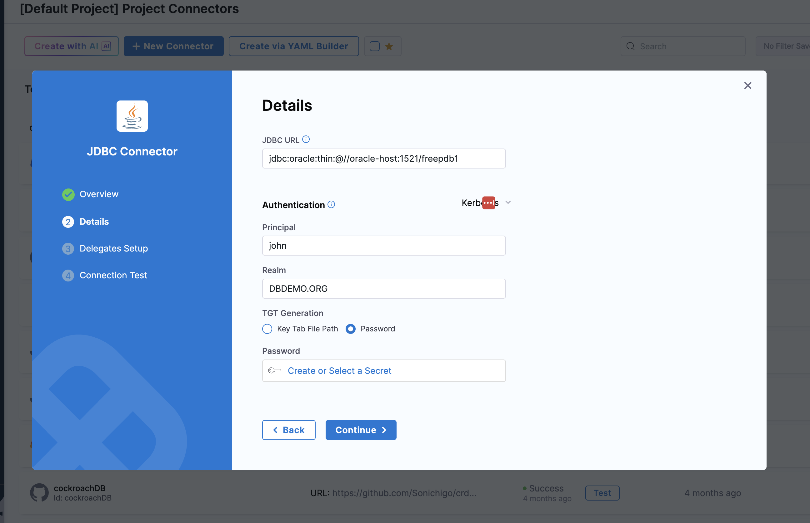
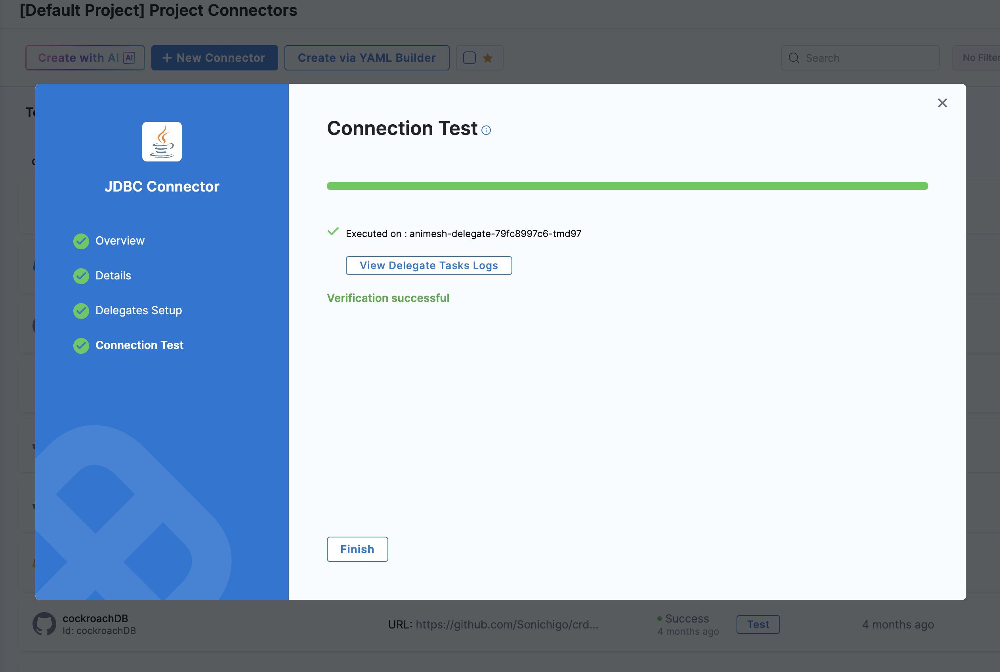

Kerberos authentication enables secure, ticket-based authentication between your Harness Delegate and database servers. This guide explains how to configure Kerberos for:
1. Microsoft SQL Server (MSSQL)
2. Oracle Database

It covers Delegate configuration, infrastructure prerequisites, JDBC properties, and connection flow.

## What is Kerberos Authentication?
Kerberos is a network authentication protocol that uses tickets to allow nodes to prove their identity securely. When you test a database connection using Kerberos, the Delegate does not send a username and password directly to the database. Instead, it uses Kerberos tickets to prove identity in a secure and standardized way.

The authentication flow happens in a predictable sequence:
1. The Delegate initializes Kerberos configuration using `krb5.conf`.
2. The `kinit` command generates a Ticket Granting Ticket (TGT) using the keytab file or password.
3. The JDBC driver uses the TGT to request a Service Ticket for the target database.
4. The database validates the Service Ticket against its registered SPN.
5. If validation succeeds, the connection is established.

This model improves security and aligns with enterprise identity systems:
- No passwords are transmitted during connection.
- Authentication is validated centrally by the KDC (Active Directory).
- Access control is enforced using standard Kerberos policies.

This approach allows you to integrate database authentication into your DevOps pipelines without compromising security or compliance requirements.

## Prerequisites
Before you begin, ensure you have the following prerequisites in place:
- A Harness account with access to the Database DevOps module.
- Network connectivity between Delegate and:
    - KDC / Active Directory
    - Database server
- Valid Kerberos principal and Keytab file.
- Correct `krb5.conf` configuration.
- Database SPN registered correctly in AD.

## 1. Configure the Delegate for Kerberos
To enable Kerberos authentication, you need to configure the Delegate with the necessary Kerberos files and settings.

Kerberos authentication is executed from the Delegate. The Delegate must:
- Resolve KDC DNS.
- Have `krb5.conf` configured.
- Have access to Keytab file.
- Execute `kinit`.

### 1. DNS Resolution (Required)
The Delegate must resolve the KDC server hostname. This can be checked by running the following command:

```shell
nslookup <KDC_HOSTNAME>
``` 

This command will attempt to resolve the KDC hostname from the Delegate container. If DNS resolution fails, ensure that the Delegate's network configuration allows access to the KDC and that the correct DNS servers are configured.

### 2. Kerberos Configuration
The Delegate needs access to the `krb5.conf` file, which contains Kerberos realm and KDC information. You can provide this file by mounting it as a volume in the Delegate's Kubernetes deployment. Add the following Kerberos startup script to the Delegate YAML under the `INIT_SCRIPT` environment variable:

```yaml
- name: INIT_SCRIPT
  value: |-
    yum install -y krb5-workstation krb5-libs || true
    truncate -s 0 /etc/krb5.conf
    cat <<EOT >> /etc/krb5.conf
    [libdefaults]
        default_realm = DBDEMO.ORG
        dns_lookup_realm = false
        rdns = false
    [realms]
      DBDEMO.ORG = {
        kdc = dc1.dbdemo.org
        admin_server = dc1.dbdemo.org
      }
    [domain_realm]
      .dbdemo.org = DBDEMO.ORG
      dbdemo.org = DBDEMO.ORG
    EOT
    <!-- Use one of the following commands based on your authentication method -->
    <!-- kinit -k -t /tmp/user.keytab kerbtest@DBDEMO.ORG --> if using Keytab file for Kerberos authentication
    <!-- echo 'password' | kinit USERNAME@KERBEROS.DOMAIN --> if using password-based Kerberos authentication
    klist
```
In above script:
- **Principal**: Enter the account name associated with the Kerberos account
- **Realm**: Enter a realm. A realm is a logical network served by a single Kerberos database and a set of Key Distribution Centers (KDCs).
- **TGT Generation**: Select one of the following options:
  - **Key Tab File**: Generates a new TGT from KDC every time you authenticate with the service. For more information, please see below
  - **Password**: Use Harness encrypted text secrets to save the password and refer to it using this option.

:::info note
Learn how to generate a Keytab file [here](https://developer.harness.io/docs/platform/secrets/add-winrm-keys/#generating-keytab-files). Ensure the Keytab file path matches the mounted location in Delegate.
:::

### 3. Mount Required Files
The Delegate needs access to the Keytab file for authentication. Under `CI_MOUNT_VOLUMES` in Delegate environment, add the following configuration to mount both `krb5.conf` and the Keytab file:

```yaml
- name: CI_MOUNT_VOLUMES
  value: "/etc/krb5.conf:/etc/krb5.conf,/tmp/user.keytab:/tmp/user.keytab"
```

:::info
`CI_MOUNT_VOLUMES` to mount certificates into build pods is needed since the JDBC Test Connection runs inside the delegate container which needs access to keytab files and `krb5.conf`.

`/etc/*:/etc/*` is the default path to mount files in Delegate which **should not be changed**, and `/tmp/*:/tmp/*` is user defined path, but make sure that the destination and source paths match.
:::

## MSSQL Kerberos Configuration
For Microsoft SQL Server, the JDBC URL must include the following properties to enable Kerberos authentication:
```shell
jdbc:sqlserver://<serviceName>.DBDEMO.ORG:1433;databaseName=master;integratedSecurity=true;authenticationScheme=JavaKerberos;encrypt=true;trustServerCertificate=true;
```
Required Properties
- `integratedSecurity=true`
- `authenticationScheme=JavaKerberos`

Ensure SPN is registered in AD (Active Directory):
```sh
MSSQLSvc/<hostname>:1433@REALM
```
## Oracle Kerberos Configuration

### Server-Side Configuration
Oracle requires additional **server-side configuration** to enable Kerberos authentication at location **`$ORACLE_HOME/network/admin`** or **`$TNS_ADMIN`**:
1. Create `sqlnet.ora` with the following content:
```shell
NAMES.DIRECTORY_PATH = (TNSNAMES, EZCONNECT, ONAMES, HOSTNAME)
SQLNET.AUTHENTICATION_SERVICES = (BEQ, KERBEROS5)
SQLNET.KERBEROS5_KEYTAB = /u01/app/kerb/final.keytab
SQLNET.KERBEROS5_CONF = /etc/krb5.conf
SQLNET.KERBEROS5_CONF_MIT = true
SQLNET.AUTHENTICATION_KERBEROS5_SERVICE = oracle
SQLNET.FALLBACK_AUTHENTICATION = TRUE
SQLNET.KERBEROS5_CLOCKSKEW = 6000
```
:::important note
Most Oracle Kerberos errors originate from incorrect `sqlnet.ora` configuration. Ensure all properties are set correctly and paths match your environment.
:::

2. Create `tnsnames.ora` with the following content:
```shell
freepdb1 =
  (DESCRIPTION =
    (ADDRESS = (PROTOCOL = TCP)(HOST = oracle-host)(PORT = 1521))
    (CONNECT_DATA =
      (SERVICE_NAME = freepdb1)
    )
  )
```

### JDBC URL for Oracle
The JDBC URL for Oracle with Kerberos authentication should be formatted as follows:
```shell
jdbc:oracle:thin:@//oracle-host:1521/freepdb1
```

## JDBC Connection Test

1. Select the "JDBC Connector" under "Project Settings" > "Connectors" in Harness.
2. When setting up your database connection in Harness, you need to specify the correct JDBC URL and properties to enable Kerberos authentication:
- Principal
- Realm
- Keytab file path (Mounted path in Delegate) / Password (if using password-based Kerberos). 


3. Select the Delegate that has been configured for Kerberos authentication and test the connection. If everything is configured correctly, you should see a successful connection message.

