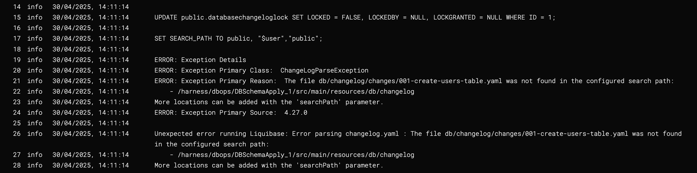
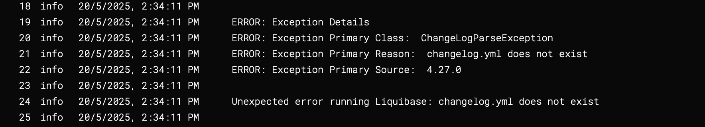
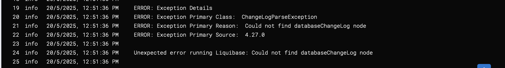
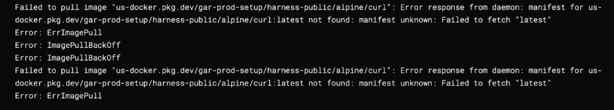
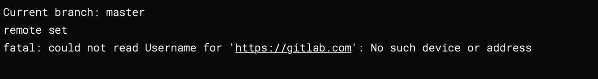

import Tabs from '@theme/Tabs';
import TabItem from '@theme/TabItem';

This guide outlines common issues encountered while using Harness Database DevOps and their corresponding solutions.


## 1. searchPath Parameter Issue
 
When working with a changelog file that includes other changelog files, Liquibase might throw an error due to improper handling of file paths. This can occur when the "file" path is not set correctly: 

**Error Message**:



**Example usage in a master changelog:**
```yaml
## db/changelog/changelog.yaml
databaseChangeLog:
  - include:
      file: db/changelog/changes/001-create-users-table.yaml
  - include:
      file: db/changelog/changes/002-add-sample-data.yaml
```

**How to Solve**:

The `searchPath` parameter is used to specify the schema search order for database objects. If the changelog file includes other changelogs, ensure that the paths are correctly specified relative to location of the master changelog file, which is considered the master file. 

For example, if the master changelog is located in `db/changelog/master.yaml`, the path to the included changelogs should be relative to that file. Correct example:

```yaml
## db/changelog/changelog.yaml
databaseChangeLog:
  - include:
      file: changes/001-create-users-table.yaml
  - include:
      file: changes/002-add-sample-data.yaml
```
This way, Liquibase can correctly resolve the paths to the included changelogs, and the error should be resolved.

:::info important note
Liquibase uses the full path to the changelog file as part of the identifier of unique change ids. If your changelog has already been applied to an existing database, and your changelog path needs to change, you can add a change of type ''- logicalFilePath: example-changelog.yaml' to specify the path to the changelog that should be used for uniquely identifying change IDs.
:::

## 2. changelog.yaml does not exist

Liquibase throws this error when it cannot find the changelog file. This can occur when the path is incorrect or the file is missing.

**Error Message**:



**How to Solve**:
- Verify that the changelog file exists at the specified location.
- Ensure the filename and path in your configuration exactly match the file in your repository or working directory.
- Cross-check for typos or incorrect directory structures.

## 3. Could not find databaseChangeLog node

This error comes up when Harness DB DevOps cannot find the `databaseChangeLog` node in the changelog file. This can occur if the file is not formatted correctly or is missing the required node. This issue typically surfaces when the changelog file contains unexpected content. 

:::info
Most common occurence of this issue will be while setting up DB Schema with a custom script.
:::
**Error Message**:



**Example** for such a incorrect custom script:

```sh
if [ ! -d "db" ]; then
  mkdir db
  curl https://api.github.com/repos/Sonichigo/mux-sql/main/liquibase.yml -o db/changelog.yml
fi
```

Above we have an invalid API call to fetch the changelog file, which resulted in an error response, which was mistakenly written to the changelog output file. As a result, instead of a valid changelog XML or YAML, the file contained an error log or HTML/JSON response and when the system attempted to run `Preview & Validate SQL`, it failed due to the absence of the required `databaseChangeLog` node.

**How to Solve**:

Ensure while fetching the changelog file, you are calling the correct API endpoint and the response is in the expected format. You can also check the contents of the changelog file to ensure it contains the correct `databaseChangeLog` node, after the API call. 

**Example** for a correct custom script:
```sh
if [ ! -d "db" ]; then
  mkdir db
  curl -H 'Accept: application/vnd.github.v3.raw' -L https://api.github.com/repos/Sonichigo/mux-sql/contents/liquibase.yml?ref=main -o db/changelog.yml
fi
```

## 4.  ImagePullError of alpine/curl:latest

This error is generally limited to Custom Script steps. 

When using the Custom Script step to set up a DB schema in a pipeline with the default image registry (Harness Docker Registry), you may encounter an `ImagePullError` for the `alpine/curl:latest` image. This happens as the image available in the specified default image registry contains only related to Harness Platform.

However, you may also encounter the `ImagePullError` in other steps if your configured image repository does not contain the required out-of-the-box Drone images (e.g., alpine/curl, plugins/git, etc.). In such cases, these base images must be manually added to your image registry.

**Error Message**:



**How to Solve**:

Ensure you are using the correct container registry for your environment. Follow the official [Harness documentation](https://developer.harness.io/docs/platform/connectors/cloud-providers/ref-cloud-providers/docker-registry-connector-settings-reference/) to configure this custom image Registry. Make sure that in the new registry Connector, the `alpine/curl:latest` image is available.

## 5. Authentication Error: could not read Username

While adding a remote repository and pushing changes in a pipeline or shell environment, you may encounter an authentication error. This typically occurs when the credentials for the remote repository are not set up in a specified manner.

**Error Message**:



**How to Solve**:

Use a properly formatted Git URL that includes:

- The email address (URL encoded) as the username.
- A secret-based Personal Access Token (PAT) for secure authentication.

**Example** for a properly formatted URL:
```sh
git remote add origin https://my.email%40gmail.com:<+secrets.getValue("PAT_TOKEN")>@gitlab.com/<John_Doe>/changelog.git
git push -u origin main
```
:::info note
- Replace `my.email@gmail.com` with your Git account email (URL-encoded as %40 for @).
- Replace `PAT_TOKEN` with the name of the Harness secret containing your GitLab PAT.
- Make sure the secret is securely stored in Harness under **Project Settings → Secrets**.
:::

## 6. If I execute a dropTable or dropColumn and a rollback is triggered, will the data also be recovered? Or is only the schema structure restored?
When a dropTable or dropColumn operation is executed and subsequently rolled back, only the schema structure can potentially be recreated—the original data will not be restored. While it is technically possible to instruct the rollback to recreate the table or column definition, the associated data is permanently lost unless a backup was taken beforehand.

In scenarios involving destructive operations like DROP, the rollback cannot magically recover deleted data. The only viable recovery strategy would be to restore from a database backup taken prior to the drop operation—which still results in some level of data loss and operational risk.

:::note warning
Dropping tables or columns in production environments should be treated with extreme caution. It is highly recommended to adopt a backup-first approach and validate rollback strategies before applying such changes.
:::

## 7.  I encountered an error during rollback. What does it mean and how can I fix it?

This error occurs in PostgreSQL when replication is enabled, and the databasechangelog table (created by Liquibase) has no primary key or replica identity. PostgreSQL requires a replica identity to process DELETE operations during rollback.

**Error Message**: `ERROR: cannot delete from table "databasechangelog" because it does not have a replica identity and publishes deletes.`

**How to Solve**:

Run the following SQL to allow deletes even without a primary key:

```sql
ALTER TABLE databasechangelog REPLICA IDENTITY FULL;
```
This tells PostgreSQL to use the full row for replication tracking. We're planning to update DB DevOps to add a primary key to this table automatically in future versions.

:::important note
Apply the workaround only if your environment uses logical replication and encounters this error. In non-replicated environments, this issue typically does not occur
:::

**Long-Term Fix (Planned):**

We plan to update Harness DB DevOps to include a primary key on the databasechangelog table upon creation to ensure better compatibility with replication-enabled PostgreSQL environments. Until then, applying the above workaround will unblock affected users.

## 8. Why do I see the error: "The DB Instance connector cannot be an expression"?
This is expected behavior in Database DevOps Module. Unlike other CD modules in Harness where connectors can be passed as expressions, `DB Instances` require fixed connectors.
This is by design—features like drift detection depend on resolving the database schema, instance, and connector outside of pipeline execution. To support such functionality, the connector must be fully defined and cannot be referenced as a runtime or expression value.

:::note
Use a fixed connector when defining your DB Instance in order to enable full DB DevOps capabilities.
:::

## 9. From which release version is extra memory required 

Starting with using drone-liquibase version or latest image version i.e. 1.9.0, enhanced memory allocation was introduced increased memory utilization during changelog parsing and SQL generation.
As a result, the recommended memory allocation for the Database DevOps service increased from 200 MB to 500 MB to ensure stable performance and avoid unexpected OOM (Out of Memory) events.

:::note
If you are upgrading from any version prior to 1.9.0, ensure your deployment configuration reflects the updated 500 MB memory requirement.
:::

## 10. Why am I seeing a lock even though the database team confirmed no database-level locks?
In many scenarios, the “lock” you encounter is not a database engine–level lock but a Liquibase changelog lock. Liquibase uses an internal DATABASECHANGELOGLOCK table to coordinate concurrent change executions. If a pipeline fails, times out, or terminates unexpectedly, the lock may remain active—even when the underlying database shows no locks.

This residual lock prevents subsequent runs from proceeding until the lock is manually released.

**How to Identify Liquibase Locks:**
Liquibase stores the lock state in the DATABASECHANGELOGLOCK table. If the LOCKED column is true, Liquibase considers the schema locked.

**How to Solve:**
Use the liquibase step to run the Liquibase command:
```sh
release-locks
```

This clears any stale Liquibase-level locks and restores normal pipeline execution.

## 11. Why is kinit failing with “Client not found in Kerberos database”?
The principal does not exist in the realm, or the realm name is incorrect (case-sensitive).

**How to Solve**:
- Verify the principal exists in the KDC/Active Directory.
- Verify the principal format: `user@REALM`
- Ensure the realm is uppercase (e.g., DBDEMO.ORG)
- Regenerate the keytab if necessary

## 12. Why is the connection failing even though kinit works?
`kinit` only proves that the principal is valid. The database connection requires a properly registered SPN.

**How to Solve**:
- Verify SPN registration in AD
  - MSSQL format: `MSSQLSvc/hostname:1433@REALM`
  - Oracle format: `oracle/hostname@REALM`
- Ensure the hostname in the JDBC URL matches the SPN
- Avoid using IP addresses in JDBC URLs

## 13. Why do I see “Clock skew too great” errors?
This error occurs when there is a significant time difference between the client machine (where kinit is run) and the KDC/AD server. Kerberos requires synchronized time for ticket validation.

## 14. Why does the Delegate fail to resolve the KDC server?
This can occur if the Delegate's DNS configuration cannot resolve the KDC hostname specified in krb5.conf.

**How to Solve**:
- Validate resolution using: `nslookup dc1.dbdemo.org`
- Ensure the Delegate has proper DNS settings to resolve the KDC hostname.

## 15. Why am I getting “No Kerberos credentials available” when running the pipeline?
This error indicates that the Kerberos credentials obtained via `kinit` are not accessible to the pipeline execution environment. The TGT was not generated, expired, or is not accessible to the JVM process.

**How to Solve**:
Ensure the keytab is mounted at the correct path and the path is correctly referenced in the Delegate YAML configuration. Then restart the Delegate to pick up the new credentials. Also, confirm that the environment variables for Kerberos are set correctly in the Delegate configuration.

## 16. Why does Oracle Kerberos authentication fail but MSSQL works?
Oracle has additional **server-side requirements** for Kerberos authentication, such as correct `sqlnet.ora` configuration and correct keytab usage. Whereas, MSSQL is often more straightforward to set up for Kerberos.

## 17. Why does the connection work locally but fail in Harness?
This is often due to differences in the environment where `kinit` is executed and where the pipeline runs. The local environment may have access to Kerberos credentials, while the pipeline environment does not.

**How to Solve**:
- Compare `krb5.conf` files
- Confirm mounted keytab path inside Delegate container
- Validate environment variables in Delegate YAML
- Ensure network policies allow traffic to KDC and database

## 18. Why am I getting “ORA-12514: TNS:listener does not currently know of service requested in connect descriptor” when using Kerberos with Oracle?
This error indicates that the Oracle listener does not recognize the service name specified in the JDBC URL.

**How to Solve**:
Either incorrect service name is specified in the JDBC URL or the Oracle listener is configured to listen on the correct port. Verify the service name in the JDBC URL matches the one registered with the Oracle listener. Also, ensure the listener is running and configured to accept connections for that service.

## 19. What encryption type does Oracle require when using addent to generate a Kerberos keytab entry?
Oracle requires `aes256-cts-hmac-sha1-96` and `aes128-cts-hmac-sha1-96` as the encryption type for modern oracle versions. Older version of Oracle also support `rc4-hmac` encryption type, but Oracle has deprecated this encryption type in modern versions due to RC4's known cryptographic weaknesses. 
