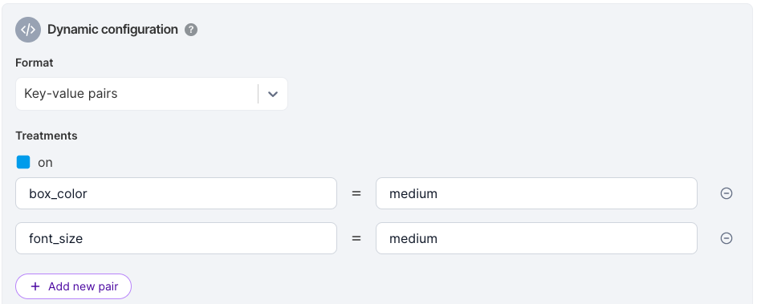
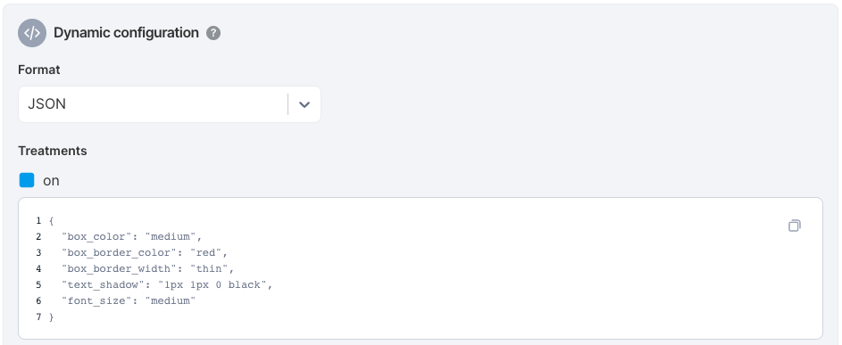

## Overview

You can attach configurations to any of your treatments on a feature flag's **Definition** tab to dynamically control components of your features, such as:

* Color, size and other visual components of your application
* The copy or text in different areas of your application
* Backend configurations such as weights set for search algorithms
* Number of retries and time until timeouts to handle failed connections
* Pagination limits for an API return
* Throughput, number of threads for performance thresholds

You can edit configurations for your treatments using the following methods:

* Key-value pairs for simpler configurations
* JSON format if you have a more advanced use case with a need for nested objects

These configurations give you the ability to make modifications to your features quickly so you can experiment with different variations of a feature with your customers without a code change.

To set up dynamic configuration, do the following:

1. From the left navigation, select **Feature flags**, then select a feature flag. The Definition tab appears.
2. In the **Dynamic configuration** area, select either the Key-value pairs or JSON format and fill out the following fields:

  * Key-value pairs
  * JSON

**For Key-value pairs**

If you select **Key-value pairs** as your format, attach one or more configurations to each of your treatments as follows:

1. In the Enter a key field, enter the keys that you want your code to check for (e.g., color, font size, message copy). You can add more keys as desired.
2. In the Enter a value field,  enter the values for each of your keys. (e.g., green, size 16, Buy now!).
3. To add key-value pairs for each treatment, click **Add new pair** for each treatment to attach as many key-value pairs as necessary for each of your treatments. To remove a key-value, click the minus button.

    :::important[Note]
    All keys and values are interpreted as strings when configurations are saved in this format (e.g., 5 is stringified and sent as 5) so your code needs to convert from that format at runtime.
    :::

**For JSON**

Select JSON as your format to get a JSON editor for each of your treatments as follows:

1. In the JSON editor, enter valid JSON into the editor. Basic JSONlinting is done and nested JSON objects are permitted.
2. Click to expand or collapse when editing if you have a large JSON object entered as a configuration.

The Harness FME platform stringifies the entered JSON and provides it as a string to each of our SDKs when downloading feature flag plans.

## SDK usage and programmatic configuration updates

To find out how to use the configurationsin your code, look through the documentation for the language for your project:
* Android [docs](/docs/feature-management-experimentation/sdks-and-infrastructure/client-side-sdks/android-sdk#get-treatments-with-configurations) 
* Go [docs](/docs/feature-management-experimentation/sdks-and-infrastructure/server-side-sdks/go-sdk#get-treatments-with-configurations) 
* iOS [docs](/docs/feature-management-experimentation/sdks-and-infrastructure/client-side-sdks/ios-sdk#get-treatments-with-configurations)
* Java [docs](/docs/feature-management-experimentation/sdks-and-infrastructure/server-side-sdks/java-sdk#get-treatments-with-configurations)
* JavaScript [docs](/docs/feature-management-experimentation/sdks-and-infrastructure/client-side-sdks/javascript-sdk#get-treatments-with-configurations)
* .NET [docs](/docs/feature-management-experimentation/sdks-and-infrastructure/server-side-sdks/net-sdk#get-treatments-with-configurations)
* Node.js [docs](/docs/feature-management-experimentation/sdks-and-infrastructure/server-side-sdks/nodejs-sdk#get-treatments-with-configurations)
* PHP [docs](/docs/feature-management-experimentation/sdks-and-infrastructure/server-side-sdks/php-sdk#get-treatments-with-configurations)
* Python [docs](/docs/feature-management-experimentation/sdks-and-infrastructure/server-side-sdks/python-sdk#get-treatments-with-configurations)
* Ruby [docs](/docs/feature-management-experimentation/sdks-and-infrastructure/server-side-sdks/ruby-sdk#get-treatments-with-configurations) 

All the configurations that are configurable in our user interface are also editable using our Admin APIs. Refer to examples on how to include configurations in changes to roll out plans [in our APIs](https://docs.split.io/v2/reference#create-split-definition-in-environment).

## Data validation and switching formats

FME validates that the entered configs are valid JSON and won’t allow you to save until you have entered valid JSON.

Additionally, you can switch between key-value and JSON editing when configuring your plan. However, if moving from JSON to Key-value pairs, make sure all keys and values in the JSON object are strings. Nested objects, arrays, numbers, or booleans aren’t accepted and the application prevents you from switching.

## Configuration size limit

To make sure configurations are not too large, the configurations for each feature flag are limited at 1KB in size. If you need a larger set of configurations, contact support@split.io.

## Troubleshooting

### Dynamic configuration section does not show up

When clicking on any feature flag, the Dynamic configuration section does not show up, even though other users see the section from their browser.

This issue is typically caused by the Split UI loading an outdated cached version of the page from before dynamic configuration was available.

Clear your browser cache to force the UI to load the latest content. To confirm, open an Incognito window and log in to `app.split.io`. If the dynamic config section appears there, clearing your cache will fix the issue.

For example, in Google Chrome:

1. Go to **Settings** → **Privacy and security** → **Clear browsing data**.
1. Select **Cookies and other site data**.
1. Click **Clear data**.