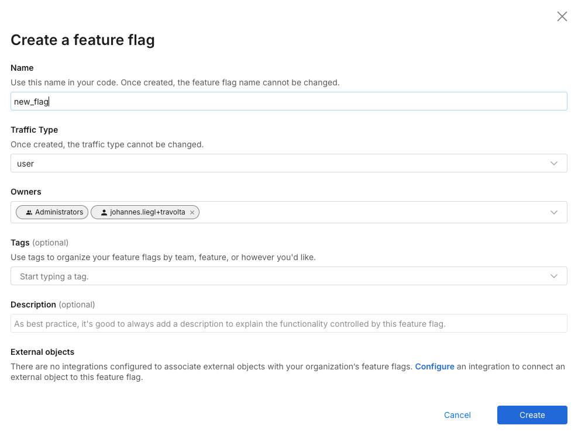
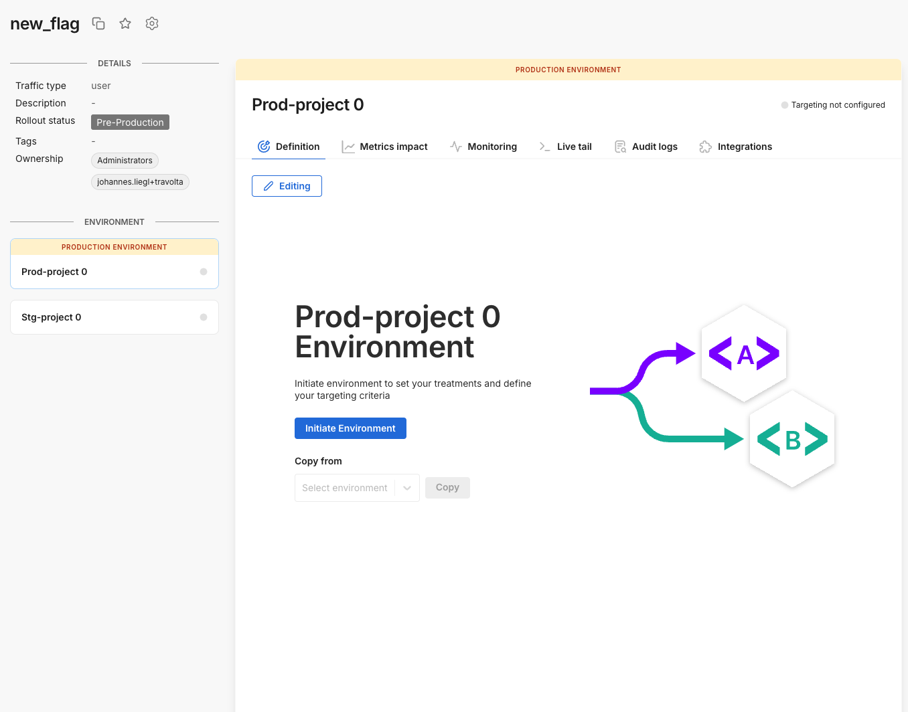
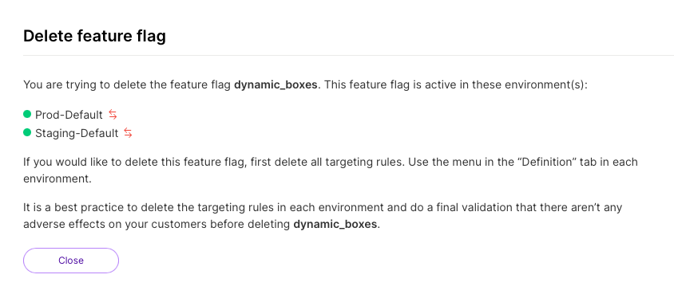

## Overview

To create a feature flag, do the following:

1. From the left navigation, click **Feature flags**. The feature flag list view appears.

2. Click the **Create feature flag** button to create a new feature flag.

    

3. Enter the following information for your new feature flag to help you and your team manage your feature flags and customize them to your team's workflow:

    * **Name.** Enter a name your team can recognize. Feature flag names must start with a letter and can contain the characters - _ a-z A-Z 0-9.  They can't be named *datetime*, *string*, *set*, or *integer* because those are reserved words.
    * **Traffic type.** Select a [traffic type](/docs/feature-management-experimentation/management-and-administration/fme-settings/traffic-types/) you want to use this feature flag for. A traffic type indicates the type of key you use to split your traffic, for example, user, account, store, etc.
      :::important[Note]
      Once a feature flag is created with specific traffic types, you cannot change the traffic type or name. This is done so the experiment data is not mixed from different traffic types, which could contaminate the results. To use a different traffic type, create a new feature flag with the desired traffic type.
      :::

    * **Owners.** By default, a user creating a feature flag is an owner along with the Admin group. You can add more users or groups as owners for your feature flag. Use owners to organize a feature flag to those *owned by me* for filtering and notification purposes, and to grant edit permissions in environments that [restrict who can edit](/docs/feature-management-experimentation/management-and-administration/fme-settings/permissions).
    * **Tags.** Optionally add one or more [tags](/docs/feature-management-experimentation/management-and-administration/tags) to categorize a feature flag or associate it with a particular team, feature release, area of your product, or other internal structure. Tags are useful for filtering lists and rollout boards. Be aware that tags are case sensitive.
    * **Description.** Optionally provide a description of a feature flag. The description explains the flag’s purpose and what functionality is controlled. If the flag being used for an experiment, use this to provide information about the experiment objective.
    * **External objects.** Optionally associate a feature flag with one or more external objects, if a compatible integration is configured. Examples of integrations include [Jira](/docs/feature-management-experimentation/integrations/jira-cloud) and [Azure DevOps](/docs/feature-management-experimentation/integrations/azure-devops).

4. Click the **Create feature flag** button to create your feature flag. Your new flag is displayed. 

    

1. To configure your feature flag for a particular environment, select the environment on the left panel, and click the Initiative environment button within the Definition tab. 

## Create a rollout plan

After you have created your feature flag, you can [define treatments and set targeting rules](/docs/feature-management-experimentation/feature-management/setup/define-feature-flag-treatments-and-targeting) for your feature flag. This is also known as creating a rollout plan.

:::info
When you set up an account, two environments are automatically created. For more information, see [Environments](/docs/feature-management-experimentation/management-and-administration/fme-settings/environments).
:::

## Delete a feature flag

To delete a feature flag, you first need to delete all targeting rules for that flag within all environments. 

To delete a feature flag, do the following:

1. Select the feature flag you want to delete.
1. Access the desired environment and click the **Ellipses** icon next to the **KILL** button and click **Delete targeting rules**. The Delete rules page appears.
1. Type `DELETE` in the warning page field and then, in the **Add approvers** fields, optionally start typing users or groups. If you don’t add approvers, the feature flag is deleted immediately. 
1. Click the **Delete** button. If you haven’t selected approvers, the targeting rules are deleted.
1. Repeat the same action for all environments that the feature flag is added to. 
1. Once you delete definitions, delete the feature flag by clicking the **Gear** icon adjacent to the flag name.

## Troubleshooting

### I created a feature flag but can’t add targeting rules

If you're unable to edit a newly created feature flag (for example, adding or modifying targeting rules), it’s likely due to restricted editing permissions configured at the environment level. In many workspaces, environments are locked down by default, so editing rights must be manually granted after a flag is created.

To avoid this issue, your workspace administrator might consider one of the following options:

* Create a sandbox environment: Set up an environment where anyone can create and edit feature flags. Once finalized, a teammate with edit rights in a restricted environment can promote the flag.

* Use approvals: The approvals feature allows users to make edits in restricted environments, while still requiring an approver to publish those changes. This ensures oversight without blocking iteration.

  Approvals can work in two ways:

  * Users request a peer to review and approve changes before publishing.
  * Admins assign a group of authorized approvers (often the same users with default edit rights).

### Cannot delete feature flag from UI even after deleting the targeting rules

When trying to delete a feature flag that exists in multiple Environments, an error message appears preventing deletion—even after deleting all the custom targeting rules.

The error refers to all feature flag definitions within each environment, including Treatments, Individual targets, Dynamic Configurations, Default Rules, and Custom Targeting Rules.

1. In each environment where the flag is present, click the second (...) icon near the top right corner and select **Delete targeting rules**.
1. Repeat this step for **all environments** where the feature flag exists.
1. After all targeting rules and definitions are removed from every environment, you should be able to successfully delete the feature flag from the UI.

### Can feature flags move between workspaces?

There is no supported way to migrate existing feature flags from one workspace to another. This limitation exists because environments, API keys, segments, and traffic types are all scoped to a single workspace. 

To cut over a feature flag from one workspace to another, you would also need to recreate or copy any segments used by that flag. You may also want to ensure the traffic type is consistent, although this isn’t strictly required.

If you choose to manually recreate the flag in a new workspace, here’s what that process typically looks like:

* Leave the original feature flag in place while it continues receiving traffic.

* Recreate the feature flag in the new workspace.

* Update the API key in your code to use the key from the new workspace.

* Once traffic is flowing to the new workspace, remove the old flag from the original workspace.

:::info
If your feature flag uses random percentage-based targeting, user bucketing will change when the flag is recreated in the new workspace.
:::

Rather than migrating flags, Harness recommends setting up workspaces in advance and having teams use their designated workspace for all net-new releases. 

Existing feature flags should remain in the current (often “Default”) workspace until they are fully removed from code. This strategy avoids disruption and allows teams to incrementally adopt their own workspaces without impacting production traffic.