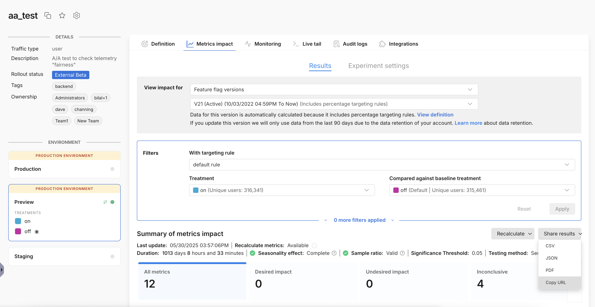
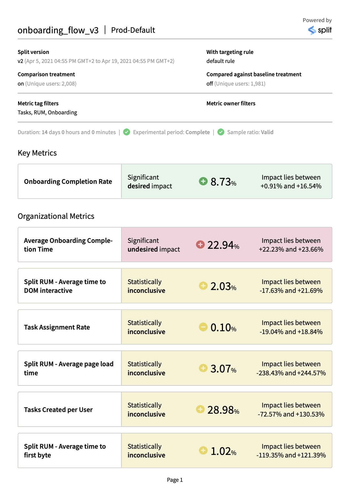
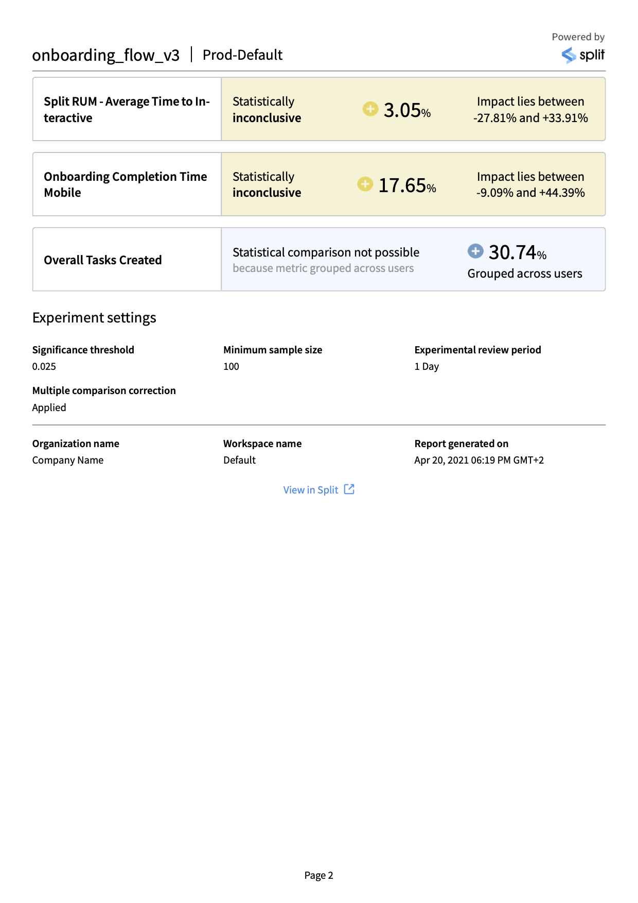
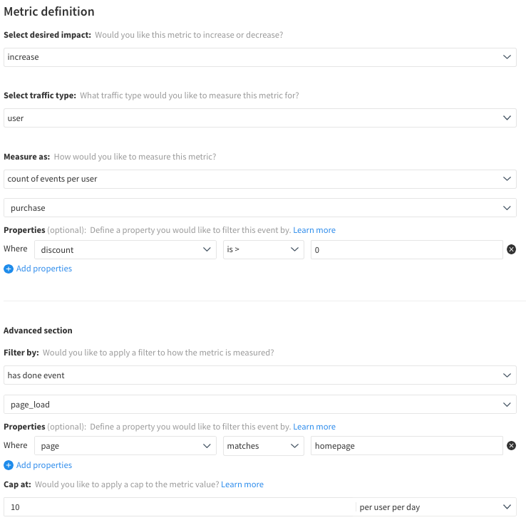

## Overview

The share results functionality allows you to download a copy of your metrics impact results in various formats or share via URL. This enables you to:

* Share the outcome of your experiments with colleagues without them needing to visit Split
* Keep a record of experiment outcomes in your preferred documentation formats or applications
* Conduct further manual analysis or visualizations as desired
* Import the metric results into your own internal systems
* View results in a tabular format

## Sharing results

When viewing the Metrics impact tab, under Results, you can find the **Share results** dropdown on the right side of the page, above the metric cards.


To generate the results, simply click on **Share results** to view the dropdown of format options. Click on your chosen format and your browser will begin downloading the file. A green pop up will appear on the page when the file has finished downloading. 

Clicking on **Copy URL** will copy a URL link to your current view in the Split app to your clipboard and will not download any file.



:::info
* The results reflect the version, rule, and treatments selected in the filter box above, including any metric tag or metric owner filters applied.
* Share results is not currently supported when using [custom dates](/docs/feature-management-experimentation/experimentation/metrics/setup/filtering#selecting-custom-dates).
:::

### Available formats

You can generate a report containing your metrics impact results in the below formats:

* CSV: This format contains the observed metric data and the results of the statistical analyses. The report contains one row per metric and is intended to be human readable as well as appropriate for further manual analyses or reporting.
  
  You can find reference documentation for the fields contained in the CSV reports here.

* JSON: This format contains the observed metric data, the results of the statistical analyses, as well as the statistical settings and metric definitions at the time of analysis. This format is intended for ingesting data into other tools and databases.
  
  You can find reference documentation for the fields contained in the JSON reports here.

* PDF: This format presents a visual representation of your metrics impact results, similar to the Split UI. This format is ideal for sharing results with stakeholders and for quickly understanding the high level outcomes of your tests.
  
  An example PDF report is shown below.

  
  

* Copy URL: This copies a URL link to your current view in the Split app to your clipboard.

## Reference for fields in the CSV results

There is one row per metric, containing details of the observed data, the results of the statistical analyses and the metadata describing the test.

| Field | Type | Description |
|:---:|:---:|:---:|
| Metric | string | The metric name |
| Result | string | The summary of the metric result at the time of report generation |
| Impact | float | The measured relative impact of the comparison treatment compared to the baseline treatment, as a fraction of the baseline treatment |
| Impact lies above | float | The lower bound of the confidence interval on the impact |
| Impact lies below | float | The upper bound of the confidence interval on the impact |
| Baseline metric value | float | The measured value of the metric for the baseline treatment. For percentage metrics. i.e. percent of unique users, this value is expressed as a fraction |
| Comparison metric value | float | The measured value of the metric for the comparison treatment. For percentage metrics. i.e. percent of unique users, this value is expressed as a fraction |
| Comparison metric lies above | float | The lower bound of the confidence interval on the comparison metric value |
| Comparison metric lies below | float | The upper bound of the confidence interval on the comparison metric value |
| Baseline metric lies above | float | The lower bound of the confidence interval on the baseline metric value |
| Baseline metric lies below | float | The upper bound of the confidence interval on the baseline metric value |
| pValue | float | The p-Value for this metric. If multiple comparison corrections have been applied this will already have been adjusted for to control for the false discovery rate |
| Baseline sample size | int | Number of unique samples for the baseline treatment in the dataset used to generate this report |
| Comparison sample size | int | The number of unique samples for the comparison treatment in the dataset used to generate this report |
| Sample Ratio | string | The result of the sample ratio mismatch calculation. If this is “Mismatch” there is a sample ratio mismatch and results should not be trusted. See [here](https://help.split.io/hc/en-us/articles/360020636472-Sample-ratio-check) for more details. |
| Baseline treatment | string | The baseline treatment for the statistical analysis in this report, if there is one |
| Comparison treatment | string | Comparison treatment for the statistical analysis in this report |
| Key metric | boolean | Boolean representing whether this metric was a Key metric for this test |
| Split | string | The feature flag name |
| Environment | string | The name of the Split environment in this report |
| Version | int | The feature flag version number in this report |
| Rule | string | Name of the rule which this report contains data for |
| Comparison target rollout percentage | float | The target percentage of comparison treatment samples compared to the sum of comparison and baseline samples, expressed in a decimal form. For example, for a 50% : 50% rollout, the targeted rollout percentage would be 0.5 |
| Version start time | datetime | Date and time the version started (local time zone) |
| Version end time | datetime | Date and time the version ended (local time zone), if it has. This will be null for versions which are still active at the time of report generation. |
| Experiment duration | datetime | For versions which have already ended, the length of time for which the version was active, in days. |
| Last calculation time | datetime | Date and time the results were last updated (local time zone). Hence the results in the report are based on data received by Split between Version start time and this Last calculation time. If a calculation has not yet run this field will be equal to the Version start time. |
| Duration of data collection | float | Period of time over which the data used to generate this report was collected, in days. Note that this may be shorter than the Experiment duration if the results had not been recently calculated when the report was generated. |
| Review period state | string | The review period state. COMPLETE_BEFORE : The test was ended before a full review period COMPLETE : The test was ended after a full review period INACTIVE_BEFORE : The test is still active, but the report does not contain data for a full review period ACTIVE : The test is active and the report contains data for full review period(s) INACTIVE_BETWEEN : The test is still active and has run for at least one full review period, but the report was generated between review periods If the review period is not “ACTIVE” or “COMPLETE”, interpret your results with caution as they may not be representative of your entire customer base. |
| Metric tag filters applied | array | Any metric tags filters used to filter down the metrics in this report |
| Metric owner filters applied | array | Any metric owner filters used to filter down the metrics in this report |
| Experiment significance threshold | float | The significance threshold used for the statistical analyses in this report, as specified by the experiment settings at the time of report generation |
| Minimum sample size | int | Minimum sample size required in each treatment before statistical comparisons are run for a metric. Specified by the experiment settings at the time of report generation |
| Multiple comparison correction | boolean | A boolean reflecting whether multiple comparison corrections were applied to the statistical analyses in this report. Specified by the experiment settings at the time of report generation |
| Experimental review period | int | The experimental review period, as specified by the experiment settings at the time of report generation |
| Metric spread | string | ACROSS : Metric is measured across the whole sample and statistical comparisons are not possible PER : Metric is measured per unique key e.g. per user |
| Metric aggregation | string | TOTAL : Metric is a sum of values COUNT : Metric is a count of values RATE : Metric measures the percent of the sample who have done the event AVERAGE : Metric is an average of values NONE : Metric definition unknown |
| Metric ID | string | ACROSS : Metric is measured across the whole sample and statistical comparisons are not possible PER : Metric is measured per unique key e.g. per user |
| Traffic type | string | Traffic type |
| Workspace | string | The name of the Split project that contains the feature flag |
| Report generated on | datetime | The date and time the report was generated (local timezone) |
| URL | string | A link to view these results in the Split UI |

## Reference for fields in the JSON results 

The top level JSON fields contain metadata for the report, The metrics section contains an array for each metric in the report, each containing the data describing the measurements and results of the statistical analyses for this metric. 

Inside each metric is a `metricDefinition` array containing fields which describe the definition of the metric at the time the report was downloaded.

For metadata:

| Field | Type | Description |
|:---:|:---:|:---:|
| organizationName | string | The name of the Split account that contains the feature flag |
| split | string | The feature flag name |
| splitDescription | string | The feature flag description |
| SplitVersionNumber | int | The feature flag version in this report |
| versionStartTime | int | The time when the version started (unix milliseconds) |
| versionEndTime | int | The time when the version ended (unix milliseconds), if it has ended. This will be null for versions which are still active at the time of report generation. |
| lastUpdateTime | int | The time the results were last updated (unix milliseconds). Hence the results in the report are based on data received by Split between versionStartTime and lastUpdateTime. |
| versionDurationAtLastUpdateInMs | int | Duration of data collection, in milliseconds. |
| versionDurationAtLastUpdate | float | Duration of data collection, in days. |
| experimentDuration | int | For versions which have already ended, the length of time for which the version was active, in milliseconds. |
| environmentName | string | The name of the Split environment |
| workspaceName | string | The name of the Split project |
| trafficTypeName | string | The traffic type |
| baselineTreatment | string | The baseline treatment for the statistical analysis in this report, if there is one |
| comparisonTreatment | string | The comparison treatment for the statistical analysis in this report |
| ruleName | string | Name of the feature flag targeting rule |
| sampleSizeOfBaseline | int | The number of unique samples for the baseline treatment in the dataset used to generate this report |
| sampleSizeOfComparison | int | The number of unique samples for the comparison treatment in the dataset used to generate this report |
| minimumSampleSize | int | The minimum sample size required in each feature flag treatment before statistical comparisons are run for a metric. This value is specified by the experiment settings at the time of report generation |
| filterTags | array of strings | Any metric tags filters used to filter down the metrics in this report |
| filterOwners | array of strings | Any metric owner filters used to filter down the metrics in this report |
| srmPValue | float | The p-value output of the sample ratio mismatch calculation |
| significanceThreshold | float | The significance threshold used for the statistical analyses in this report, as specified by the experiment settings at the time of report generation |
| mcc | boolean | A boolean reflecting whether multiple comparison corrections were applied to the statistical analyses in this report. This value is specified by the experiment settings at the time of report generation |
| experimentalReviewPeriodState | string | The review period state. COMPLETE_BEFORE : The test was ended before a full review period COMPLETE : The test was ended after a full review period INACTIVE_BEFORE : The test is still active, but the report does not contain data for a full review period ACTIVE : The test is active and the report contains data for full review period(s) INACTIVE_BETWEEN : The test is still active and has run for at least one full review period, but the report was generated between review periods If the review period is not “ACTIVE” or “COMPLETE”, interpret your results with caution as they may not be representative of your entire customer base. |
| targetedRatio | float | The target fraction, of the sum of unique samples in the two selected treatments, who receive the comparison treatment. For example, for a 50% : 50% rollout, the targetedRatio would be 0.5 |
| currentRatio | float | The actual fraction of all unique samples who received the comparison treatment |
| splitLink | string | A link to view these results in the Split UI |
| sampleRatio | string | The result of the sample ratio mismatch calculation. If this is “Mismatch” there is a sample ratio mismatch and results should not be trusted. See [here](https://help.split.io/hc/en-us/articles/360020636472-Sample-ratio-check) for more details. |
| experimentalReviewPeriod | int | The experimental review period configured for this test, as specified by the experiment settings at the time of report generation |
| reportGenerationTime | int | The time when the report was generated (unix milliseconds) |
| metricsTotal | int | The total number of metrics in the report |
| metricsWithDesiredImpact | int | The number of metrics in the report with a statistically significant desired impact |
| metricsWithUndesiredImpact | int | The number of metrics in the report with a statistically significant undesired impact |
| metricsWithInconclusiveImpact | int | The number of metrics in the report with a statistically inconclusive impact |
| metricsThatNeedMoreData | int | The number of metrics in the report which need more data before a statistical comparison can be run |
| metricsWithComparisonNotPossible | int | The number of metrics in the report for which a statistical comparison was not possible |
| metricsUnavailable | int | The number of metrics in the report for which data is unavailable |
| metrics | Array | An array containing the measured data and the results of the statistical comparisons for each metric. See below. |

For metrics:

| Field | Type | Description |
|:---:|:---:|:---:|
| id | int | Unique identifier for the metric |
| name | string | The metric name |
| stateSummary | string | Summary of the metric result at the time of report generation |
| stateDetailed | string | More granular categorization of the metric result at the time of report generation |
| impact | float | The measured relative impact of the comparison treatment compared to the baseline treatment, as a fraction of the baseline treatment |
| impactLower | float | The lower bound of the confidence interval on the impact |
| impactUpper | float | The upper bound of the confidence interval on the impact |
| baselineMetricUpper | float | The upper bound of the confidence interval on the baseline metric value |
| baselineMetricLower | float | The lower bound of the confidence interval on the baseline metric value |
| comparisonMetricUpper | float | The upper bound of the confidence interval on the comparison metric value |
| comparisonMetricLower | float | The lower bound of the confidence interval on the comparison metric value |
| sampleSizeBaseLine | int | The number of unique samples contributing to the metric result for the baseline treatment |
| sampleSizeComparison | int | The number of unique samples contributing to the metric result for the comparison treatment |
| baselineMetricValue | float | The measured value of the metric for the baseline treatment. For percentage metrics. i.e. percent of unique users, this value is expressed as a fraction |
| comparisonMetricValue | float | The measured value of the metric for the comparison treatment. For percentage metrics. i.e. percent of unique users, this value is expressed as a fraction |
| pValue | float | The p-Value for this metric. If multiple comparison corrections have been applied this will already have been adjusted for to control for the false discovery rate |
| mlde | float | The minimum likely detectable effect of this metric |
| endOfReviewPeriodMlde | float | The expected minimum likely detectable effect of this metric at the end of the next review period, assuming metric characteristics and rate of increase in the sample size remains consistent |
| format | string | Formatting guide for the metric result |
| comparisonRemainingNormality | int | The remaining number of unique samples receiving the comparison treatment needed for the comparison treatment to reach the minimum sample size |
| baselineRemainingNormality | int | The remaining number of unique samples receiving the baseline treatment needed for the baseline treatment to reach the minimum sample size |
| baselineZero | boolean | A boolean representing whether the metric value for the baseline was zero. If True, the impact will be an absolute impact rather than a relative impact |
| metricDefinition | array | This section contains information on the metric definition at the time of report generation. See below |
| key | boolean | A boolean representing whether this metric was a Key metric for this test |

For metric definitions:

| Field | Type | Description |
|:---:|:---:|:---:|
| id | int | Unique identifier for the metric |
| name | string | The metric name |
| stateSummary | string | Summary of the metric result at the time of report generation |
| stateDetailed | string | More granular categorization of the metric result at the time of report generation |
| impact | float | The measured relative impact of the comparison treatment compared to the baseline treatment, as a fraction of the baseline treatment |
| impactLower | float | The lower bound of the confidence interval on the impact |
| impactUpper | float | The upper bound of the confidence interval on the impact |
| baselineMetricUpper | float | The upper bound of the confidence interval on the baseline metric value |
| baselineMetricLower | float | The lower bound of the confidence interval on the baseline metric value |
| comparisonMetricUpper | float | The upper bound of the confidence interval on the comparison metric value |
| comparisonMetricLower | float | The lower bound of the confidence interval on the comparison metric value |
| sampleSizeBaseLine | int | The number of unique samples contributing to the metric result for the baseline treatment |
| sampleSizeComparison | int | The number of unique samples contributing to the metric result for the comparison treatment |
| baselineMetricValue | float | The measured value of the metric for the baseline treatment. For percentage metrics. i.e. percent of unique users, this value is expressed as a fraction |
| comparisonMetricValue | float | The measured value of the metric for the comparison treatment. For percentage metrics. i.e. percent of unique users, this value is expressed as a fraction |
| pValue | float | The p-Value for this metric. If multiple comparison corrections have been applied this will already have been adjusted for to control for the false discovery rate |
| mlde | float | The minimum likely detectable effect of this metric |
| endOfReviewPeriodMlde | float | The expected minimum likely detectable effect of this metric at the end of the next review period, assuming metric characteristics and rate of increase in the sample size remains consistent |
| format | string | Formatting guide for the metric result |
| comparisonRemainingNormality | int | The remaining number of unique samples receiving the comparison treatment needed for the comparison treatment to reach the minimum sample size |
| baselineRemainingNormality | int | The remaining number of unique samples receiving the baseline treatment needed for the baseline treatment to reach the minimum sample size |
| baselineZero | boolean | A boolean representing whether the metric value for the baseline was zero. If True, the impact will be an absolute impact rather than a relative impact |
| metricDefinition | array | This section contains information on the metric definition at the time of report generation. See below |
| key | boolean | A boolean representing whether this metric was a Key metric for this test |

For example, this metric definition as shown in the UI would have the below `metricDefinition` in a JSON report output:



```
 'metricDefinition': {'aggregation': 'COUNT',
  'spread': 'PER',
  'desiredDirection': 'Increase',
  'baseEventTypeId': 'purchase',
  'baseEventPropertyFilters': [{'property': 'discount',
    'operator': 'GREATER_THAN',
    'secondOperand': '0',
    'inverted': False,
    'stringInListOperand': None,
    'numberRangeOperand': None}],
  'filterEventPropertyFilters': [{'property': 'page',
    'operator': 'STRING_EQUAL',
    'secondOperand': 'homepage',
    'inverted': False,
    'stringInListOperand': None,
    'numberRangeOperand': None}],
  'cap': {'metricCap': 10, 'granularity': 'per_user_per_day'},
  'hasDoneFilters': 'page_load'}
```