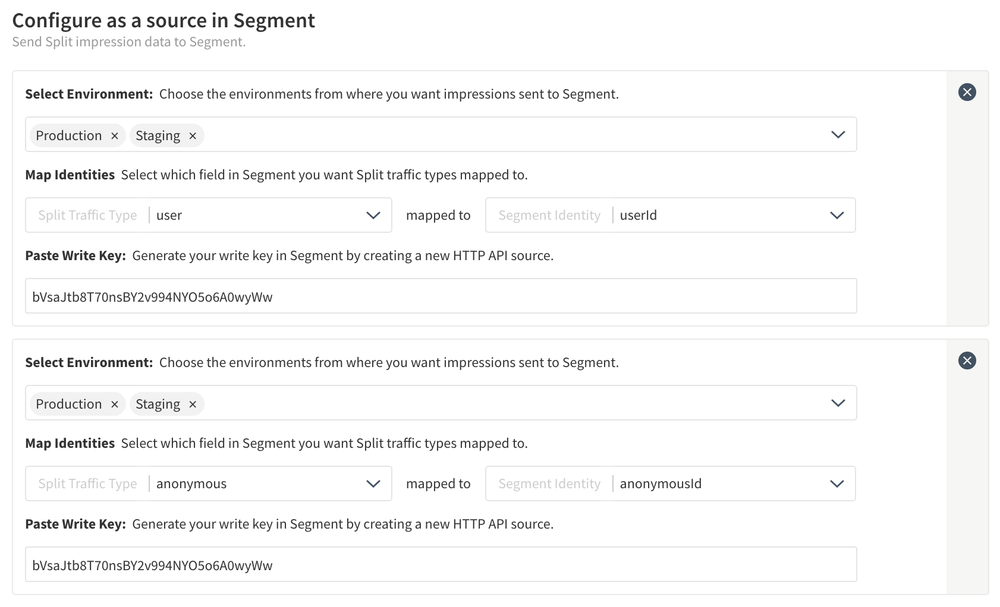
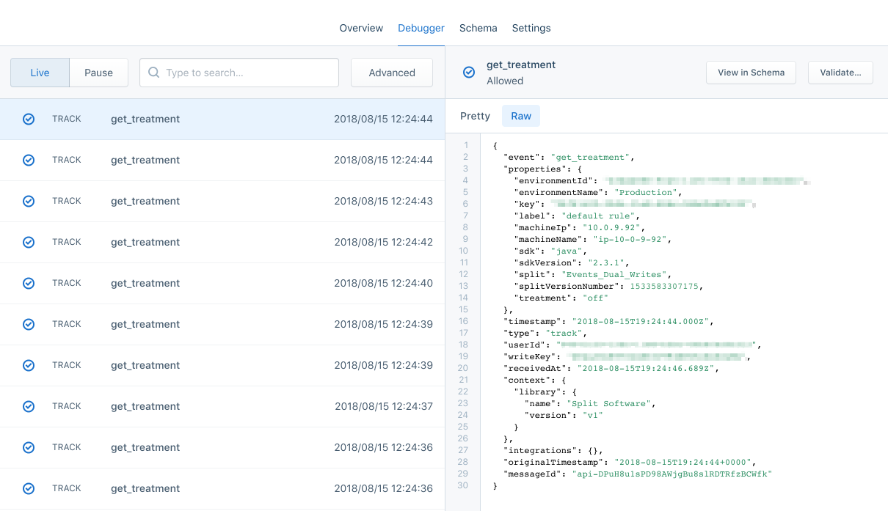
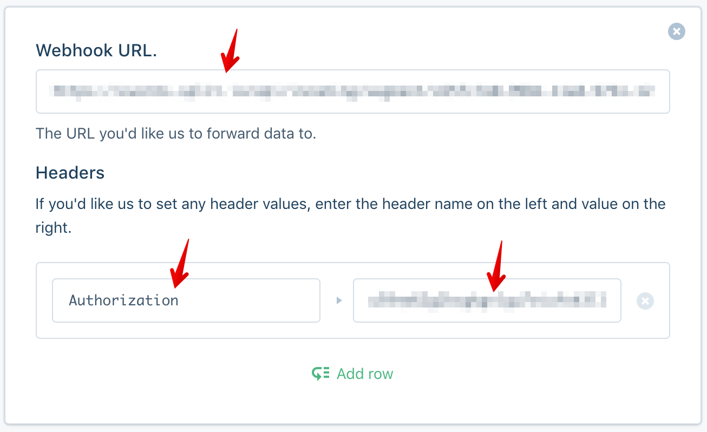
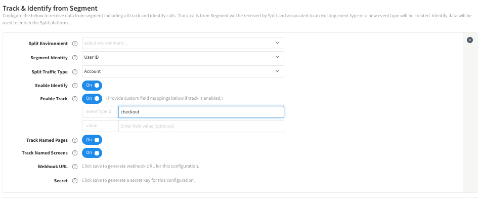

<p>
  <button hidden style={{borderRadius:'8px', border:'1px', fontFamily:'Courier New', fontWeight:'800', textAlign:'left'}}> help.split.io link: https://help.split.io/hc/en-us/articles/360020742532-Segment </button>
</p>

Segment allows you to easily manage integrations with multiple analytics services. By tracking events and users via Segment’s API and libraries, you can send your product’s data to all of your analytics and marketing platforms, with minimal instrumentation code. They offer support for most platforms, including iOS, Android, JavaScript, Node.js, PHP, and more.
 
Use this integration to:

* Send data from Harness FME as a source in Segment. When configured, FME sends traffic impression data for feature flags to Segment.

* Send data to Harness FME as a destination in Segment. When configured, FME processes and displayes Segment event data in Harness FME for analysis. FME supports the `identify`, `group`, `track`, `page` and `screen` specs. FME and Segment let you change these integration settings via your Segment and Harness FME dashboards without having to touch any code. 
 
This documentation provides additional details on the different types of Segment integrations you can use, how they affect your data in Harness FME, and instructions for setting up the integration. 

:::warning[Important]
If you use both the `anonymousId` and `userId` fields on Segment's `track` call to differentiate between logged in and anonymous traffic find out how to [verify your Segment events](https://help.split.io/hc/en-us/articles/360035701011-Segment-Verifying-Segment-Events-in-Split) in Harness FME or learn how to [successfully experiment with anonymous and logged-in users](/docs/feature-management-experimentation/experimentation/setup/anonymous-and-logged-in-users/). 
:::

## Harness FME as a source
 
### In Segment

1. Add a new HTTP API source.<br />Segment docs can be found [here](https://segment.com/docs/sources/server/http/).
2. Enter a name.
3. Copy the Write key provided for this new source.

   

### In Harness FME

1. Click the **profile button** at the bottom of the left navigation pane and click **Admin settings**.
2. Click **Integrations** and navigate to the Marketplace tab.
3. Find Segment in the integration list, click **Add** and select the project for which you want to configure the integration.
4. Select the environments that you want the data sent from.
5. Select how you would like to map Harness FME traffic types to Segment identities.
6. Paste the write key you copied in step 3 of the _In Segment_ instructions and click **Save**.

   

If you have different Harness FME environments that correspond to different Segment workspaces, you can click **Add configuration** to configure the integration to send with a different write key.

When configured properly, data begins flowing in Segment as a `track` type with the event name `get_treatment` as shown below.



## Harness FME as a destination

### In Harness FME

1. Click the **profile button** at the bottom of the left navigation pane and click **Admin settings**.
2. Click **Integrations** and navigate to the Marketplace tab.
3. Find Segment in the integration list, click **Add** and select the project for which you want to configure the integration.
4. Under Configure as a destination in Segment, click **Add configuration**.
5. Configure the following fields:
    * **Select environment**: Select the environment from where you want impressions sent to Segment.
    * **Map identities**: Select which Segment identity should be used when mapping Segment identities to Harness FME traffic types. (Either Segments User ID or Anonymous ID)
    * **Enable identify**: When enabled, identities captured in Segment is mapped to the traffic types you selected above and then be displayed in Harness FME.
    * **Enable track**: When enabled, events captured in Segment is sent to Harness FME. Map your event data using the field mapping below.
        * **eventTypeId**: This field can be customized, but is most likely maps to the event field in the segment track call.
        * **Value**: Optionally, if you want to create a sum or average metric, be sure to send this field.
    * **Track named pages**: Track events to FME for page method calls that have a name associated with them, e.g. page(‘signup’) translated to view_signup_page.
    * **Track named screens**: Tracks events to FME for screen method calls that have a name associated with them, e.g. screen(‘signup’) translated to viewed_signup_screen.
6. Once you’ve configured the above fields, click **Save**.
7. Your integration is now configured. Copy the key or click **Enable with Segment**.

    

### In Segment

1. Select the source you want to send data from to Harness FME.
2. Click **Add destination** and select Split. 
3. Paste the key provided from Harness FME within Segment in the API key field.
4. Click **Save** and be sure to toggle the destination to on.

   

## Harness FME as a destination (via webhook)

### In Harness FME

1. Click the **profile button** at the bottom of the left navigation pane and click **Admin settings**.
2. Click **Integrations** and navigate to the Marketplace tab.
3. Find Segment in the integration list, click **Add** and select the project for which you want to configure the integration.
4. Under Configure as a destination in Segment, click **Add configuration**.
5. Configure the following fields:
    * **Select environment**: Select the environment from where you want impressions sent to Segment.
    * **Map identities**: Select which Segment identity to use when mapping Segment identities to Harness FME traffic types (either Segments User ID or Anonymous ID).
    * **Enable identify**: When enabled, identities captured in Segment are mapped to the traffic types you selected above and displayed in Harness FME.
    * **Enable track**: When enabled, events captured in Segment are sent to Harness FME.  Map your event data using the field mapping below.
        * **eventTypeId**: this field can be customized, but is most likely maps to the event field in the segment track call.
        * **Value**: Optionally, if you want to create a sum or average metric, be sure to send this field.
    * **Track named pages**: Track events to FME for page method calls that have a name associated with them, e.g. page(‘signup’) translated to view_signup_page.
    * **Track named screens**: Tracks events to FME for screen method calls that have a name associated with them, e.g. screen(‘signup’) translated to viewed_signup_screen.
6. Once you’ve configured the above fields, click **Save**.
7. Your integration is now configured. Copy the webhook URL and secret provided.

    

### In Segment

1. Select the source you’d like to send data from to Harness FME.
2. Click **Add destination** and select webhook*. (Segment docs on this can be found [here](https://segment.com/docs/destinations/split/))
3. Paste the webhook URL provided from Harness FME within Segment in the webhook URL field.
4. Paste the secre* provided from Harness FME within Segment under Headers as an Authorization.
5. Click **Save**.

   <div style={{maxWidth:600}}>  </div>

## Segment spec details 

### Identify

The `identify` call lets you tie a user to their actions and record traits about them. When you enable in Harness FME and call the `identify` function, Segment passes that ID's information to FME with `userId` (or `anonymousId`) as the FME traffic type you selected when configuring the integration. Traits are mapped to traffic type attributes in FME. Learn more about attributes in Harness FME [here](https://help.split.io/hc/en-us/articles/360020529772-Identifying-customers).

Read more on Segment's `identify` spec [here](https://segment.com/docs/spec/identify/).

### Track
The `track` call lets you record any actions your users perform, along with any properties that describe the action. When you enable in Harness FME and call the `track` function, FME records events within Harness FME. For more information, see the [Events documentation](/docs/feature-management-experimentation/release-monitoring/events/).

Read more on Segment's `track` spec [here](https://segment.com/docs/spec/track/).

### Page
The `page` call lets you record whenever a user sees a page of your website, along with any optional properties about the page. When you enable in Harness FME and call the `page` function FME records events for `page` method calls that have a name associated with them. For example, `page('signup')` translates to `view_signup_page`.

Read more on Segment's `page` spec [here](https://segment.com/docs/spec/page/).

### Screen
The `screen` call lets you record whenever a user sees a screen, the mobile equivalent of page, in your mobile app, along with any properties about the screen. When you enable in Harness FME and call the `screen` function, FME records events for `screen` method calls that have a name associated with them. For example, `screen('signup')` translates to `view_signup_screen`.

Read more on Segment's `screen` spec [here](https://segment.com/docs/spec/screen/).

### Group
The `group` call allows you to associate an individual user with a group of users. FME associates a group with the particular traffic type you configure. Learn more about using the group methods in the advanced functionality below. 

Read more on Segment's `group` spec [here](https://segment.com/docs/spec/group/).

## Advanced functionality

### Set event-level groups via .track()
To support mapping events across multiple traffic types (for example, fire a `track` event for a user and an account), Harness FME supports setting event-level groups. The group designation only applies for the specific event being logged. To specify these groups, provide an integration-specific property with key-value pairs corresponding to traffic type name in FME and the ID of the customer in FME. An example call is shown below. 

```json
{
  "anonymousId": "23adfd82-aa0f-45a7-a756-24f2a7a4c895",
  ...
  "messageId": "ajs-f8ca1e4de5024d9430b3928bd8ac6b96",
  "properties": {
        "split": [{
            "account": "4d3405a0-9ca5-11e5-9706-16a11fb02dec" ### key
        }],
 ...
  "type": "track",
  "userId": "41e51150-6825-11e8-9f57-0acd31e5aef0",
  "originalTimestamp": "2015-12-12T19:11:01.152Z"
}
```

#### Identify additional traffic types in Harness FME via .group()

Harness FME supports the ability to identify multiple traffic types (for example, identifying accounts) within FME via Segment's `group` method. To specify these groups, provide an integration-specific trait with key-value pair corresponding to traffic type name in FME and the ID of the customer in FME that you want to identify. If Harness FME can identify an FME traffic type in the traits, all additional traits are created as attributes of the traffic type and the values mapped to the key provided.

```json
{
  "anonymousId": "23adfd82-aa0f-45a7-a756-24f2a7a4c89",
  ...
  "messageId": "022bb90c-bbac-11e4-8dfc-aa07a5b093db",
  ...
  "traits": {
     "split": {
           "account": "4d3405a0-9ca5-11e5-9706-16a11fb02dec" ### key
         },    
     ...
     }
  "type": "group",
  "userId": "7f244b10-9ca5-11e5-9706-16a11fb02dec",
  "groupId": "4d3405a0-9ca5-11e5-9706-16a11fb02dec",
  ...
}
```

## Troubleshooting

### What happens if the eventTypeId field has spaces in Segment?
If the name has a space, Harness FME replaces the space with an underscore changing `sample event` to `sample_event` when it appears in the Harness FME user interface.

### What does Harness FME do if the eventTypeId field is not mapped correctly?
The `eventTypeId` field is required, so if name does not map correctly or does not match the configuration settings, the event is dropped.

### What does Harness FME do if the eventTypeId field is mapped correctly, but the value field is not?
The `value` field is optional. If `eventTypeId` is mapped correctly but the `value` field does not align with the configuration settings, the `value` field is null in Harness FME.

### What happens in Harness FME if we have traits.company in our identify call?
Passing `traits.company` is received as a string version of the object in FME as an attribute `company`. We recommend flattening the object if you want to see this data in Harness FME.

### What size limits does Harness FME have on trait values?
Trait values are limited to 255 characters. 

### Why is the Segment integration not showing desired events?

The Segment to Split integration is set up to enable tracking event "checkout". Under the eventTypeId field, we put "checkout". However, the checkout event never shows up under "Traffic Type" page.



It's possible that the `eventTypeId` field in the Segment integration page is incorrectly set. You should not put the actual event name here, only the property name that holds the event name.

Review the JSON structure for the desired event in Segment, and based on the structure, determine the property's path and name, and add it to the Segment integration page in the Split user interface.

For example, if the Segment JSON looks like the following:

```json
{
   "event": "checkout"
   "properties" : {
     "environmentId" : "xxxxx"
     "environmentName" : "xxxxx"
     "key" : "zxcv"
     "machineIP" : "x.x.x.x"
     "page" : "eCommerce"
   }
}
```

The `eventTypeId` field should be set to `event`.

If the Segment JSON looks like the following:

```json
{
   "eventId": "231344"
   "properties" : {
     "eventName" : "checkout"
     "environmentId" : "xxxxx"
     "environmentName" : "xxxxx"
     "key" : "zxcv"
     "machineIP" : "x.x.x.x"
     "page" : "eCommerce"
   }
}
```

The `eventTypeId` field should be set to `properties.eventName`.