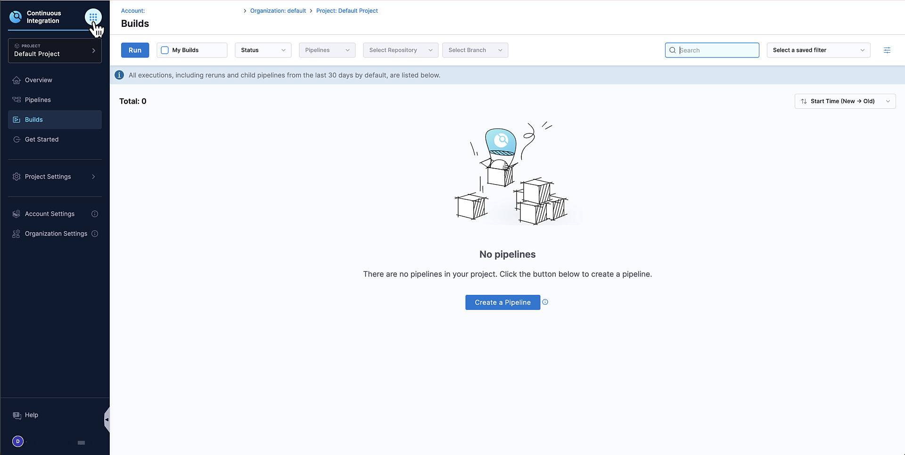
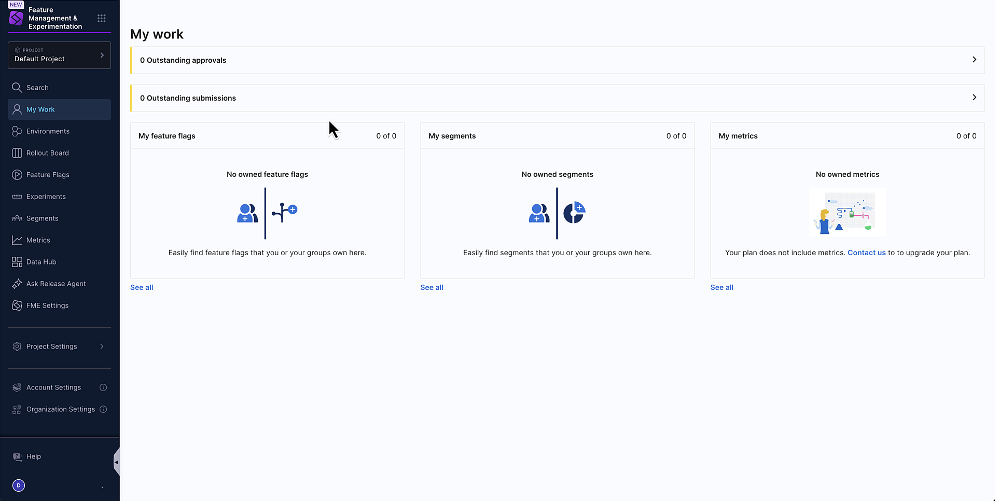

In June 2024, [Harness acquired Split](https://www.harness.io/blog/harness-to-acquire-split), now called Harness Feature Management & Experimentation (FME). This page provides information to support you during the transition to Feature Management & Experimentation (FME) in the Harness platform.

## Get started with Harness

If you're new to Harness, go to [Get started with Harness](/docs/category/get-started) and learn about the Harness software delivery platform.

## Accessing Harness FME

Whether you are a new Harness user, an existing Harness customer, or a customer migrating from Split, accessing Feature Management & Experimentation (FME) starts in the [Harness platform](https://app.harness.io/). 

:::warning Split to Harness FME
If you are currently accessing Split via `app.split.io`, our customer success and support teams will be in contact with you to help you ensure a smooth transition into FME on `app.harness.io`. For more information, see [Split to Harness Migration](/docs/feature-management-experimentation/split-to-harness).
:::

To start [Harness Feature Management & Experimentation (FME)](/docs/feature-management-experimentation/getting-started/overview/):

1. In the Harness navigation menu, select the **Grid menu** icon.

   

1. In the modal, select **Feature Management & Experimentation (FME)** under `DevOps Modernization`. You are redirected to the Harness FME module landing page.

   

1. Click **Start FME Free Plan**. After selecting **Start FME Free Plan**, your account is initialized with the FME Free Plan, allowing you to begin exploring FME in the Harness platform.

   

   :::info Selecting Start FME Free Plan
   Selecting **Start FME Free Plan** is a required step for all Harness customers, regardless of whether you intend to use the [Free or Enterprise Plan](https://www.harness.io/pricing).
   :::

1. If you would like to upgrade to the Enterprise plan and access additional features and capabilities, [contact your Harness sales representative](https://www.harness.io/company/contact-sales). 
    
    

    

    
Migrated Split Account?

    When a Split account is migrated to Harness FME, the structure of your [Harness organizations](/docs/feature-management-experimentation/split-to-harness/administering-migrated-account#harness-organizations-and-environments), [projects](/docs/feature-management-experimentation/split-to-harness/administering-migrated-account#projects), and [resource groups](/docs/feature-management-experimentation/split-to-harness/administering-migrated-account#user-groups) depend on whether your account is on the **Free** or **Enterprise Plan** at the time of the migration.

    | Plan | Organization created | Project location | Resource group |
    |------|----------------------|------------------|----------------|
    | **Free** | Default Harness organization | Default organization | `All Project Level Resources` |
    | **Enterprise** | `<legacy Split account name> FME` | Dedicated FME organization | `FME All Resources` |

    - On the **Free plan**, legacy Split projects are recreated as Harness projects in the default Harness organization.
    - On the **Enterprise plan**, a Harness organization named **`<legacy Split account name> FME`** is created, and legacy Split projects are recreated as Harness projects within this organization.
    
      In both cases, each Harness project created by the migration script links to its corresponding legacy Split (FME) project.

    

### Harness clusters and base URLs

When your account is [migrated from Split to Harness](/docs/feature-management-experimentation/split-to-harness/migrated-account), you will access **Feature Management & Experimentation (FME)** through the Harness platform. Most migrated accounts use `app.harness.io`, but some customers (depending on their cluster) will use a different base URL.

To identify which Harness cluster your account is in, navigate to **Account Settings** and select **Account Details**. 

Your Harness base URL depends on which cluster your account is hosted in. 

| Cluster       | Base URL                 |
| ------------- | ------------------------ |
| Prod1         | `app.harness.io`         |
| Prod2         | `app.harness.io`         |
| Prod3         | `app3.harness.io`        |
| Prod0 / Prod4 | `accounts.harness.io`    |
| EU clusters   | `accounts.eu.harness.io` |

## Authentication, access, and user management

Authentication, access, and user management are part of the Harness platform. [Permissions](/docs/feature-management-experimentation/permissions) granted to users and user groups depend on their associations with resources and resource groups, which are controlled at the account, organization, and project level in Harness. 

For more information about authentication, access, and user management, see the following:

* [Harness platform authentication (including 2FA and SSO)](/docs/category/authentication)
* [Harness RBAC for FME](/docs/feature-management-experimentation/permissions/rbac)

## Administering a Migrated Split Account on Harness

Split administrators should read the [Before and After Guide: Administering a Migrated Split Account on Harness](/docs/feature-management-experimentation/split-to-harness/administering-migrated-account/). The guide will walk you through administrative tasks which change to standard Harness platform features after your migration into Harness.

## Harness platform integrations

We are moving rapidly to unlock integrations with Harness's innovative DevOps tools, developer experience improvements, security features, and cloud optimizations, while continuing to enhance the core of what you've previously known as Split. 

You can use Harness FME directly within the [Harness Internal Developer Portal (IDP)](/docs/internal-developer-portal). This integration allows you to view and manage your feature flags and experiments directly from your developer portal, alongside other Harness tools. For setup instructions and configuration details, see the [Harness IDP documentation](/docs/internal-developer-portal/plugins/available-plugins/harness-native-plugins/harness-fme).

To learn more about upcoming integrations and planned enhancements, see the [FME Product Roadmap](https://developer.harness.io/roadmap/#fme).

<UniversityAdmonition title="Harness FME self-paced training">
  For an interactive onboarding experience including further use cases and features like **feature management**, **release monitoring**, and **cloud experimentation**, check out the [**Harness Feature Management & Experimentation self-paced training**](https://university-registration.harness.io/page/fme).
</UniversityAdmonition>