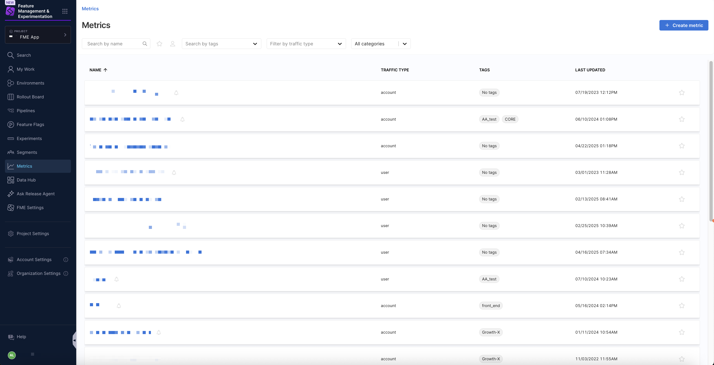
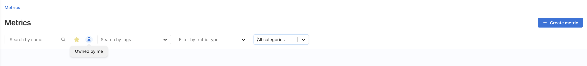
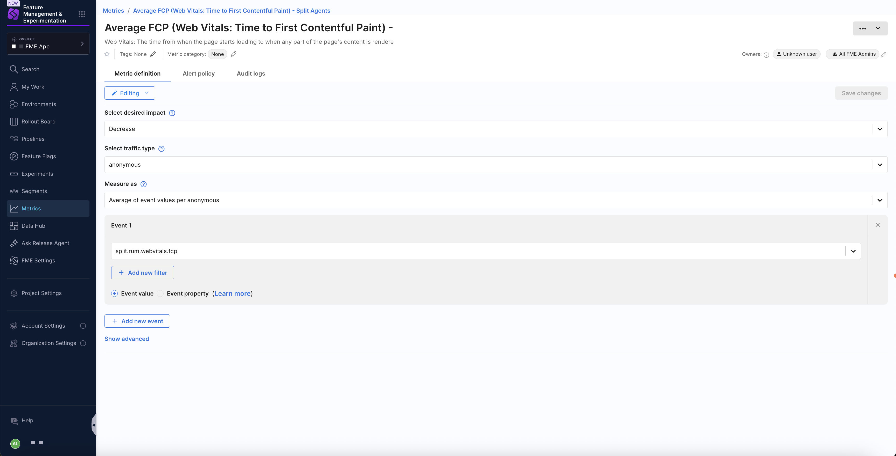

The **Metrics** page in Harness Feature Management & Experimentation (FME) provides a centralized list view for searching and managing your <Tooltip id="fme.release-monitoring.metric">metrics</Tooltip>. You can browse metrics created in Harness FME, scan key details such as traffic type, tags, ownership, and last updated time, and navigate directly to metric definitions, alert policies, and audit logs.

Metric results are calculated per treatment for <Tooltip id="fme.openfeature.feature-flag">feature flags</Tooltip> that share the same traffic type and use percentage-based targeting rules, allowing you to compare impact between a baseline and comparison treatment.

## Search and manage metrics

To access metrics created in Harness FME, select **Metrics** from the FME navigation menu. When viewing the list of metrics, you can use the following filters and indicators to help you navigate to a selected metric.

- **Search**: Search for metrics by name.
- **Starred by me**: Show only metrics you’ve starred.
- **Owned by me**: Show metrics you created or where you are listed as an owner.
- **Search by tags**: Use the `Search by tags` dropdown menu to filter metrics by one or more tag values.
- **Filter by traffic type**: Narrows results by traffic types such as `user`, `account`, or `anonymous`.
- **All categories**: Use the **All categories** dropdown to filter by [**Guardrail** metrics](/docs/feature-management-experimentation/release-monitoring/metrics/categories/).

Each metric appears as a row in the list with column-based details, including the name, traffic type, tags, and the timestamp it was last updated. If a bell icon appears next to a metric name, the metric has an associated [alert policy](/docs/feature-management-experimentation/release-monitoring/metrics/setup/metric-alert-policy/).

Select a metric to open its details. You can switch between the **Metric definition**, **Alert policies**, and **Audit logs** tabs.

### Common metrics

This section outlines common metrics and how to create them in Harness FME, empowering you to effectively measure impact and run experiments. You'll find a breakdown of various metrics, including conversions, page views, and more. 

| Metric Guide | Description |
|---|---|
| [Conversions](https://www.harness.io/harness-devops-academy/conversions) | Map, measure, and improve the conversion rate of key user workflows. |
| [Errors](https://www.harness.io/harness-devops-academy/errors) | Measuring errors alongside feature flags leads to faster issue identification, response, and resolution. |
| [Inputs](https://www.harness.io/harness-devops-academy/inputs) | Track user-entered fields and forms such as radio buttons, checkboxes, sliders, and dropdowns. |
| [Interactions](https://www.harness.io/harness-devops-academy/interactions) | Measure clicks, hover states, scroll depth, and other user interactions. |
| [Page Load Performance](https://www.harness.io/harness-devops-academy/page-load-performance) | Use on-page events such as page load timing and load failures to understand performance. |
| [Page Views](https://www.harness.io/harness-devops-academy/page-views) | Use page view counts and rates in conjunction with other metrics to construct ratios and funnels. |
| [Rage Clicks](https://www.harness.io/harness-devops-academy/rage-clicks) | Identify areas of user frustration by measuring rapidly repeated clicks on an element or area of the screen. |
| [Satisfaction](https://www.harness.io/harness-devops-academy/satisfaction) | Use feedback response rates, occurrence rates, and scores to understand user happiness. |
| [Sessions](https://www.harness.io/harness-devops-academy/sessions) | Construct engagement metrics such as session start and end, entry and exit rates, and session length. |
| [Shopping Cart](https://www.harness.io/harness-devops-academy/shopping-cart) | Track changes to a shopping cart to measure cart size, value, completion, and abandonment metrics. |

These metrics are designed to help you build impactful products and drive business growth.

## Metric types

Harness FME supports the following custom metric types. Metrics are calculated per traffic type key (e.g. per user). This means that each individual key's contribution is calculated and adds a single data point to the distribution of the metric result, so each key has equal weighting in the result.

In the table below, we assume the traffic type selected for the metric is `user`.

| **Function** | **Description** | **Example** |
| --- | --- | --- |
| **Count of events per user** | Counts the number of times the event is triggered by your users. Shows the average count. _As users revisit your app, they will increase this value, while new users will bring the average down._ | The average number of times your users visit a webpage. The average number of support tickets your users create. |
| **Sum of event values per user** | Adds up the values of the event for your users. Shows the average summed value. _As users revisit your app, they will increase this value, while new users will bring the average down._ | How much your users spend on average on your website (over the duration of the experiment). The total time your users on average played media on your website. |
| **Average of event values per user** | Averages the value of the event for your users. _Revisiting users will increase the confidence of the result. This calculated result is not expected to change significantly during the experiment (unless experimental factors change)._ | The average purchase value when your users check out. The average page load time your users experience. |
| **Ratio of two events per user** | Compares the frequency of two events for your users. Shows the average ratio. _Revisiting users will increase the confidence of the result. This calculated result is not expected to change significantly during the experiment (unless experimental factors change)._ | The average number of hotel searches before a hotel booking. The number of invitations accepted compared with the number of invitations received by your users (on average). The ratio of app sessions with errors compared to app sessions without errors. |
| **Percent of unique users** | Calculates the percentage of users that triggered the event. _As the experiment continues, revisiting users may increase the percentage, while data from new users may increase the confidence of the result._ | The percentage of website visitors that completed a purchase. The percentage of users that experienced an error. |

## Metric categories

For more information about metric categories, see [Metric categorization](/docs/feature-management-experimentation/experimentation/metrics/categories/).
