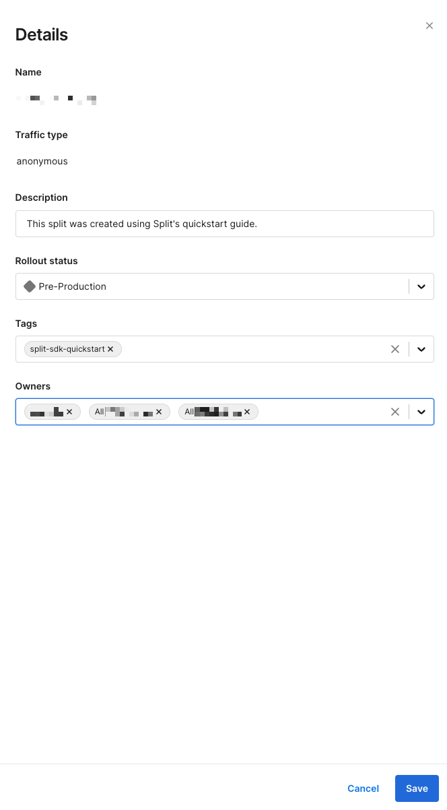

:::danger Owners Permissions Update
Owners are no longer granted edit permissions by default. Owners are treated as metadata to help identify responsible stakeholders and filter FME resources (such as feature flags, segments, and metrics). 

To manage who can edit, use [environment-level permissions](/docs/feature-management-experimentation/management-and-administration/fme-settings/permissions) or set explicit editors on a flag, segment, or metric.
:::

## Overview

In addition to [tags](/docs/feature-management-experimentation/management-and-administration/tags/), owners allow you to organize and manage feature flags, segments, and metrics across the Split user interface. 

You can use owners to:

- Filter feature flags, segments, and metrics in the browse panes to those **owned by me**.
- Restrict editing of a specific feature flag, segment, or metric to its owners by setting **Restrict who can edit** to `Owners`:

  * For feature flags, click on the **Gear** icon and click **Edit details**. In the Owners section, add groups or individuals, then click **Save**.
  * For segments and metrics, navigate to the **Owners** section on the top right corner or click the **Editing** dropdown on the **Definition** tab. Select **Restrict who can edit** and add groups or individuals in the **Editors** field, then click **Apply**.

:::tip
Ownership alone is for organization and filtering purposes. It does not grant edit rights. To give owners edit rights, select **Restrict who can edit** to owners in one of the above locations. Owners will still be able to edit if they already have broader environment-level rights.
:::

When you add owners and set **Restrict who can edit** to owners, those owners are automatically included as editors for that specific flag in all environments. This helps you simplify permissions while preventing others without environment- or project-level edit rights from making changes.

| Scenario                                 | Owner has edit rights?            |
|------------------------------------------|------------------------------------|
| Owner only          | ❌ No (organizational only)         |
| Owner only, **Restrict who can edit** (Owners)   | ✅ Yes for that object in all environments |
| Owner + environment-level editor rights  | ✅ Yes through environment permissions   |

Harness recommends using groups where possible as owners. When you onboard new teammates, their Split instance includes several feature flags owned by their team.

## Adding or removing owners

:::info
Only current owners can change owners for a feature flag, segment, or metric.
:::

To change the owner for a feature flag:

1. Click the Gear icon next to the feature flag name and select **Edit details**. The **Details** panel appears.
   
   

1. In the **Owners** field, either begin entering to select an existing group or user or use the down arrow to display a list of owners.
1. Select the desired owners and click **Save**.

To change the owner for a segment or a metric:

1. Navigate to a segment or metric.
1. Use the **Owners** field in the top-right or go to the **Definition** tab and click the **Editing** pencil icon.
   
   

1. Select **Restrict who can edit** and add groups or users in the **Owners** field.
1. Click **Apply**.

## Filter by

Owners are useful when you locate those items in the **Owned by me** list. To find items in this list, in the feature flag view list, click **Owned by me**. 

The feature flags, segments, and metrics that you own directly or indirectly as part of a group display.