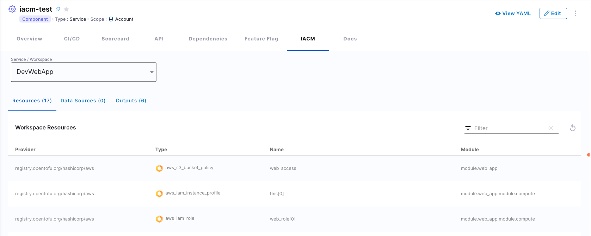

# Harness Infrastructure as Code Management

| Plugin details |                                                        |
| -------------- | ------------------------------------------------------ |
| **Created by** | Harness                                                |
| **Category**   | Infrastructure                                         |
| **Source**     | [GitHub](https://github.com/harness/backstage-plugins) |
| **Type**       | Open-source plugin                                     |
| **Listed on**  | [Backstage Plugin Directory](https://backstage.io/plugins/) |

## Configuration

### Application configuration YAML

_No action required_

This plugin requires a backend proxy configuration to make calls to Harness APIs with authentication. The following configuration is set by default and you do not need to change anything:

```yaml
proxy:
  "/harness/prod":
    target: "https://app.harness.io/"
    pathRewrite:
      "/api/proxy/harness/prod/?": "/"
    allowedHeaders:
      - authorization
```

### Secrets

No secrets are required for this plugin because both IDP and IACM are part of the Harness software delivery platform.

### Delegate proxy

_No action required_

This plugin does not require a delegate proxy to be set up.

## Layout

_No action required_

This plugin exports a UI tab that you can use as a new IACM tab for workspaces or for any other layout page. The following configuration is set by default in **Layout** under **Admin** for **Service** and you do not need to change anything:

```YAML
- name: iacm
  path: /iacm
  title: IACM
  contents:
    - component: EntityIacmContent
```

Also, you could add a conditional like `isHarnessIacmAvailable` which is met when `harness.io/workspace-url` annotation is present in the software component's `catalog-info.yaml` definition file.

```YAML
- name: iacm
  path: /iacm
  title: IACM
  contents:
    - component: EntitySwitch
      specs:
        cases:
          - if: isHarnessIacmAvailable
            content:
              component: EntityIacmContent
```

The IACM plugin displays comprehensive workspace information including:
- **Resources**: All provisioned infrastructure resources (VMs, databases, networks, etc.)
- **Data Sources**: External data referenced by the workspace
- **Outputs**: Exported values from the workspace state



## Annotations

Set the `harness.io/workspace-url` annotation in its `catalog-info.yaml` definition file to configure the plugin for a service in the software catalog.

The URL format should be: `https://app.harness.io/ng/account/<ACCOUNT_ID>/module/iacm/orgs/<ORGANIZATION_ID>/projects/<PROJECT_ID>/workspaces/<WORKSPACE_ID>/resources`

```yaml
apiVersion: backstage.io/v1alpha1
kind: Component
metadata:
  name: payment-service
  description: Payment processing service
  annotations:
    harness.io/workspace-url: https://app.harness.io/ng/account/<ACCOUNT_ID>/module/iacm/orgs/<ORGANIZATION_ID>/projects/<PROJECT_ID>/workspaces/<WORKSPACE_ID>/resources
spec:
  type: service
  lifecycle: production
  owner: team-platform
```

## Support

The plugin is owned by Harness and managed in the [Harness plugins repository](https://github.com/harness/backstage-plugins) as an open-source project. Create a GitHub issue to report bugs or suggest new features for the plugin.
