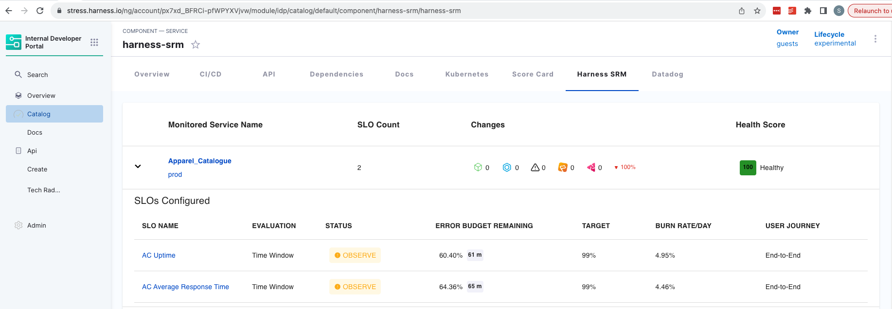

# Harness Service Reliability

| Plugin details |                                                        |
| -------------- | ------------------------------------------------------ |
| **Created by** | Harness                                                |
| **Category**   | Service Reliability, SLOs, Errors                      |
| **Source**     | [GitHub](https://github.com/harness/backstage-plugins) |
| **Type**       | Open-source plugin                                     |

## Configuration

### Application configuration YAML

_No action required_

This plugin requires a backend proxy configuration to make calls to Harness APIs with authentication. The following configuration is set by default and you do not need to change anything:

```yaml
proxy:
  "/harness/prod":
    target: "https://app.harness.io/"
    pathRewrite:
      "/api/proxy/harness/prod/?": "/"
    allowedHeaders:
      - authorization
```

### Secrets

No secrets are required for this plugin because both IDP and SRM are part of the Harness software delivery platform.

### Delegate proxy

_No action required_

This plugin does not require a delegate proxy to be set up.

## Layout

This plugin exports a UI tab that you can use as a new SLOs tab for a service or for any other layout page. Go to **Admin** > **Layout**, select **Service** in the dropdown menu, and then add the following YAML code in the new Tab section:

```yaml
- name: SLOs
  path: /slos
  title: SLOs
  contents:
    - component: EntityHarnessSrmContent
```

Note: You can also use the `isHarnessSRMAvailable` conditional. It is satisfied when the `harness.io/services` annotation is present in the software component's `catalog-info.yaml` definition file.



## Annotations

To configure the plugin for a service in the software catalog, set a `harness.io/services` annotation in its `catalog-info.yaml` definition file:

```yaml
apiVersion: backstage.io/v1alpha1
kind: Component
metadata:
  # ...
  annotations:
    harness.io/services: |
      labelA: <harness_service_url>

spec:
  type: service
  # ...
```

This should already be configured if you use Harness CI/CD and have the CI/CD tab working.

## Support

The plugin is owned by Harness and managed in the [Harness plugins repository](https://github.com/harness/backstage-plugins) as an open-source project. Create a GitHub issue to report bugs or suggest new features for the plugin.
