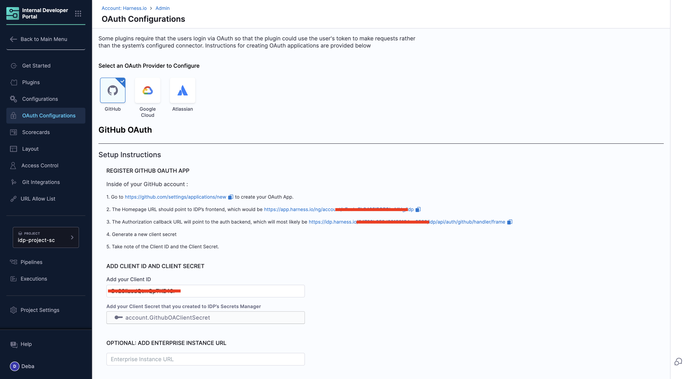

Some plugins and other parts of IDP do not use a fixed API key to communicate with providers such as GitHub or Google. These plugins require the user to log in using their GitHub/Google accounts and use the user's credentials to fetch data. This is the recommended approach for building Backstage plugins, for the following reasons:

1. Access control is taken care of because the plugin, rather than a general-purpose service account, makes requests on behalf of the user.
2. API rate limits are no longer an issue. Using a single token to authenticate all IDP users in a short period of time can result in rate limits set by the provider being exceeded.
3. Access is federated, so there is no need to create one general purpose service account with access to all systems. This is a safer security practice.

To facilitate OAuth login support for GitHub or Google-based plugins, you, as a platform engineer, can create GitHub or Google OAuth applications and configure them in IDP.

To create a GitHub or Google OAuth application, go to **Admin** > **OAuth Configurations**, and them follow the instructions on the page.

After you create the application, plugins that depend on OAuth (for example, [GitHub Actions](./available-plugins/github-actions.md)) display a **Login to GitHub** dialog for users who visit the catalog page with the plugin enabled.

