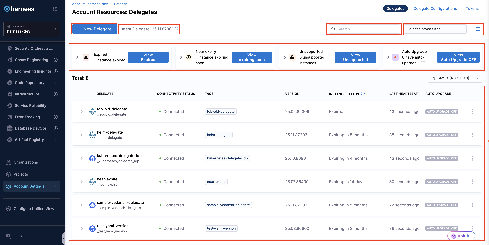
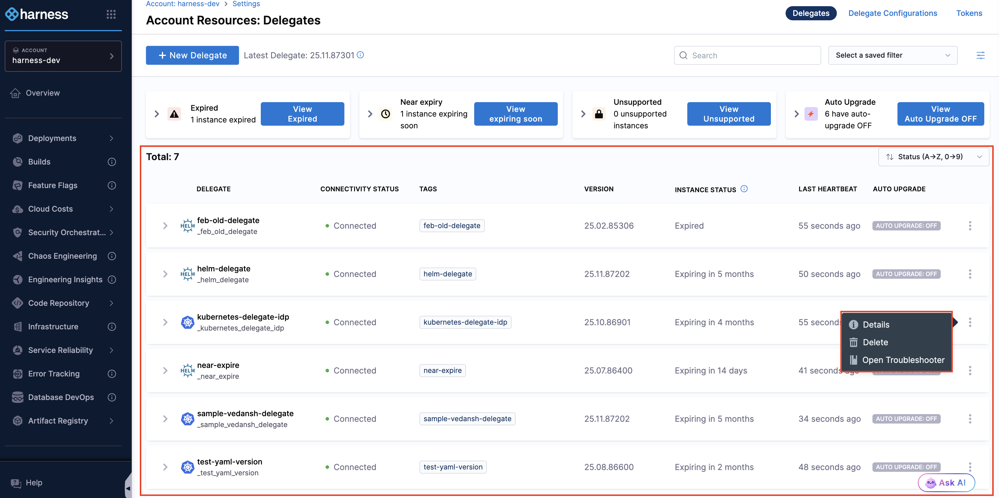
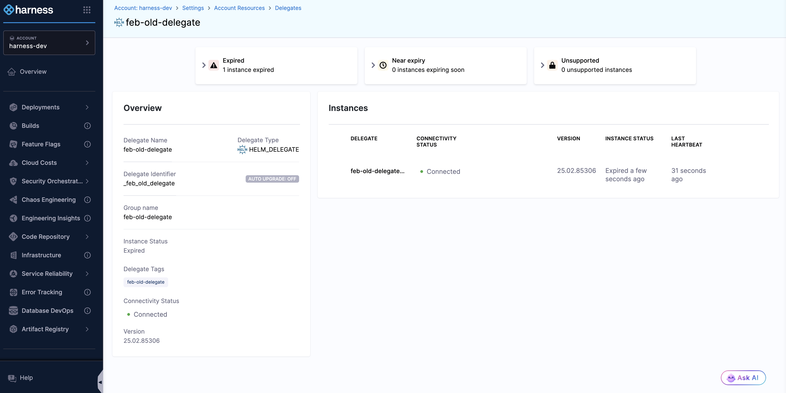

Delegates are only backward compatible up to a certain version and may not support new features. Running outdated delegates can lead to task failures, caching issues, and inconsistent behavior. 

To prevent such issues, proactively manage and upgrade delegates. Options to manage delegates include:

* [API to fetch the latest supported version](https://apidocs.harness.io/delegate-setup-resource/publisheddelegateversion)
* [Delegate version support status](/docs/platform/delegates/delegate-reference/delegate-image-version-status#reference-information)
* [Delegate overview page in your Harness account](#managing-delegates)

## Managing delegates

You can manage your delegate instances in your Harness account via the Delegate overview page. To access the Delegate overview page, navigate to your desired scope—Account, Organization, or Project—in your Harness account, and choose **Settings** > **Delegates**. 

This page contains delegate-related information, including delegate installation, the latest version details, a search box, filters, [delegate health overview cards](#delegate-health-overview-cards), and a [list of delegates](#delegate-instance-overview) with their details as shown in the image below

 

### Delegate health overview cards

There are four delegate health cards that display the status of delegate instances. 

1. **Expired**: Delegates running beyond their [EOS/EOL](/docs/platform/delegates/delegate-reference/delegate-image-version-status/#support-lifecycle-definitions) are no longer supported and might have limited functionality. These delegates should be upgraded immediately to prevent service disruption.

    Use the steps below to view delegates that are in an expired state:

        <iframe
        src="https://app.tango.us/app/embed/37a96947-55a6-4723-8e2b-05e0b6669b60"
        style={{ minHeight: "450px" }}
        sandbox="allow-scripts allow-top-navigation-by-user-activation allow-popups allow-same-origin"
        title="View Expired Delegates in Harness"
        width="80%"
        height="20%"
        referrerPolicy="strict-origin-when-cross-origin"
        frameBorder="0"
        allowFullScreen
        ></iframe>

2. **Near expiry**: Delegates that are about to expire. Ensure these delegates are upgraded before they reach [EOS/EOL](/docs/platform/delegates/delegate-reference/delegate-image-version-status/#support-lifecycle-definitions).

    Use the steps below to view delegates that are in near expiry state:

        <iframe
        src="https://app.tango.us/app/embed/84dde8ac-3bcc-411a-a662-04c1ca1c9404"
        style={{ minHeight: "450px" }}
        sandbox="allow-scripts allow-top-navigation-by-user-activation allow-popups allow-same-origin"
        title="View Near Expiry Delegates in Harness"
        width="80%"
        height="20%"
        referrerPolicy="strict-origin-when-cross-origin"
        frameBorder="0"
        allowFullScreen
        ></iframe>    

3. **Unsupported**: Delegates running prior to [latest released version](/release-notes/delegate#delegate-image-release-notes). These delegate may cause task failures or incompatibility issues. 

    Use the steps below to view delegates that are unsupported:

        <iframe
        src="https://app.tango.us/app/embed/6d951a35-6a2a-47a8-bfa5-dc64d09a2ad3"
        style={{ minHeight: "450px" }}
        sandbox="allow-scripts allow-top-navigation-by-user-activation allow-popups allow-same-origin"
        title="View Near Expiry Delegates in Harness"
        width="80%"
        height="20%"
        referrerPolicy="strict-origin-when-cross-origin"
        frameBorder="0"
        allowFullScreen
        ></iframe> 

4. **Auto-upgrade OFF**: Delegates with [auto-upgrade](/docs/platform/delegates/install-delegates/delegate-upgrades-and-expiration) OFF need manual updates. Enable auto-upgrade to keep them on the latest version.

    Use the steps below to view delegates with Auto Upgrade OFF:

        <iframe
        src="https://app.tango.us/app/embed/5a36ba33-b801-470a-acf3-d528193e5d66"
        style={{ minHeight: "450px" }}
        sandbox="allow-scripts allow-top-navigation-by-user-activation allow-popups allow-same-origin"
        title="View Near Expiry Delegates in Harness"
        width="80%"
        height="20%"
        referrerPolicy="strict-origin-when-cross-origin"
        frameBorder="0"
        allowFullScreen
        ></iframe> 

### Delegate listing overview

The delegate within the scope are listed here with their details. Use the arrow to view each delegate's instances, shown as below

- Delegate - It is a delegate type featuring a logo such as Helm, Kubernetes, or Docker, a delegate name, and a unique identifier within the scope.
- Connectivity Status - Shows the current connection status for the delegate instance as “Connected” or “Not connected”.
- Tags - The delegate tag is automatically added to your delegate during configuration. You can assign one or more tags to your delegate instance.
- Version - Displays the running delegate version. Shows “N/A” if the delegate is not connected.
- Instance Status - Displays when the delegate expires. It is used to determine when a delegate needs to be updated or replaced.
- Last Heartbeat - It indicates when the delegate was last connected.
- Auto Upgrade - Displays whether Auto Upgrades are enabled(ON) or disabled(OFF) for the delegate.

The vertical three dots on the right provide options based on the delegate type: **Details** leading to the group overview page, a [**Delete**](/docs/platform/delegates/manage-delegates/delete-a-delegate/#delete-a-delegate) option to remove the delegate from the listing (Note: this does not uninstall the delegate from your infrastructure), and an **Open Troubleshooter** option appears for Delegate Type Kubernetes.

To view details of a delegate, click any delegate in the list. This opens a group overview page showing delegate instances running for that group. 

The delegate group overview page is similar to the delegate overview page, including delegate health overview cards and listing details, but has an additional "**Group Name**" field under overview tab which is similar to "Delegate Name" as shown below

## Related documentation

- [Auto upgrader for delegates](/docs/platform/delegates/install-delegates/delegate-upgrades-and-expiration/)
- [Secure delegates](/docs/category/secure-delegates)
- [Delegate tokens](/docs/platform/delegates/secure-delegates/secure-delegates-with-tokens/)
- [Troubleshooting](/docs/category/troubleshooting)