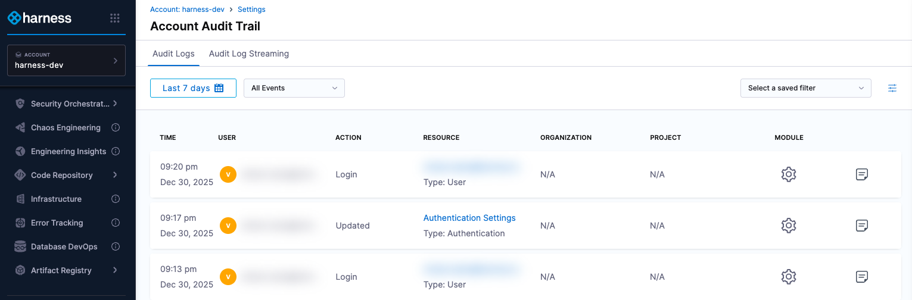
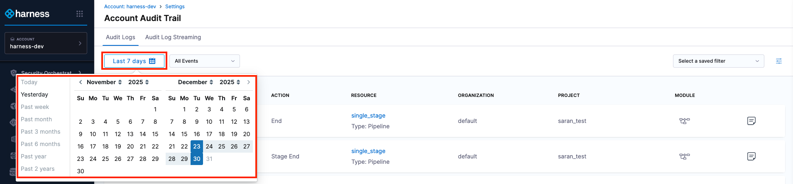
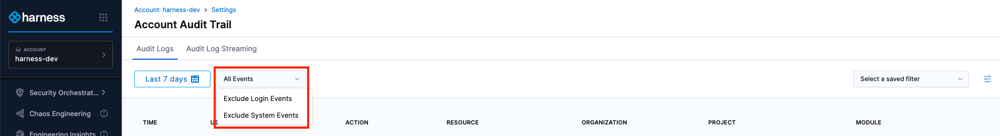
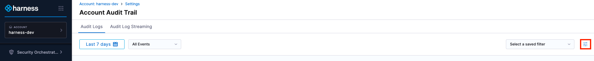

An audit trail is a chronological record of all key actions performed within the system. It shows who did what, when, and where, helping you track changes and activities in your Harness account.

Audit trails are automatically generated and cannot be altered, keeping the information accurate and reliable. This information can be used during compliance or to help identify and resolve issues more quickly.

### Before you begin

* [Key Concepts](/docs/platform/get-started/key-concepts.md)
* [RBAC in Harness](/docs/platform/role-based-access-control/rbac-in-harness)

## Viewing the audit trail

:::note
The audit trail can only be viewed at the account and organization scope. Audit events for the account scope do not appear in the audit trail at the organization scope. 
:::

To view the audit trail at the account scope (for organization scope events, go to the **Organization Settings**), follow these steps:

1. In Harness, go to **Account Settings**.
2. Navigate to the **Security and Governance** section, then click **Audit Trail**.
3. The **Audit Trail** page opens, showing audit logs from the past 7 days by default. 

   Each record logs an activity that happens within the system. These records may take a few minutes to appear in the Audit Trail. If you still can't see an event, try refreshing your browser.

      

### Filter by date and time

Limit the audit events displayed to a specific time range, from 1 day up to 2 years. Use the date picker to select the exact start and end dates, including the time of day.

### Audit trail types

By default, all audit events are displayed. You can refine the records using the following filters:

- **Exclude Login Events**: Hides authentication-related events, such as successful or failed logins, 2FA, and so on from the records.
- **Exclude System Events**: Hides events generated by the system.

### Add a filter

To add a filter, perform the following steps:

1. In **Account Audit Trail**, click the filter icon.

      

2. In the **New Filter** settings, select filters to refine audit events. Narrow the viewable events by adding filters and selecting:
      * User
      * Organization
      * Project
      * Resource Type
      * Resource Identifier
      * Action
         :::info note
         The Resource Identifier operates in conjunction with the Resource Type. It allows you to use the resource identifier to filter audit events related to a specific resource using that identifier.
         :::

         :::tip Infrastructure Audit Trail
         To retrieve the infrastructure audit trail, use the **Environment** resource type and provide your environment identifier as the **Resource Identifier**.
         :::

3. In **Filter Name**, enter a name for your filter.

4. For **Who can view and edit the filter?**, select **Only me** or **Everyone** based on the visibility you want to set for this filter.

5. Select **Save** to create a filter.

   

6. Select **Apply** to view the audit events as per the filter you just created.

   

   By default, the events of the last 7 days are returned for the filter. To view more results, you can select the date range accordingly.

### Audit trail data fields

The data fields capture the information for each audit event, including the user, action, time, and affected resources.
   - **Time**: The date and time when the activity occurred.
   - **User**: The user who performed the action (typically shown as an email ID or username). 
   - **Action**: The action that was performed (created, updated, deleted and so on). 
   - **Resource**: The Harness entity that was affected by the action.
   - **Organization**: The organization name corresponding to the affected entity, if applicable.
   - **Project**: The project name corresponding to the affected entity, if applicable.
   - **Module**: The module corresponding to the affected entity (pipeline, Platform and so on).
   - **Event Summary**: A detailed summary of the event, highlighting the changes made, along with the corresponding YAML differences.
         

:::info IMPORTANT
By default, the Audit Trail does not capture pipeline execution events such as Pipeline Start, Pipeline End, Stage Start, and Stage End. To capture these events, enable the `Enable Pipeline Execution Audit Events` setting under the pipeline category in account scope settings.

This setting is available only at the account scope.
:::

## Audit trail for events

Audit trail are stored for **up to 2 years**. If you need to retain them for a longer period, you can use [audit log streaming](/docs/platform/governance/audit-trail/audit-streaming) to export logs externally.

Audit logs capture key activities performed in your account. For example, when a new user is added, an audit log records the action (created, updated, revoked, etc.) along with relevant user details.

:::note
This is not an exhaustive list, as audit logs are generated dynamically based on user and system activities.
:::

### Module categories and resources

| Modules Category                         | Resources                                                                                                                                                                                                                                                                                                                                                                                                                                                                                                                                                                                                                                                                            | Description                                                                                                                 |
|------------------------------------------|--------------------------------------------------------------------------------------------------------------------------------------------------------------------------------------------------------------------------------------------------------------------------------------------------------------------------------------------------------------------------------------------------------------------------------------------------------------------------------------------------------------------------------------------------------------------------------------------------------------------------------------------------------------------------------------|-----------------------------------------------------------------------------------------------------------------------------|
| **Platform Core**                        | <ul><li>`ORGANIZATION`</li><li>`PROJECT`</li><li>`USER`</li><li>`USER_GROUP`</li><li>`ROLE`</li><li>`ROLE_ASSIGNMENT`</li><li>`PERMISSION`</li><li>`RESOURCE_GROUP`</li><li>`SERVICE_ACCOUNT`</li><li>`API_KEY`</li><li>`TOKEN`</li></ul>                                                                                                                                                                                                                                                                                                                                                                                                                                            | Core platform entities used to manage accounts, projects, users, access control, and authentication across Harness.         |
| **Secrets Management**                   | <ul><li>`SECRET`</li><li>`CERTIFICATE`</li></ul>                                                                                                                                                                                                                                                                                                                                                                                                                                                                                                                                                                                                                                     | Secure storage and management of sensitive values such as secrets and certificates used by pipelines and services.          |
| **Continuous Deployment**                | <ul><li>`SERVICE`</li><li>`ENVIRONMENT`</li><li>`ENVIRONMENT_GROUP`</li><li>`PIPELINE`</li><li>`TRIGGER`</li><li>`TEMPLATE`</li><li>`INPUT_SET`</li><li>`DEPLOYMENT_FREEZE`</li><li>`DB_SCHEMA`</li><li>`DB_INSTANCE`</li></ul>                                                                                                                                                                                                                                                                                                                                                                                                                                                      | Resources used to define, configure, and execute application and database deployments.                                      |
| **Delegates**                            | <ul><li>`DELEGATE`</li><li>`DELEGATE_GROUPS`</li><li>`DELEGATE_CONFIGURATION`</li><li>`DELEGATE_TOKEN`</li></ul>                                                                                                                                                                                                                                                                                                                                                                                                                                                                                                                                                                     | Delegates enable secure connectivity between Harness and customer infrastructure to execute tasks.                          |
| **Connectors**                           | <ul><li>`CONNECTOR`</li></ul>                                                                                                                                                                                                                                                                                                                                                                                                                                                                                                                                                                                                                                                        | Configurations that allow Harness to integrate with external systems such as cloud providers, Git, and artifact registries. |
| **Dashboards**                           | <ul><li>`DASHBOARD`</li><li>`DASHBOARD_FOLDER`</li></ul>                                                                                                                                                                                                                                                                                                                                                                                                                                                                                                                                                                                                                             | Visual dashboards and folders used to organize and display insights and reports across modules.                             |
| **Governance**                           | <ul><li>`GOVERNANCE_POLICY`</li><li>`GOVERNANCE_POLICY_SET`</li></ul>                                                                                                                                                                                                                                                                                                                                                                                                                                                                                                                                                                                                                | Policies and policy sets used to enforce standards, compliance, and guardrails across the platform.                         |
| **File Store**                           | <ul><li>`FILE`</li><li>`VARIABLE`</li></ul>                                                                                                                                                                                                                                                                                                                                                                                                                                                                                                                                                                                                                                          | Files and variables stored in Harness and referenced during pipeline execution and configuration.                           |
| **Platform Settings**                    | <ul><li>`SETTING`</li><li>`NG_LOGIN_SETTINGS`</li><li>`NG_ACCOUNT_DETAILS`</li><li>`SMTP`</li><li>`IP_ALLOWLIST_CONFIG`</li><li>`STREAMING_DESTINATION`</li><li>`BRANDING_SETTINGS`</li><li>`BRANDING_ASSET`</li><li>`BANNER`</li></ul>                                                                                                                                                                                                                                                                                                                                                                                                                                              | Account-level and platform-wide settings that control security, notifications, branding, and integrations.                  |
| **Chaos Engineering**                    | <ul><li>`CHAOS_HUB`</li><li>`CHAOS_INFRASTRUCTURE`</li><li>`CHAOS_EXPERIMENT`</li><li>`CHAOS_GAMEDAY`</li><li>`CHAOS_PROBE`</li><li>`CHAOS_SECURITY_GOVERNANCE`</li><li>`CHAOS_IMAGE_REGISTRY`</li></ul>                                                                                                                                                                                                                                                                                                                                                                                                                                                                             | Resources used to design, run, and govern chaos experiments to validate system resilience.                                  |
| **Service Reliability Management**       | <ul><li>`MONITORED_SERVICE`</li><li>`SERVICE_LEVEL_OBJECTIVE`</li><li>`DOWNTIME`</li><li>`NOTIFICATION_CHANNEL`</li><li>`NOTIFICATION_RULE`</li></ul>                                                                                                                                                                                                                                                                                                                                                                                                                                                                                                                                | Resources for monitoring service health, defining SLOs, tracking downtime, and sending reliability notifications.           |
| **Security Testing Orchestration**       | <ul><li>`STO_TARGET`</li><li>`STO_EXEMPTION`</li><li>`STO_OVERRIDE`</li><li>`TICKET`</li></ul>                                                                                                                                                                                                                                                                                                                                                                                                                                                                                                                                                                                       | Security testing targets, exceptions, overrides, and ticketing artifacts for managing security findings.                    |
| **Cloud Cost Management**                | <ul><li>`PERSPECTIVE`</li><li>`PERSPECTIVE_BUDGET`</li><li>`PERSPECTIVE_REPORT`</li><li>`PERSPECTIVE_FOLDER`</li><li>`COST_CATEGORY`</li><li>`BUDGET_GROUP`</li><li>`AUTOSTOPPING_RULE`</li><li>`AUTOSTOPPING_LB`</li><li>`AUTOSTOPPING_STARTSTOP`</li><li>`COMMITMENT_ORCHESTRATOR_SETUP`</li><li>`COMMITMENT_ACTIONS`</li><li>`CLUSTER_ORCHESTRATOR_SETUP`</li><li>`CLUSTER_ORCHESTRATOR_VPA_RULE`</li><li>`CLUSTER_ACTIONS`</li><li>`CCM_ANOMALY`</li><li>`CCM_ANOMALY_ALERT`</li><li>`CCM_RECOMMENDATION`</li><li>`CCM_RECOMMENDATION_IGNORE_LIST`</li><li>`CCM_RECOMMENDATION_SETTINGS`</li><li>`CCM_RECOMMENDATION_TICKET_SYSTEM`</li><li>`CLOUD_ASSET_GOVERNANCE_*`</li></ul> | Cost visibility, optimization, anomaly detection, and governance resources for managing cloud spend and efficiency.         |
| **Feature Management & Experimentation** | <ul><li>`FEATURE_FLAG`</li><li>`FEATURE_FLAG_STALE_CONFIG`</li><li>`TARGET_GROUP`</li></ul>                                                                                                                                                                                                                                                                                                                                                                                                                                                                                                                                                                                          | Feature flags and target groups used to control feature rollout and experimentation.                                        |
| **GitOps**                               | <ul><li>`GITOPS_REPOSITORY`</li><li>`GITOPS_CLUSTER`</li><li>`GITOPS_CREDENTIAL_TEMPLATE`</li><li>`GITOPS_REPOSITORY_CERTIFICATE`</li><li>`GITOPS_GNUPG_KEY`</li><li>`GITOPS_AGENT`</li><li>`GITOPS_PROJECT_MAPPING`</li><li>`GITOPS_APPLICATION`</li><li>`GITOPS_APPLICATION_SET`</li></ul>                                                                                                                                                                                                                                                                                                                                                                                         | GitOps resources for managing clusters and applications using Git as the source of truth.                                   |
| **Code Repository**                      | <ul><li>`CODE_REPOSITORY`</li><li>`CODE_BRANCH_RULE`</li><li>`CODE_PUSH_RULE`</li><li>`CODE_TAG_RULE`</li><li>`CODE_BRANCH`</li><li>`CODE_TAG`</li><li>`CODE_REPOSITORY_SETTINGS`</li><li>`CODE_WEBHOOK`</li></ul>                                                                                                                                                                                                                                                                                                                                                                                                                                                                   | Source code repositories and governance rules for managing code changes and integrations.                                   |
| **Internal Developer Portal**            | <ul><li>`IDP_APP_CONFIGS`</li><li>`IDP_CONFIG_ENV_VARIABLES`</li><li>`IDP_PROXY_HOST`</li><li>`IDP_SCORECARDS`</li><li>`IDP_CHECKS`</li><li>`IDP_ALLOW_LIST`</li><li>`IDP_OAUTH_CONFIG`</li><li>`IDP_CATALOG_CONNECTOR`</li><li>`IDP_BACKSTAGE_CATALOG_ENTITY`</li><li>`IDP_BACKSTAGE_SCAFFOLDER_TASK`</li><li>`IDP_LAYOUT`</li><li>`IDP_HOMEPAGE_LAYOUT`</li><li>`IDP_PERMISSIONS`</li><li>`IDP_PLUGINS`</li><li>`IDP_CATALOG_*`</li><li>`IDP_GIT_INTEGRATIONS`</li><li>`IDP_GROUPS`</li><li>`IDP_WORKFLOW`</li><li>`IDP_ENVIRONMENT`</li><li>`IDP_ENVIRONMENT_BLUEPRINT`</li><li>`IDP_AGGREGATION_RULE`</li></ul>                                                                  | Developer self-service portal resources including service catalog, workflows, scorecards, and integrations.                 |
| **Software Engineering Insights**        | <ul><li>`SEI_CONFIGURATION_SETTINGS`</li><li>`SEI_COLLECTIONS`</li><li>`SEI_INSIGHTS`</li><li>`SEI_PANORAMA`</li></ul>                                                                                                                                                                                                                                                                                                                                                                                                                                                                                                                                                               | Metrics, insights, and configurations used to analyze software delivery and engineering performance.                        |
| **Software Supply Chain Assurance**      | <ul><li>`SSCA_ARTIFACT`</li><li>`SSCA_COMPLIANCE`</li><li>`SSCA_COMPONENTS`</li></ul>                                                                                                                                                                                                                                                                                                                                                                                                                                                                                                                                                                                                | Artifact and component-level compliance data for securing the software supply chain.                                        |
| **Infrastructure as Code Manager**       | <ul><li>`WORKSPACE`</li><li>`IAC_MODULE`</li></ul>                                                                                                                                                                                                                                                                                                                                                                                                                                                                                                                                                                                                                                   | Workspaces and modules used to manage infrastructure using infrastructure-as-code workflows.                                |
| **Continuous Error Tracking**            | <ul><li>`CET_AGENT_TOKEN`</li><li>`CET_CRITICAL_EVENT`</li><li>`CET_SAVED_FILTER`</li></ul>                                                                                                                                                                                                                                                                                                                                                                                                                                                                                                                                                                                          | Error tracking resources used to capture, filter, and analyze application runtime issues.                                   |
| **Harness Artifact Registry**            | <ul><li>`ARTIFACT_REGISTRY`</li><li>`ARTIFACT_REGISTRY_UPSTREAM_PROXY`</li></ul>                                                                                                                                                                                                                                                                                                                                                                                                                                                                                                                                                                                                     | Artifact registries and upstream proxies for storing and serving build artifacts.                                           |
| **Gitspaces**                            | <ul><li>`CDE_GITSPACE`</li><li>`CDE_INFRAPROVIDER`</li></ul>                                                                                                                                                                                                                                                                                                                                                                                                                                                                                                                                                                                                                         | Cloud development environments used to provision and manage Git-based workspaces.                                           |
| **Other / System**                       | <ul><li>`MODULE_LICENSE`</li><li>`EULA`</li><li>`NETWORK_MAP`</li><li>`SERVICE_DISCOVERY_AGENT`</li><li>`APPLICATION_MAP`</li><li>`DAEMON_SET`</li><li>`RUNNER`</li><li>`GITX_WEBHOOK`</li><li>`RMG`</li></ul>                                                                                                                                                                                                                                                                                                                                                                                                                                                                       | System-level, licensing, and miscellaneous resources used internally or across multiple modules.                            |

### Resource type and supported actions

Each resource in Harness can perform specific actions that reflect how it is created, updated, executed, accessed, or governed across the platform.

| Resource Type                                                                                                            | Supported Actions                                                                                                                                                                                                                                                       | Description                                                                |
| ------------------------------------------------------------------------------------------------------------------------ | ----------------------------------------------------------------------------------------------------------------------------------------------------------------------------------------------------------------------------------------------------------------------- | -------------------------------------------------------------------------- |
| **All Resources (Generic)**                                                                                              | <ul><li><code>CREATE</code></li><li><code>UPDATE</code></li><li><code>DELETE</code></li><li><code>RESTORE</code></li><li><code>MOVE</code></li></ul>                                                                                                                    | Core lifecycle actions applicable to most resources across Harness.        |
| **Access & Identity Resources** (<code>USER</code>, <code>ROLE</code>, <code>SERVICE_ACCOUNT</code>, <code>TOKEN</code>) | <ul><li><code>INVITE</code></li><li><code>ADD_MEMBERSHIP</code></li><li><code>REMOVE_MEMBERSHIP</code></li><li><code>CREATE_TOKEN</code></li><li><code>REVOKE_TOKEN</code></li><li><code>DELETE_TOKEN</code></li></ul>                                                  | Actions related to managing users, access, and authentication credentials. |
| **Platform Authentication**                                                                                              | <ul><li><code>LOGIN</code></li><li><code>LOGIN2FA</code></li><li><code>UNSUCCESSFUL_LOGIN</code></li></ul>                                                                                                                                                              | Records authentication activity for users and service accounts.            |
| **Pipeline Resources** (<code>PIPELINE</code>, <code>STAGE</code>, <code>INPUT_SET</code>)                               | <ul><li><code>START</code></li><li><code>END</code></li><li><code>STAGE_START</code></li><li><code>STAGE_END</code></li><li><code>PAUSE</code></li><li><code>RESUME</code></li><li><code>ABORT</code></li><li><code>TIMEOUT</code></li><li><code>RERUN</code></li></ul> | Actions that track pipeline and stage execution lifecycle.                 |
| **Governance & Policy Resources**                                                                                        | <ul><li><code>ENABLED</code></li><li><code>DISABLED</code></li><li><code>BYPASS</code></li><li><code>FREEZE_BYPASS</code></li></ul>                                                                                                                                     | Actions that reflect policy state changes or controlled overrides.         |
| **Git-Backed Resources** (<code>GitOps</code>, <code>Code</code>, <code>IACM</code>)                                     | <ul><li><code>SYNC_START</code></li><li><code>SYNC_SUCCEEDED</code></li><li><code>SYNC_FAILED</code></li><li><code>MOVE_TO_GIT</code></li><li><code>FORCE_PUSH</code></li></ul>                                                                                         | Actions related to Git synchronization and source-controlled changes.      |
| **SLO & Reliability Resources**                                                                                          | <ul><li><code>ERROR_BUDGET_RESET</code></li></ul>                                                                                                                                                                                                                       | Actions associated with SLO and reliability management events.             |
| **Feature Management Resources**                                                                                         | <ul><li><code>ENABLED</code></li><li><code>DISABLED</code></li></ul>                                                                                                                                                                                                    | Actions indicating feature flag state changes.                             |
| **Impersonation**                                                                                                        | <ul><li><code>START_IMPERSONATION</code></li><li><code>END_IMPERSONATION</code></li></ul>                                                                                                                                                                               | Tracks when an identity assumes or exits impersonated access.              |
| **Tickets & Exceptions**                                                                                                 | <ul><li><code>TICKET_CREATED</code></li><li><code>TICKET_CREATE_FAILED</code></li><li><code>DISMISS_ANOMALY</code></li></ul>                                                                                                                                            | Actions representing exceptions, alerts, or external ticketing outcomes.   |
| **System & Compliance Events**                                                                                           | <ul><li><code>SIGNED_EULA</code></li><li><code>STABLE_VERSION_CHANGED</code></li><li><code>EXPIRED</code></li></ul>                                                                                                                                                     | One-time or system-level events recorded for audit and compliance.         |

