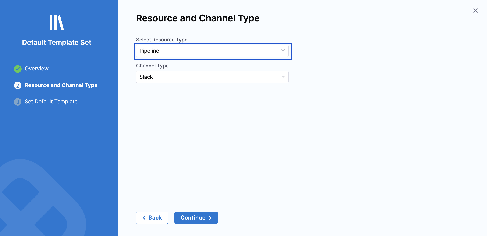
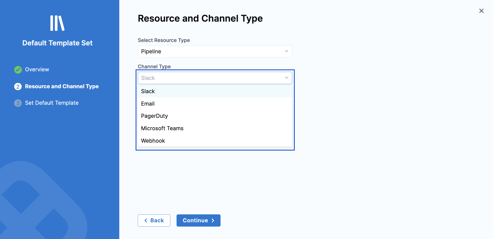
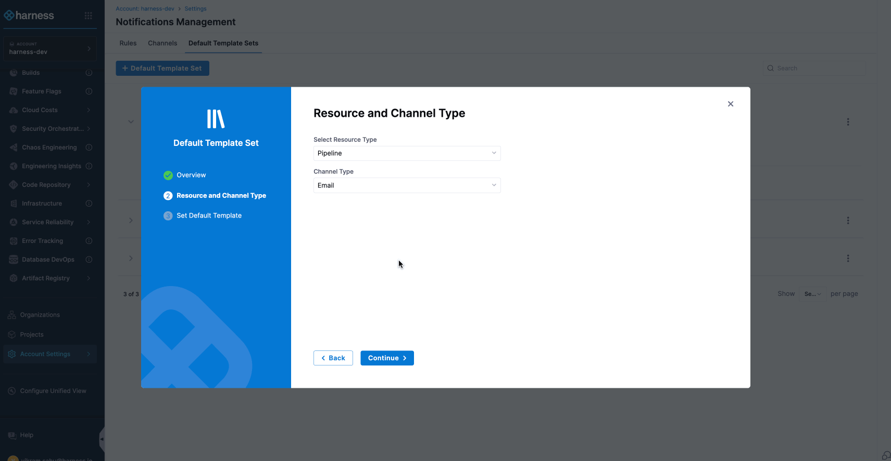

import Tabs from '@theme/Tabs';
import TabItem from '@theme/TabItem';

:::note Feature Availability
The Default Notification Template feature requires the `PL_DEFAULT_NOTIFICATION_TEMPLATE_SET_SUPPORT` feature flag. Contact [Harness Support](mailto:support@harness.io) to enable this feature.
:::

The Default Notification Template feature allows you to define templates that automatically apply when no specific template is selected for a notification rule. This ensures consistent and complete information in all notifications without requiring manual template selection for each rule.

You can configure default notification templates at different scopes (Account, Organization, or Project) and for specific event types and channel types, providing granular control over notification content.

## **Configuration Steps**

### Step 1: Navigate to the Default Templates Sets page

- Navigate to **Settings** at your desired scope (Account, Organization, or Project).

- Go to **General** → **Notification Management**.

- Select the **Default Template Sets** tab.

    

### Step 2: Create a Default Template Set

- Click **+ Default Template Set**

- In the Overview section:
        - Enter a name for the template set
        - Add an optional description and tags

- Click Continue

        

### Step 3: Configure Resource and Channel Type

- **Resource Type**: Automatically set to **Pipeline** (currently the only supported resource).

        

- **Channel Type**: Select one from the dropdown. Click Continue to proceed.

        

### 4: Define Event-Template Combinations

- Select one or more pipeline events from the **Select Pipeline Events** dropdown.

        

- Click **Select Template** and choose the template to serve as the default for the selected event type. If the template includes runtime input variables, provide the required values. Repeat this process for additional event and template combinations as needed.

        

- Click **Submit** to save the default template set. Once saved, the template set appears on the Default Template Sets page with a summary showing the configured events and templates.

        

## **Template Selection Priority**

The system follows a specific priority order when selecting a template for each event and channel type combination:

**1. Template selected in notification rule**: If you specify a template when creating or editing a notification rule, that template is used.

**2. Default template by scope**: If no template is specified in the rule, the system searches for default templates starting at the current scope and moving up the hierarchy: Project → Organization → Account.

**3. Built-in template**: If no custom or default templates are available, the built-in static template is used.

This hierarchy ensures that notifications are always sent with appropriate content, even when no specific template is configured.        

### **Examples for Template Selection Priority**

The following examples demonstrate how the template selection priority works in different scenarios, from basic to more advanced use cases.

    
Case 1: Default Notification Template available at the Project scope

    

        Consider the following setup across different scopes:

        - **Project P**: Default template "Template A" configured for Pipeline Success + Email
        - **Organization**: Default template "Template B" configured for Pipeline Success + Email
        - **Account**: Default template "Template C" configured for Pipeline Success + Email

        You create a notification rule at Project P for:

        - **Event Type**: Pipeline Success
        - **Channel**: Email
        - **Template**: None selected in the notification rule

        In this scenario, the system selects the template using the following priority order:

        1. **Rule-level template**: No template was specified in the notification rule, so the system proceeds to check for default templates.
        2. **Project scope**: The system finds "Template A" configured for Pipeline Success + Email at Project P and uses it. The search stops here.

        **Result**: The notification uses "Template A" because it was found at the Project scope, which has the highest priority after rule-level templates. Templates at higher scopes ("Template B" and "Template C") are not considered since a match was found at the current scope.
    

    
Case 2: Default Notification Template available only at the Account scope

    

        Consider the following setup across different scopes:
        
        - **Project P**: No default template configured for Pipeline Success + Email
        - **Organization**: No default template configured for Pipeline Success + Email
        - **Account**: Default template "Template C" configured for Pipeline Success + Email

        You create a notification rule at Project P for:

        - **Event Type**: Pipeline Success
        - **Channel**: Email
        - **Template**: None selected in the notification rule

        In this scenario, the system selects the template using the following priority order:

        1. **Rule-level template**: No template was specified in the notification rule, so the system proceeds to check for default templates.
        2. **Project scope**: No default template found for Pipeline Success + Email. The search continues to the next scope level.
        3. **Organization scope**: No default template found for Pipeline Success + Email. The search continues to the next scope level.
        4. **Account scope**: Default template "Template C" is found for Pipeline Success + Email. The search stops here.

        **Result**: The notification uses "Template C" because it was the only matching default template available at the Account level. If no template were available at any scope, the system would fall back to the built-in static template.
    

    
Case 3: Template explicitly selected in the notification rule

    

        Consider the following setup across different scopes:
        
        - **Project P**: Default template "Template A" configured for Pipeline Success + Email
        - **Organization**: Default template "Template B" configured for Pipeline Success + Email
        - **Account**: Default template "Template C" configured for Pipeline Success + Email

        You create a notification rule at Project P for:

        - **Event Type**: Pipeline Success
        - **Channel**: Email
        - **Template**: "Custom Template X" explicitly selected in the notification rule

        In this scenario:

        1. **Rule-level template**: "Custom Template X" is specified in the notification rule, so it takes priority over all default templates.

        **Result**: The notification uses "Custom Template X" because it was explicitly selected in the notification rule, regardless of any default templates configured at any scope.
    

