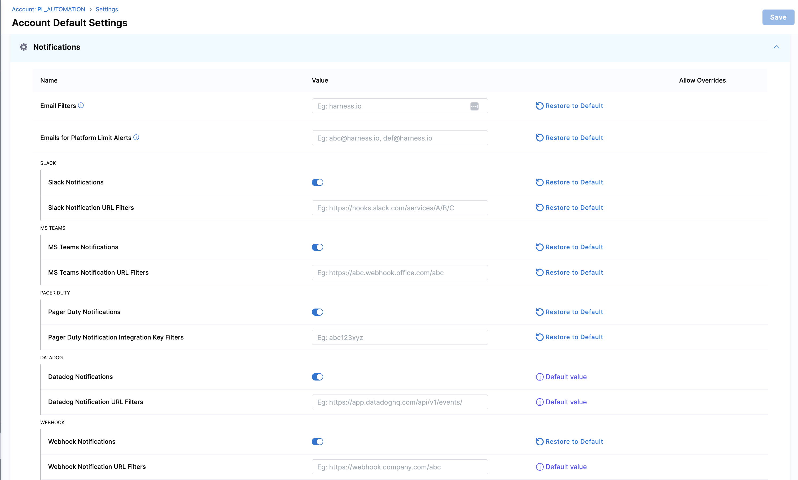
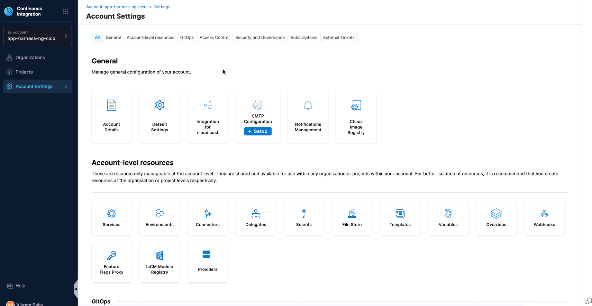
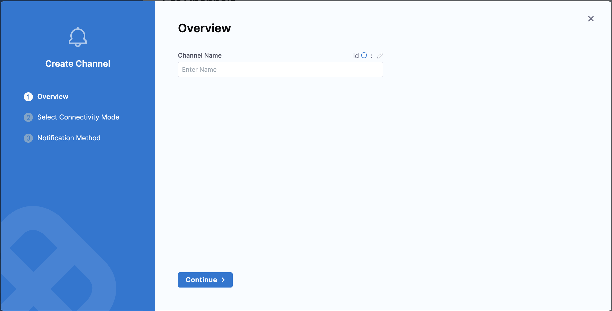

import Tabs from '@theme/Tabs';
import TabItem from '@theme/TabItem';

Notification settings allow you to control which notification channels are available across your Harness account. These settings are managed at the account scope and apply to all organizations and projects within the account.

By default, all supported notification channels are enabled. Organizations and projects inherit the account-level notification settings and cannot override them.

When a notification channel is disabled at the account level:
   - No notifications are sent through that channel.
   - This applies to both existing and newly configured notifications.
   - Notifications resume automatically when the channel is enabled.

Harness supports the following notification channels:
   - Slack
   - Microsoft Teams
   - Webhooks
   - PagerDuty
   - Email
   - Datadog

---

## Manage notification 

To enable or disable a notification channel, navigate to **Account Settings** > **Account Resources** > **Default Settings** > **Notifications**, and use the corresponding toggle.



### Email filters

Email filters allow you to restrict where notifications are sent by enforcing a domain allowlist at the account level. When enabled, notifications are delivered only to email addresses included in the allowlist.

Only fixed domains are supported. Expression-based URLs or dynamic domains are not allowed.

**Example**: If you add `example.com` to the email filters, only email addresses from that domain such as `alerts@example.com` will receive notifications.

### Emails for platform limit alerts

:::note Feature Availability
Currently, the platform limit alerts feature is behind the feature flag `PL_ENABLE_LIMIT_ALERTS_NOTIFICATIONS`. Please, contact [Harness Support](mailto:support@harness.io) to enable this feature.
:::

You can configure email recipients to receive alerts as your account approaches the default [platform resource limits](/docs/platform/account-license-limits). Email alerts are sent when usage reaches 80%, 95%, and 100% of the allowed limit, giving you visibility and time to act. You can add up to five email addresses to receive these alerts.

Platform limits are enforced at the account level, and these alerts help you proactively manage usage before limits are reached.

#### Platform Resource Mapping 

These variables are used in email notifications to alert users when platform resources are approaching their limits. You can find more about the platform resource limits [here](/docs/platform/account-license-limits/).

| Resource Name    | Resource Variable                                   |
| ---------------- | ------------------------------------------ |
| Organizations    | `MULTIPLE_ORGANIZATIONS`                   |
| Projects         | `MULTIPLE_PROJECTS`                        |
| Secrets          | `MULTIPLE_SECRETS`                         |
| User Groups      | `MULTIPLE_USER_GROUPS`                     |
| Users            | `MULTIPLE_USERS`                           |
| Service Accounts | `MULTIPLE_SERVICE_ACCOUNTS`                |
| Variables        | `MULTIPLE_VARIABLES`                       |
| API Keys         | `MULTIPLE_API_KEYS`                        |
| API Key Tokens   | `MULTIPLE_API_TOKENS`                      |
| Connectors       | `MULTIPLE_CONNECTORS`                      |
| Secret Managers  | `SECRET_MANAGERS`                          |
| Roles            | `CUSTOM_ROLES`                             |
| Resource Groups  | `CUSTOM_RESOURCE_GROUPS`                   |
| Role Bindings    | `ROLE_ASSIGNMENT`                          |
| Audit streaming  | `AUDIT_STREAMING_DESTINATION`              |
| Delegates        | `MULTIPLE_DELEGATES`                       |
| Data Sinks       | `DATA_SINKS`                               |

## Get started with pipeline notifications

Learn how to notify users of different pipeline events using popular notification methods.

### Prerequisites

* You need a Harness pipeline with active delegates and connectors. You can follow the [tutorial to get started with Harness Continuous Delivery (CD)](/docs/continuous-delivery/get-started/tutorials/kubernetes-container-deployments/manifest) to set up a sample pipeline.
* These steps use [Harness user groups](/docs/platform/role-based-access-control/add-user-groups/) to manage user access. If you want to follow along, create a user group named `notification-demo` at the account level, and then add yourself as a user in that group.

### Configure New Channels to sent notification

A new channel can be configured across all scopes. To set up a channel, go to Settings for your desired scope → General → Notification Management, and click Channels as shown below:

   

1. Click New Channel and enter a Channel Name.
            
   

2. Choose a Connectivity Mode — you can send notifications either directly through the Harness Platform or via a Harness Delegate.

   

   If you choose to send notifications through a Harness Delegate, select the appropriate delegate in the Delegate Setup window.

   

3. Notification Method: Once the connectivity mode is configured, select the [**Channel Type**](#configure-pipeline-notifications) and add details related to the channel type to proceed.
            
   :::note
   If you select the Connectivity Mode as "Connect through a Harness Delegate" and Channel Type as "Email", ensure to add an [SMTP configuration](https://developer.harness.io/docs/platform/notifications/add-smtp-configuration) to which the Harness delegate has access. If this is not done, then the Email notifications will fail.
   :::

   

### Configure pipeline notifications

<Tabs>
<TabItem value="Email">

1. Select the **Notify** icon on the right side of the Harness pipeline studio.
2. In **New Notification**, add a name for your notification.
3. In **Pipeline Events**, select the events (pipeline or stages) that will trigger the notification.
   - For stage-based events, select the stage name that you want to trigger the notification and click **Next**.
4. In **Notification Method**, select `Email`. 
For email notifications, simply type in the email addresses that you want to notify.
   - Enter multiple addresses as a comma-separated list. For example, `john.doe@example.io,qateam@example.io`.
   - Additionally, use the user group that you created above to receive notifications.
   - You can also use the user group that you created above to receive notifications.
5. You can optionally add **notification templates** to get custom notifications based on the event. To learn more, go to [Custom Notification templates for Pipeline Notifications](/docs/platform/templates/customized-notification-template).
6. Select the Connectivity Mode.
   - Connect through Harness Platform to send notifications.
   - Connect through Harness Delegate to send notifications.
      - Select the delegate that you want to use to send notifications.
8. Select **Submit** and your notification is created.

</TabItem>
<TabItem value="Slack">

To configure Slack notifications, you need to create a Slack webhook. For more information, go to the [sending messages using incoming webhooks](https://api.slack.com/messaging/webhooks) tutorial provided by Slack. Copy and store the webhook URL for use in Harness.

1. Select the **Notify** icon on the right side of the Harness pipeline studio.
2. In **New Notification**, add a name for your notification.
3. In **Pipeline Events**, select the events (pipeline or stages) that will trigger the notification.
   - For stage-based events, select the stage name that you want to trigger the notification and click **Next**.
4. In **Notification Method**, select `Slack`.
   - Paste the webhook in **Slack Webhook URL**. Harness recommends that you add the webhook as an [encrypted text secret](/docs/platform/secrets/add-use-text-secrets) and reference it in **Slack Webhook URL** as an expression, such as `<+secrets.getValue("slackwebhookURL")>`.
   - Now additionally you can use the **user-group** created above, if it is associated with the slack channels to send notifications, for more information on the same follow the instructions mentioned [here](/docs/continuous-delivery/x-platform-cd-features/cd-steps/notify-users-of-pipeline-events/#notify-slack-channels-in-user-groups)
5. You can optionally add **notification templates** to get custom notifications based on the event. To learn more, go to [Custom Notification templates for Pipeline Notifications](/docs/platform/templates/customized-notification-template).
6. Select the Connectivity Mode.
   - Connect through Harness Platform to send notifications.
   - Connect through Harness Delegate to send notifications.
      - Select the delegate that you want to use to send notifications.
7. Select **Submit** and your notification is created.

</TabItem>
<TabItem value="PagerDuty">

To configure PagerDuty notification, you need a PagerDuty [service key](https://support.pagerduty.com/docs/services-and-integrations) to integrate with Harness. Copy or store this key from PagerDuty's **Configuration** > **Services** > **Service Details dialog** > **Integrations** tab.

1. Select the **Notify** icon on the right side of the Harness pipeline studio.
2. In **New Notification**, add a name for your notification.
3. In **Pipeline Events**, select the events (pipeline or stages) that will trigger the notification.
   - For stage-based events, select the stage name that you want to trigger the notification and click **Next**.
4. In **Notification Method**, select `Pagerduty`.
   - Create an **[encrypted text](/docs/platform/secrets/add-use-text-secrets)** secret with the name `pagerdutykey` for the PagerDuty service you have created above, and reference it in **PagerDuty Key** using an expression. Harness will send notifications using this key.
   
   For example, you can reference a secret within the Org scope using an expression with `org`:
   ```
   <+secrets.getvalue("org.your-secret-Id")>
   ```
5. You can optionally add **notification templates** to get custom notifications based on the event. To learn more, go to [Custom Notification templates for Pipeline Notifications](/docs/platform/templates/customized-notification-template).
6. Select the Connectivity Mode.
   - Connect through Harness Platform to send notifications.
   - Connect through Harness Delegate to send notifications.
      - Select the delegate that you want to use to send notifications.
7. Select **Submit** and your notification is created.

</TabItem>
<TabItem value="Microsoft Teams">

In Microsoft Teams, you can use webhook notifications to inform an external application of a pipeline/stage event.

1. Select the **Notify** icon on the right side of the Harness pipeline studio.
2. In **New Notification**, add a name for your notification.
3. In **Pipeline Events**, select the events (pipeline or stages) that will trigger the notification.
   - For stage-based events, select the stage name that you want to trigger the notification and click **Next**.
4. In **Notification Method**, select `Microsoft Teams`.
   In **Enter the Microsoft Teams Webhook URL**, paste the webhook URL for your Microsoft Teams channel.

5. You can optionally add **notification templates** to get custom notifications based on the event. To learn more, go to [Custom Notification templates for Pipeline Notifications](/docs/platform/templates/customized-notification-template).
6. Select the Connectivity Mode.
   - Connect through Harness Platform to send notifications.
   - Connect through Harness Delegate to send notifications.
      - Select the delegate that you want to use to send notifications.
7. Select **Submit** and your notification is created.

</TabItem>
<TabItem value="Webhook">

In Harness you can use webhook notifications to inform an external application of a pipeline/stage event.

1. Select the **Notify** icon on the right side of the Harness pipeline studio.
2. In **New Notification**, add a name for your notification.
3. In **Pipeline Events**, select the events (pipeline or stages) that will trigger the notification.
   - For stage-based events, select the stage name that you want to trigger the notification and click **Next**.
4. In **Notification Method**, select `Webhook`.
   In **Enter the URL to be called**, use expressions to compose the URL to be called when the event occurs. For example, `https://companyurl.notify.com/execution=-<+pipeline.executionId>`.
   - The webhook call is made as a POST request, and includes a JSON object containing the properties of the triggered event.
   - The expression must be evaluated in the context of the event. For example, stage-related expressions might not be valid for pipeline start events.

5. You can optionally add **notification templates** to get custom notifications based on the event. To learn more, go to [Custom Notification templates for Pipeline Notifications](/docs/platform/templates/customized-notification-template).
6. Select the Connectivity Mode.
   - Connect through Harness Platform to send notifications.
   - Connect through Harness Delegate to send notifications.
      - Select the delegate that you want to use to send notifications.
7. Select **Submit** and your notification is created.

</TabItem>
<TabItem value="Datadog">

:::note
Currently, the Datadog notifications feature is behind the feature flag `PIPE_DATADOG_NOTIFICATIONS`. Please, contact [Harness Support](mailto:support@harness.io) to enable this feature.
:::

To configure Datadog notification, you need a Datadog [API key](https://docs.datadoghq.com/account_management/api_keys/) to integrate with Harness. Copy or store this key from Datadog's **Configuration** > **API Keys** > **API Key Details dialog** > **Integrations** tab.

1. Select the **Notify** icon on the right side of the Harness pipeline studio.
2. In **New Notification**, add a name for your notification.
3. In **Pipeline Events**, select the events (pipeline or stages) that will trigger the notification.
   - For stage-based events, select the stage name that you want to trigger the notification and click **Next**.
4. In **Notification Method**, select `Datadog`.
   Create an **[encrypted text](/docs/platform/secrets/add-use-text-secrets)** secret with the name `datadogkey` for the Datadog service you have created above, and reference it in **Datadog Key** using an expression. Harness will send notifications using this key.
   - For example, you can reference a secret within the Org scope using an expression with `org`:
   ```
   <+secrets.getvalue("org.your-secret-Id")>
   ```
5. You can optionally add **notification templates** to get custom notifications based on the event. To learn more, go to [Custom Notification templates for Pipeline Notifications](/docs/platform/templates/customized-notification-template).
6. Select the Connectivity Mode.
   - Connect through Harness Platform to send notifications.
   - Connect through Harness Delegate to send notifications.
      - Select the delegate that you want to use to send notifications.
7. Select **Submit** and your notification is created.

</TabItem>
</Tabs>

More detailed information on how to configure the notification at the receiver end can be found [here](/docs/continuous-delivery/x-platform-cd-features/cd-steps/notify-users-of-pipeline-events/).

When you run the pipeline, you'll receive notifications on the platform you set up.

