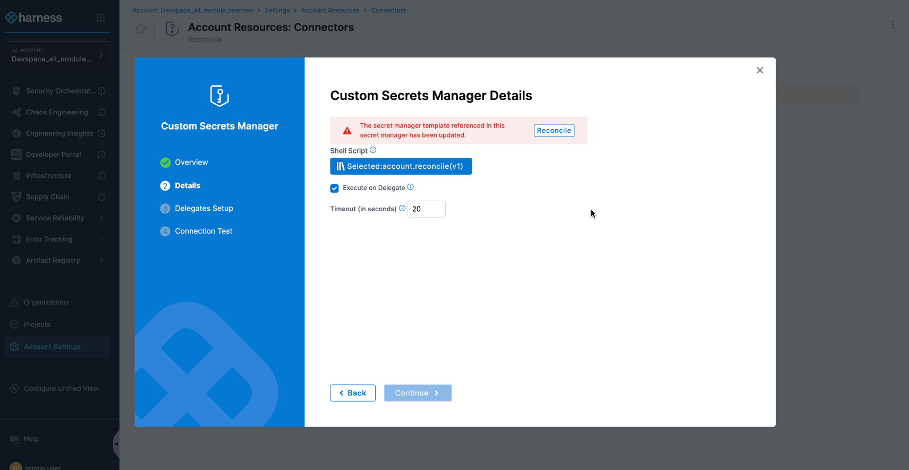
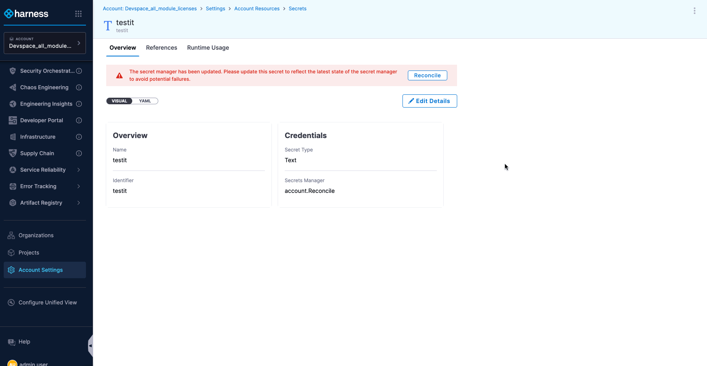
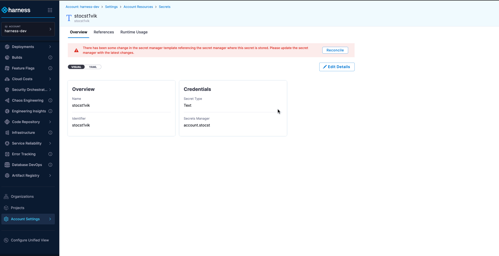

Secret Manager Template reconciliation is the process of updating dependent Custom Secret Managers and Secrets when you modify their associated template. When you update a Secret Manager Template, all entities that use it need to be updated to match the new template settings.

**How it works:**
- Harness automatically detects when a template has been modified
- Alert banners appear on all dependent entities (Custom Secret Managers and Secrets)
- You can review the configuration differences in a YAML diff view
- Apply the changes to keep all the entities synchronized

This article guides you through the reconciliation process for both Custom Secret Managers and their dependent Secrets.

## Prerequisites

Before you can reconcile templates, ensure you have the following configured:

- A [Secret Manager Template](/docs/platform/templates/create-a-secret-manager-template)
- A [Custom Secret Manager](https://developer.harness.io/docs/platform/secrets/secrets-management/custom-secret-manager/) that references the Secret Manager Template
- A [Secret](https://developer.harness.io/docs/platform/secrets/secrets-management/harness-secret-manager-overview) that uses the Custom Secret Manager

## Modify a Secret Manager Template

To show how reconciliation works, let's update a Secret Manager Template. In this example, we'll change template values from fixed values to runtime inputs:

1. Navigate to your Secret Manager Template in the Templates section

2. Click the **More options** (⋮) menu and select **Open/Edit Template**

3. In the **Configuration** section, change the values from **Fixed value** to **Runtime Input**

4. Click **Save** to apply your template updates

   

:::info What happens next?
After saving the template changes, Harness automatically identifies all dependent Custom Secret Managers and Secrets that need to be updated. Reconciliation alerts will appear on these entities to guide you through the update process.
:::

## Reconcile the Secret Manager

After updating the template, you need to reconcile each Custom Secret Manager that references it

- Navigate to the Custom Secret Manager and click **Reconcile** in the alert banner

   

- On the details page, click **Reconcile** again to view the YAML diff

- Review the configuration changes, provide values for any runtime inputs, and click **Continue** to apply

   

## Reconcile the Secret

After reconciling the Secret Manager, update all dependent secrets:

- Navigate to each Secret that uses the Custom Secret Manager and click **Reconcile** in the alert banner

- On the Secret editing page, click **Reconcile** again to view the YAML diff

- Review the configuration changes, provide values for any runtime inputs, and click **Save** to apply

    

:::note Important Note
If a Secret is created in a Custom Secret Manager that needs reconciliation, Harness will redirect you to the [Secret Manager page](#reconcile-the-secret-manager) to complete the Custom Secret Manager reconciliation first.
    

        
Click to view

        

        
        

    

:::   