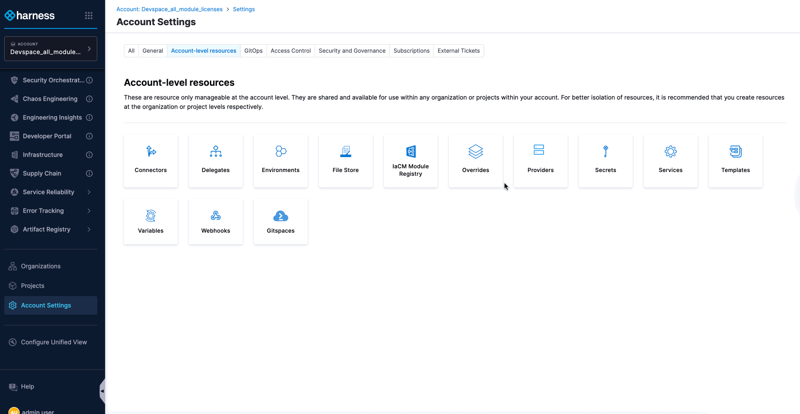
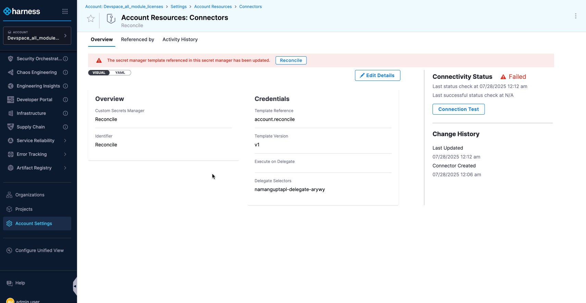

:::note Permissions Required
    Important: You must have **Create/Edit** permissions for the relevant connector or secret to perform reconciliation.
:::

When a Custom Secret Manager Template is updated, any Custom Secret Managers or Secrets referencing it can become out of sync, which may cause pipeline failures. To prevent this, Harness provides alerts and a guided reconciliation process that helps you update affected entities.

## Steps to Reconcile a Secret Manager Template

1. Create a [Secret Manager Template](/docs/platform/templates/create-a-secret-manager-template) with [fixed value](https://developer.harness.io/docs/platform/variables-and-expressions/runtime-inputs/).

2. Create a [Custom Secret Manager](https://developer.harness.io/docs/platform/secrets/secrets-management/custom-secret-manager/), select the Secret Manager template created earlier, configure the delegate options, and complete the setup.

3. Create a [new secret](https://developer.harness.io/docs/platform/secrets/secrets-management/harness-secret-manager-overview) using the Custom Secret Manager from previous step, and click **Save** to apply the changes.

:::tip How Reconciliation Works?
    If a Secret Manager template is linked to a Custom Secret Manager and a Secret, any changes to the template trigger a reconciliation option for both. For example, changing a template variable from a fixed value to a runtime input will display an alert with the option to reconcile.
:::

4. Update the Secret Manager Template: Navigate to your Secret Manager Template, click the More options (three dots), and select Open/Edit Template. Go to the Configuration section and change the values from Fixed value to Runtime Input, as shown below. 

    :::note 
        In this example, we’re updating the template from fixed values to runtime inputs, but it could be any update related to variables, including those with expressions.
    :::

    

5. Reconcile the Secret Manager: After updating the template, an alert appears with the message 'The secret manager template referenced in this secret manager has been updated.' and a Reconcile button.

    - Click Reconcile to open the Custom Secret Manager page. On the Details page, you’ll see the alert 'The secret manager template referenced in this secret manager has been updated.' Click Reconcile again to proceed.

        

    - After clicking Reconcile on the Details page, a YAML difference appears showing the current and updated variables. Review the changes and reconcile as needed. Click Continue to proceed.

        

    After reconciling the Secret Manager, update the secrets that reference it.

6. Reconcile the Secret: Navigate to the Secret that references your Secret Manager. You’ll see an alert stating, 'The secret manager has been updated. Please update this secret to reflect the latest state of the secret manager to avoid potential failures.' Click Reconcile to proceed.

    - Click Reconcile to open and edit the Secret. The same alert message appears. Click Reconcile again to view the YAML differences between the current and updated versions. Review the changes and reconcile as needed.

        