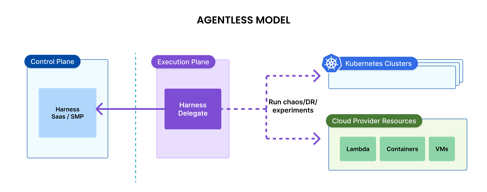
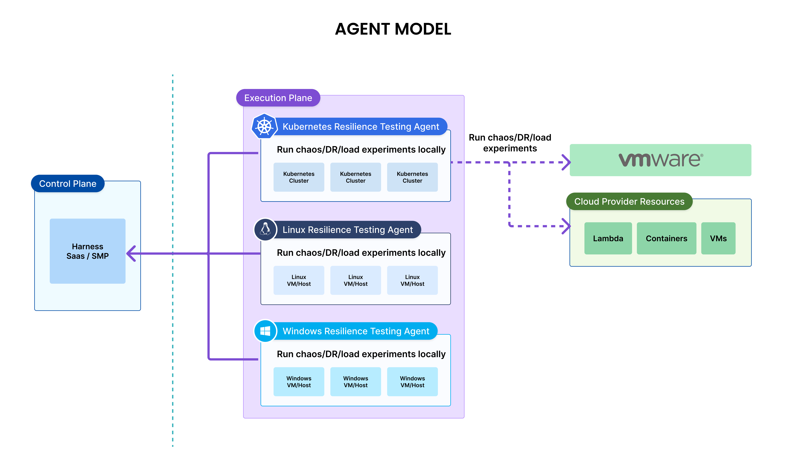
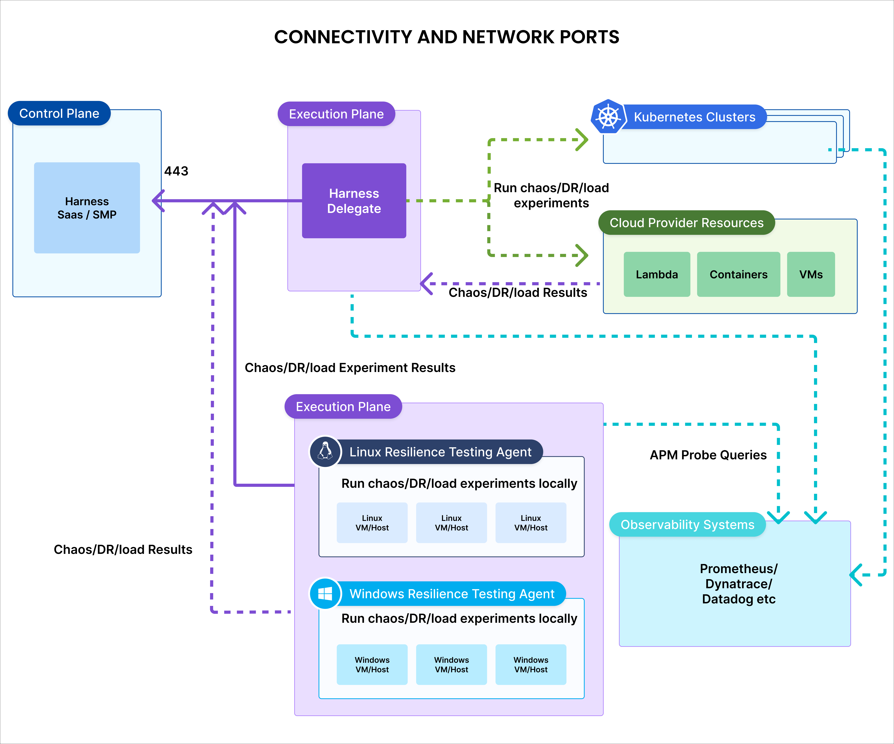
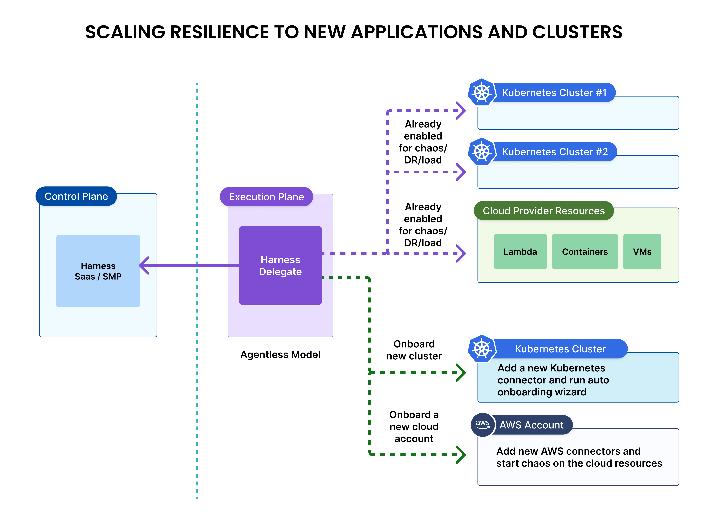

# Harness Resilience Testing Architecture

Harness Resilience Testing is a part of Harness platform that is offered as SaaS or deployed on-premise (SMP) that is managed by the enterprise customers. The capabilities of Resilience Testing are same in both the **SaaS** and **On-Premise** models. 

Irrespective of the model, the architecture is divided into two parts:

1. **The Control Plane** that is part of the Harness Platform that is responsible for orchestrating, managing, and controlling the execution of chaos experiments.
2. **The Execution Plane** that resides in the enterprise's private or public network where chaos experiments are executed. It consists of the infrastructure where faults are injected and tested.

An enterprise typically consists of one chaos control plane and one or more chaos execution planes. The diagrams below describe different deployment models.

## Deployment Models

Harness Resilience Testing can be deployed in two ways:

**[SaaS](./on-premise-vs-saas#saas)**: Fully managed cloud service with automatic updates and scaling to help you get started quickly with minimal setup.

**[On-Premise (SMP)](./on-premise-vs-saas#on-premise)**: Deploy in your own infrastructure for complete control.

---

## Chaos Execution Plane

The execution plane consists of a logical group of components that reside in the customer's network responsible for running chaos experiments. Some of these components are long running and others are spawned dynamically at run time (of the chaos experiment). The chaos experiments are executed on the target resources by a chaos agent residing on the target or by the Harness delegate residing in the customer network.

### Agentless Model

In the agentless model, the chaos experiments are run by the Harness Delegate. One Harness Delegate can run chaos experiments on multiple targets such as other Kubernetes clusters, cloud platform resources, VMware resources, as long as the network connectivity is available between the Delegate and the target.

Harness Delegate can run chaos experiments on the following target types:
- Kubernetes clusters and the applications running on the Kubernetes. This includes the managed Kubernetes services like EKS, GKE and AKS.
- Cloud Platform resources like AWS ECS, AWS Lambda, GCP Cloud Run, Google Cloud Functions, Azure ACS and Azure functions. This includes cloud platform resources like load balancers too.
- VMware resources.

---

### Agent-Based Model

In the agent model, a chaos agent has to be deployed on the target resource and then the chaos agent runs the chaos experiments on the local resources.

Agent model is preferred to run chaos experiments on the Linux or Windows hosts.

The following table provides different agent types and corresponding target resources.

**Agent-Based and Agentless models**

| Model     | Agent                  | Supported Target Types                         |
|-----------|------------------------|------------------------------------------------|
| Agentless | Harness Delegate       | Kubernetes, AWS/GCP/Azure resources, VMware    |
| Agent     | Kubernetes Chaos Agent | Kubernetes, AWS/GCP/Azure resources, VMware    |
| Agent     | Linux Chaos Agent      | Linux hosts and applications running on them   |
| Agent     | Windows Chaos Agent    | Windows hosts and applications running on them |

---

## Chaos Control Plane

The control plane in Harness Resilience Testing consists of various components that helps connect the targets to Harness, create chaos experiments, set up RBACs, set up governance and orchestrate the chaos experiments. Some of the key features of the control plane are described below.

### Chaos Services

Chaos control plane has the concept of services that are used for license tracking as well as for service-oriented chaos experimentation.

- A service on the control plane is defined differently for different types of targets.
- A service also helps achieve service-oriented chaos. This feature support is available **ONLY** for Kubernetes targets using the agentless deployment model. The Kubernetes services on the target clusters or the execution plane are discovered by the [discovery service](./chaos-testing/service-discovery) of the Harness platform and [application maps](./chaos-testing/application-maps) are created around them. After discovery, chaos experiments are created to target the resources of these services by the control plane itself. This significantly reduces the initial learning required to get started with chaos engineering practices.
- Another use of services and application maps is deriving the resilience coverage metric. Since the potential chaos experiments are already created by the control plane, the ratio of the "experiments that are run versus total number of chaos experiments present" can be calculated at a service level or at an application map level. This results in a useful metric of **resilience coverage** for each service and for application map.

### Governance

Chaos governance is a critical feature of the Harness Resilience Testing module, reflecting its role in minimizing risks and ensuring controlled, purposeful chaos experiments. Without effective governance, poorly planned experiments can unintentionally expand the blast radius, leading to unexpected disruptions that may harm developer productivity or diminish customer satisfaction. Governance in chaos engineering can be broadly categorized into two key aspects, ensuring structured, safe, and impactful experimentation.

1. Guardrails around creating chaos agents, chaos experiments, and chaos execution policies. This is achieved through the [Harness platform RBAC policies](./chaos-testing/governance/rbac).
2. Guardrails around running chaos experiments. This is achieved through the [ChaosGuard](./chaos-testing/governance/governance-in-execution).

### Construct Chaos Experiments

Chaos experiments are initially [constructed](./chaos-testing/experiments) using an easy-to-use UI based builder called **Chaos Studio**. Chaos Studio helps in building complex chaos experiments with ease and also provides a great execution view. Chaos experiments will have chaos faults and resilience probes. Chaos fault templates are taken from the Enterprise ChaosHub and then tuned to the needs of the experiment. Resilience probes are constructed in accordance with the validation needs and mapped to the desired faults.

In summary, creation of chaos experiments is made easier by the UI based tooling and the end result of such creation is an YAML file. This YAML file can then be used to achieve further automation using infrastructure management tools such a Terraform or Harness IaC.

### ChaosHubs

A [ChaosHub](./chaos-testing/chaoshub) stores various resources of the Chaos Engineering module. Currently, the supported resource are:
- Chaos Faults
- Chaos Experiment Templates
- Resilience Probe Templates

Harness provides a default ChaosHub called **Enterprise ChaosHub** which contains 200+ different types of faults across different types of targets. Custom ChaosHubs are created by users to store their own chaos experiment templates and resilience probe templates. The common practice is to select the chaos faults from the Enterprise ChaosHub, construct chaos experiments in the project workspace, test them and push them to your own custom ChaosHub as a template which can be used by other users or projects in the organisation.

### Orchestrate Chaos Experiments

Once the chaos experiments are created using a chaos studio, they are available in the project workspace. You can execute them in many ways, as described below.

- **Orchestrate Via Pipelines**

  Harness chaos module provides the ability to execute experiments in pipelines with the help of a builtin step called Chaos-Step. This chaos-step executes the target experiment and the resulting resilience score is returned to the pipeline.

  This method offers a streamlined and powerful way to execute chaos experiments by integrating pipeline capabilities such as approvals, notifications, and parallel experiment execution. These features create an efficient framework for orchestrating chaos experiments seamlessly.

  You can expand the orchestration to other pipelines like Jenkins, Google Cloud Build, or GitHub Actions through APIs or the HCE-CLI, a specialized command-line tool. This ensures adaptability and seamless integration into various CI/CD workflows.

- **Orchestrate Via API**

  Harness provides API end points to invoke a chaos experiment and to query the result of a chaos experiment that is already run.

- **Orchestrate Via Scheduler**

  Harness Chaos Engineering control plane allows you to schedule a chaos experiment using CRON.

- **Orchestrate Via Portal**

  Harness chaos portal (aka the control plane) allows you to run an experiment with the **Run** button. You can stop an experiment execution with the **Stop** button in the [portal](https://app.harness.io).

  You can perform bulk actions on the chaos experiments. For example, you can choose multiple chaos experiments and add them to the pipeline for sequential execution.

- **Orchestrate Via CLI**

  HCE-CLI, a command line interface is provided for seamless execution of chaos experiments from automation scripts or from pipeline.

- **Orchestrate Via GameDays**

  The chaos control place provides a native [Gameday feature](./chaos-testing/gamedays) using which chaos experiments can be planned and executed.

---

## Connectivity Requirements

Harness Chaos Testing uses outbound HTTPS connections over port 443 for all communication between your infrastructure and the Harness control plane. **No inbound ports need to be opened** in your network.

**Required Outbound Access**

| From | To | Type of Data Out (Customer Premise to Harness) | Type of Connection |
|------|----|-------------------------------------------------|--------------------|
| Linux VM / Windows VM | `app.harness.io:443`, `*.harness.io` | New TCP connection request, Keep alive packets on the TCP connection | HTTPS |
|  | `app.harness.io:443`, `*.harness.io` | Chaos experiment results | HTTPS |
|  | APM System | Metrics Query | HTTPS |
| Harness Delegate on Kubernetes | `app.harness.io:443`, `*.harness.io` | Chaos experiment results from VMware, cloud provider resources | HTTPS |
| | `app.harness.io:443`, `*.harness.io` | New TCP connection request, Keep alive packets on the TCP connection | HTTPS |
| | APM System | Metrics Query | HTTPS |
| Applications on Kubernetes | `app.harness.io:443`, `*.harness.io` | Chaos experiment results | HTTPS |
|  | APM System | Metrics Query | HTTPS |

Target resources for chaos experiments are reached through different agent types:
- **Harness Delegate (Kubernetes Chaos Agent)**: Manages Kubernetes-based experiments and cloud provider resources
- **Linux Chaos Agent**: Executes experiments directly on Linux hosts and applications
- **Windows Chaos Agent**: Executes experiments directly on Windows hosts and applications

All agents communicate with the Harness control plane via outgoing port 443 - **no inbound port 443 needs to be opened**.

**Chaos Experiment Results Flow**

Results are sent directly to the Harness control plane via different paths:
- **Linux/Windows targets**: Results sent directly to port 443 of Harness control plane
- **Kubernetes application experiments**: Results sent directly to port 443 (do not go through Harness Delegate)
- **VMware, serverless functions, cloud provider resources**: Results sent to port 443 via the Harness Delegate

All communication flows outbound from your infrastructure to `app.harness.io:443` using HTTPS.

### Firewall Configuration

**Required Outbound Rules**

Ensure your firewall allows outbound HTTPS traffic on port 443 to:
- `app.harness.io` (primary endpoint)
- `*.harness.io` (for additional Harness services)

## Scaling Harness Resilience Testing

For the Kubernetes targets - it is easier to onboard chaos capabilities to your applications on a new Kubernetes cluster using the agentless model. Once the [Harness delegate is deployed and configured](/docs/platform/delegates/delegate-concepts/delegate-overview#install-a-delegate), you can onboard chaos to a new Kubernetes cluster by [adding a connector](/docs/platform/connectors/cloud-providers/add-a-kubernetes-cluster-connector) and running an automated chaos onboarding wizard that discovers the resources and creates initial set of chaos experiments.

