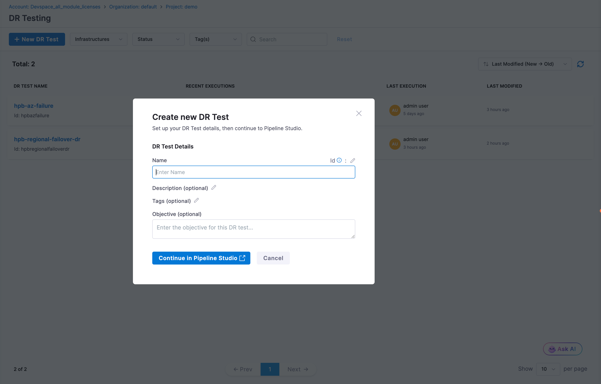
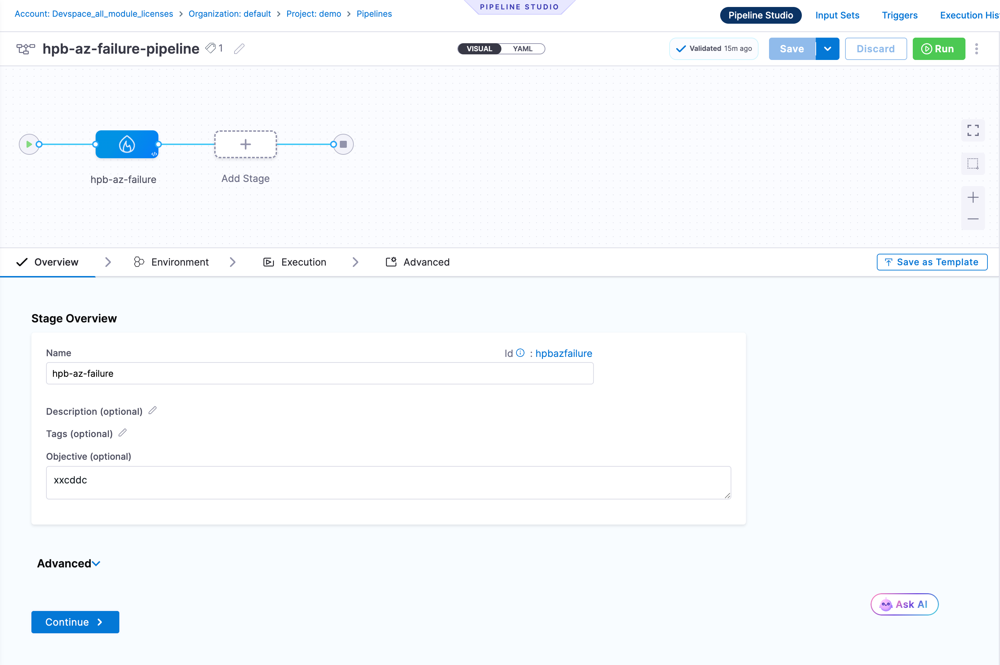
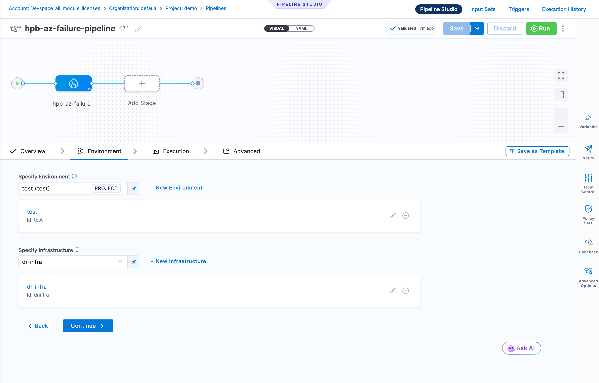
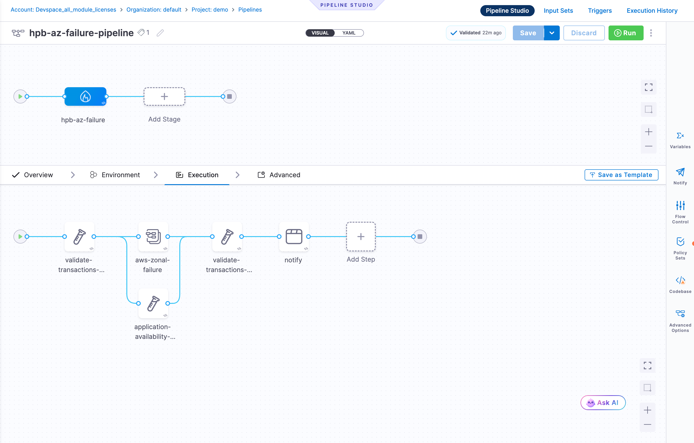

Disaster Recovery (DR) Testing validates that your systems can recover from catastrophic failures. DR tests are executed as pipeline stages, allowing you to orchestrate recovery scenarios with validation, failover, and notification steps.

:::info Feature Flag
DR Testing is currently behind a feature flag (`CHAOS_DR_TESTING_ENABLED`). Contact your Harness sales representative to get it enabled for your account.
:::

## Prerequisites

- Access to Harness Resilience Testing module
- Harness environment and infrastructure configured

## Create a DR Test

DR tests are created and then configured as pipeline stages.

### Step 1: Create New DR Test

1. Navigate to **Resilience Testing** > **DR Testing**
2. Click **+ New DR Test**

### Step 2: Configure DR Test Details

In the **Create new DR Test** dialog:

- **Name**: Enter a descriptive name for your DR test
- **Description**: (Optional) Add details about the disaster scenario being tested
- **Tags**: (Optional) Add tags to organize tests (e.g., `region-failover`, `backup-restore`)
- **Objective**: (Optional) Define the objective for this DR test

Click **Continue in Pipeline Studio** to proceed.

### Step 3: Configure Pipeline Stage

The DR test opens as a pipeline stage in Pipeline Studio.

#### Overview Tab

Configure the stage details:

- **Name**: The DR test name (auto-populated)
- **Description**: (Optional) Stage description
- **Tags**: (Optional) Additional tags
- **Objective**: (Optional) Stage objective

#### Environment Tab

Specify the environment and infrastructure where DR testing will occur:

- Select an existing environment or create a new one
- Select the infrastructure for executing the DR test
- The infrastructure determines where DR steps will run

#### Execution Tab

Click the **Execution** tab to define your DR test workflow. Add pipeline steps:

**For Example:**

**Validation Steps**
- Validate pre-disaster state
- Check backup integrity
- Verify transaction consistency

**Failover Steps**
- Trigger regional failover
- Switch to secondary data center
- Activate backup systems

**Verification Steps**
- Validate application availability
- Check data consistency
- Verify service health

**Notification Steps**
- Send alerts on completion
- Notify stakeholders

Click **+** to add steps and configure each step's parameters.

### Step 4: Save and Run

1. Click **Save** to save the pipeline
2. Click **Run** to execute the DR test
3. Monitor execution progress in real-time
4. View results in the Execution History

## Next Steps

- [Key Concepts](../key-concepts): Understand resilience testing terminology
- [Chaos Testing](../chaos-testing/get-started): Combine DR testing with chaos experiments
- [Pipelines](/docs/category/pipelines): Learn more about Harness pipelines
