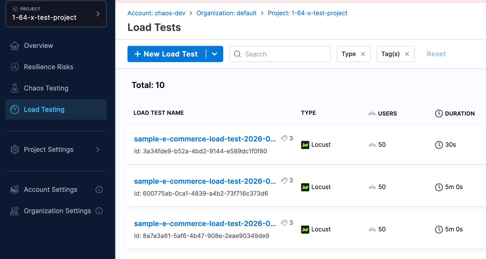
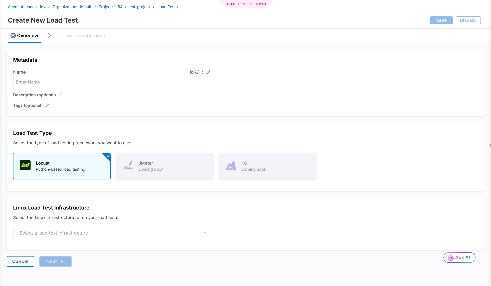
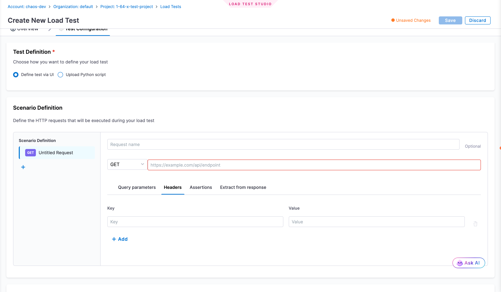
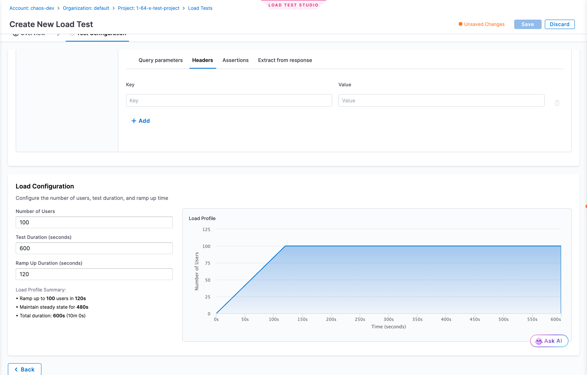

Load Testing simulates user traffic to validate your system's performance under expected and peak load conditions. Identify bottlenecks, validate scalability, and ensure your applications can handle production workloads.

:::info Feature Flag
Load Testing is currently behind a feature flag (`CHAOS_LOAD_TESTING_ENABLED`). Contact your Harness sales representative to get it enabled for your account.
:::

## Prerequisites

- Access to Harness Resilience Testing module
- A Linux Load Test Infrastructure configured in your project
- Target application endpoints accessible from the test infrastructure

## Create a Load Test

1. Navigate to **Resilience Testing** > **Load Testing**
2. Click **+ New Load Test**

:::tip Try Sample Test
To quickly explore Load Testing features, click the **+ New Load Test** dropdown and select **Try Sample Test**. This provides a pre-configured test with sample endpoints, realistic load settings, and example configurations to help you understand how load tests work before creating your own.
:::

### Configure Test (Overview Tab)

- **Name**: Enter a descriptive name for your test
- **Description**: (Optional) Add details about what the test validates
- **Tags**: (Optional) Add tags to organize tests
- **Load Test Type**: Select **Locust** (Python-based framework)
- **Infrastructure**: Select a Linux Load Test Infrastructure from the dropdown

Click **Next** to proceed to Test Configuration.

### Define Test Scenario (Test Configuration Tab)

Choose how to define your test:

**Option 1: Define test via UI**
- Configure HTTP requests with method, URL, headers, and parameters
- Add query parameters, headers, assertions, and response extractors as needed
- Click **+** to add multiple requests

**Option 2: Upload Python Script**
- Upload a custom Locust Python script (`.py` file)

### Configure Load

Set your load parameters:

- **Number of Users**: Concurrent virtual users (e.g., `100`)
- **Test Duration**: How long to run the test in seconds (e.g., `600` for 10 minutes)
- **Ramp-Up Duration**: Time to reach target users in seconds (e.g., `120` for 2 minutes)

The load profile graph shows how users ramp up, maintain steady state, and complete.

### Save and Run

1. Click **Save** to create the load test
2. Find your test in the Load Tests list
3. Click **Run** to execute
4. Monitor real-time results during execution

## Next Steps

- [Key Concepts](../key-concepts): Understand resilience testing terminology
- [Chaos Testing](../chaos-testing/get-started): Combine load testing with chaos experiments
- [Architecture](../architecture): Learn about the platform architecture
