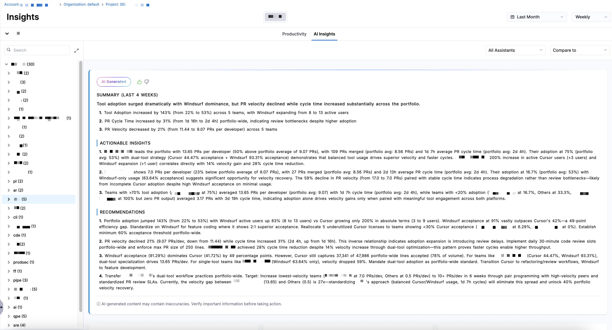
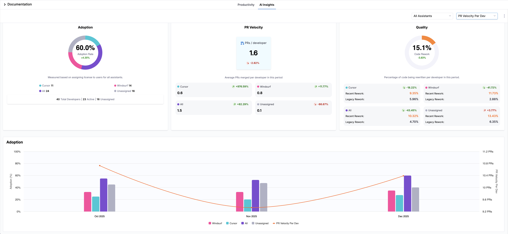

<CTABanner
  buttonText="Request Access"
  title="AI Insights is in beta!"
  tagline="Enable AI Insights to measure AI adoption and impact on productivity and quality across your teams, with AI-generated summaries and actionable recommendations. Available now in beta!"
  link="https://developer.harness.io/docs/software-engineering-insights/sei-support"
  closable={true}
  target="_self"
/>

AI Insights in SEI 2.0 provide visibility into how AI coding assistants are adopted and how they impact engineering performance. The out-of-the-box dashboard on the **Insights** page compares adoption and performance across AI coding assistants, including Cursor and Windsurf.

### Prerequisites

Before using AI Insights, ensure you have the following requirements:

- Created API keys in [Cursor](https://cursor.com/docs/api#creating-api-keys) and [Windsurf](https://docs.windsurf.com/plugins/accounts/api-reference/api-introduction#creating-a-service-key) with appropriate permissions to access usage metrics. The API key should have read access to organization or team usage data
- Configured the [Cursor](/docs/software-engineering-insights/harness-sei/setup-sei/configure-integrations/beta-integrations/cursor/) and [Windsurf](/docs/software-engineering-insights/harness-sei/setup-sei/configure-integrations/beta-integrations/windsurf/) integrations in SEI 2.0
- Set up a [Productivity Profile](/docs/software-engineering-insights/harness-sei/setup-sei/setup-profiles/productivity-profile)
- Ensure AI Insights is enabled for your organization

## AI Insights

The **AI Insights** tab on the **Insights** page in SEI 2.0 helps teams understand how AI-assisted development impacts productivity and quality outcomes. If your account has multiple Org Trees configured in SEI 2.0, the Org Trees are displayed as tiles at the top of the dashboard.

Selecting an Org Tree tile updates the dashboard to reflect data for that org tree and filters all AI metrics to only include the teams and developers within the selected Org Tree. This allows you to analyze AI adoption and performance trends across different organizations and teams.

By surfacing key aspects of AI-assisted development, the **AI Insights** dashboard helps teams:

- Understand how AI usage translates into into engineering outcomes and ROI
- Identify adoption gaps and areas of low AI usage
- Compare performance trends across assistants, teams, and organizations
- Focus investment decisions on the tools and teams that deliver the greatest impact

## AI summaries and recommendations

You can analyze the data by selecting a time range (for example, the last several weeks or months) and a time granularity (weekly, monthly, or quarterly), which determines how the data is grouped and displayed in the charts. SEI 2.0 automatically generates a contextual **AI Summary** for the selected time range and granularity. 

Each summary includes three sections:

- **Summary**: A narrative of key trends and performance changes for the selected time period.
- **Actionable Insights**: Data-driven observations explaining contributor behavior, adoption patterns, and productivity outcomes.
- **Recommendations**: Guidance on how to improve adoption, PR velocity, PR cycle time, and code quality based on observed signals.

AI Summaries are generated using the same metrics available in the AI Insights dashboard, including **Adoption**, **PR Velocity Per Developer**, **PR Cycle Time**, **Acceptance Rate**, and **Code Rework**. This ensures recommendations remain grounded in measurable engineering outcomes instead of qualitative assessments alone.

By default, the AI Summary you see when you navigate to the AI Insights dashboard reflects an organization-wide view, aggregating metrics across all teams in the selected Org Tree on the **AI Insights** tab. You can narrow the scope of the AI Summary section in two ways:

- Team-level summaries: Click on a team in the **Org Tree** on the left. The AI Summary updates automatically to reflect that team's adoption patterns, productivity trends, and code quality signals, allowing you to identify team-specific bottlenecks or high-performing code review workflows.
- Assistant-level summaries: Use the **All Assistants** dropdown menu to filter the dashboard by a specific AI assistant. When an assistant filter is applied, the AI Summary displays metrics associated with that assistant, helping you understand how each tool impacts velocity, cycle time, and rework independently.

Use the **All Assistants** dropdown menu to control which assistant's data is calculated across all widgets. Available options include `Cursor`, `Windsurf`, and `All Assistants`. Click the **Compare to** dropdown menu to overlay a second Y-axis across AI Insight visualizations. This lets you compare AI adoption and performance metrics against a [Productivity metric](/docs/software-engineering-insights/harness-sei/analytics-and-reporting/productivity#productivity-insights) (either `PR Velocity Per Developer` or `PR Cycle Time`). Trendlines for [Code Rework](/docs/software-engineering-insights/harness-sei/analytics-and-reporting/productivity#code-rework) are also added to each chart so you can assess whether the selected productivity metric is improving, regressing, or remaining stable over the selected time range.

Without a comparison selected, every chart in the AI Insights dashboard uses its own Y-axis; percentage of adoption in **Adoption**, number of lines added in **Lines Added Per Contributor**, and percentage of acceptance rate in **Acceptance Rate** sections. When you select **PR Velocity Per Developer** or **PR Cycle Time**, a second Y-axis appears on the right side of each chart, and displays the selected Productivity metric (such as PR Cycle Time in hours). This allows you to see how AI adoption and outcomes move alongside productivity over time.

To export the Productivity Insights dashboard data, click the kebab menu (⋮) and select **Export as PDF** or **Export as CSV**. For more information, see [Exporting SEI 2.0 Insights](/docs/software-engineering-insights/harness-sei/analytics-and-reporting/export).

Below is a brief overview of each widget in **AI Insights** on the **Insights** page:

### Adoption

The **Adoption** tile shows AI assistant adoption based on license assignment, including counts for `Cursor`, `Windsurf`, `All`, and `Unassigned` developers. The tile includes totals for overall number of developers, active developers, and unassigned developers.

:::info
Adoption is measured based on license assignment to developers for each assistant during the selected time period.

This tile provides a high-level view of AI enablement across your organization, helping you assess provisioning coverage, inactive licenses, and gaps in adoption. 
:::

### Velocity

The **PR Velocity** tile shows the average number of PRs merged per developer over the selected time period. The tile breaks down PR velocity by assistant type, including `Cursor`, `Windsurf`, `All`, and `Unassigned`. It also shows the percent of change for each assistant compared to the previous period, helping teams understand whether PR velocity is improving or declining.

:::info
[PR velocity](/docs/software-engineering-insights/harness-sei/analytics-and-reporting/productivity#pr-velocity-per-dev) is calculated as the average number of merged pull requests per developer during the selected time period.

PR velocity helps teams understand delivery throughput and whether AI-assisted development is contributing to faster or slower code delivery over time.
:::

### Quality

The **Quality** tile measures the percentage of code being rewritten per developer in the selected time period, including values for `Cursor`, `Windsurf`, `All`, and `Unassigned`. It breaks the metric into `Recent Code Rework` and `Remaining Code Rework` percentages. The tile also shows the relative change compared to the previous time period, helping teams identify whether rework is increasing or decreasing for each assistant.

:::info
Quality is determined by the percentage of code being rewritten per developer, also referred to as [Code Rework](/docs/software-engineering-insights/harness-sei/analytics-and-reporting/productivity#code-rework), during the selected time period.

Code Rework is a signal of maintainability and code stability. Monitoring changes in rework over time helps teams assess whether AI-assisted development is improving code quality or introducing additional churn.
:::

### Assistant adoption

Below the tiles, the **Adoption** section displays a bar chart showing adoption over time. The chart reflects the selected time range and granularity. Each bar represents a time interval (week, month, or quarter) and is color-coded by assistant. Hovering over a bar reveals the assistant name, the percentage of developers using that assistant, and the total number of developers.

:::info
Adoption is measured based on license assignment to developers for each AI assistant. Developers are categorized as `Cursor`, `Windsurf`, `All`, or `Unassigned` depending on their assigned licenses during the selected time period.

Tracking adoption over time helps you understand how widely AI assistants are being enabled across your organization and whether usage is increasing, stagnating, or decreasing.
:::

### Team adoption

To compare adoption across teams, use the **Team Adoption** section to compare adoption rates for each team in the selected Org Tree. The chart includes values for `Cursor`, `Windsurf`, `All`, and `Unassigned`, allowing you to compare adoption across teams.

:::info
Team adoption reflects the percentage of developers within each team who are assigned an AI assistant license during the selected time period.

Comparing adoption across teams helps identify uneven provisioning, under-utilized licenses, or teams that may benefit from additional onboarding or enablement.
:::

### Developers

To drill into developer data, the **Developers** section lists individual developers in the Org Tree. The table includes the following columns:

| Column                       | Definition                                                                                                                           |
| ---------------------------- | ------------------------------------------------------------------------------------------------------------------------------------ |
| **User**                     | The developer’s name or email address.                                                                                               |
| **Team**                     | The team that the developer belongs to within the selected Org Tree.                                                          |
| **Active Days**              | Number of days in the selected time range where the developer had any activity (commits, PRs, comments, etc.).                       |
| **Coding Days**              | Number of days in the selected time range where the developer made at least one code commit.                                         |
| **Assistant**                | The AI coding assistant assigned to the developer (`Cursor`, `Windsurf`, or `Unassigned`).                                                 |
| **Lines Suggested**          | The total number of lines of code suggested by the assistant during the selected time range.                                         |
| **Lines Accepted**           | The number of suggested lines that the developer accepted.                                                                           |
| **Line Acceptance Rate (%)** | The percentage of suggested lines that were accepted by the developer.                                                               |
| **PRs Merged**               | Total number of pull requests merged by the developer during the selected time range.                                                |
| **Work Resolved**            | Total number of work items (e.g., issues, tickets, tasks) resolved by the developer.                                                 |
| **New Work (%)**             | Percentage of work completed on new code (as opposed to rework).                                                                     |
| **Legacy Rework (%)**        | Percentage of rework performed on legacy code (code introduced before the recent code window).                                     |
| **Recent Rework (%)**        | Percentage of rework performed on recent code (introduced within the recent code window).                                          |
| **Features Delivered**       | Number of feature work items completed by the developer.                                                                             |
| **Defects Resolved**         | Number of defects or bugs resolved by the developer.                                                                                 |
| **Avg PR Cycle Time**        | The average time it takes for the developer’s pull requests to move from first commit through merge (typically shown in days/hours). |

:::info
Developer metrics are scoped to the selected time range, assistant filter, and your selection in the **Org Tree**. Values may differ between organization and team-level views depending on how contributors are grouped.
::: 

You can click the fields next to the **Funnel** icon to filter the table by `All`, `Active`, `Inactive`, and `Unassigned` and view a specific subset of developers and their activity.

To measure output quality, use the **Lines Added Per Active Developer** and **Acceptance Rate** charts to compare how many lines of code each assistant contributes and how frequently those contributions are accepted. 

### Lines added per active developer

The **Lines Added Per Active Developer** section displays bar charts representing the number of lines added per contributor, split by Windsurf or Cursor. Hover over each bar to see the exact number of lines added for each assistant and the total number of lines in a given time interval.

:::info
Lines Added Per Active Developer measures the total number of lines added in merged pull requests, averaged across active developers for the selected assistant and time period.

This metric helps you understand how AI-assisted development correlates with output volume and whether specific assistants are contributing to increased code production.
:::

### Acceptance rate

The **Acceptance Rate** section shows the acceptance rate per assistant. Hover over each bar to view the exact percentages for each assistant in a given time interval.

:::info
Acceptance Rate is calculated as the percentage of AI-suggested lines that are accepted into the source code during the selected time period.

Acceptance rate is a strong signal of AI usefulness and trust. Higher acceptance rates may indicate that developers find the assistant's suggestions to be relevant and production-ready.
:::