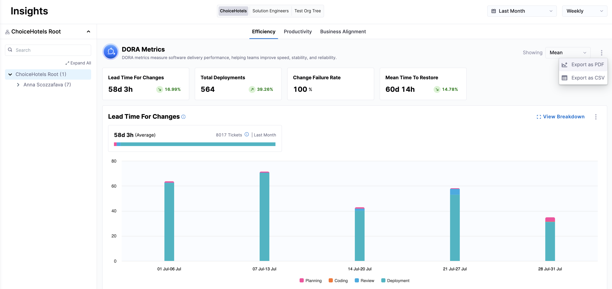

import Tabs from '@theme/Tabs';
import TabItem from '@theme/TabItem';

You can download and share insights from SEI 2.0 in PDF and CSV formats. This allows you to share key performance metrics and insights across teams and stakeholders for reporting, analysis, and decision-making. 

SEI 2.0 supports exporting **org-level, team-level, individual-level, and sprint-based metrics**, depending on the insight type and export option selected.

* **PDF Export** provides a snapshot of the dashboard view, including all widgets and the organizational hierarchy. This format is ideal for presentations and read-only sharing.
* **CSV Export** allows you to download raw metric data for further analysis. You can choose the aggregation level (for example, org, team, individual, or sprint) and select which metrics to include. 

You can click on the kebab menu (⋮) and select **Export as PDF/CSV** in the [Efficiency](/docs/software-engineering-insights/harness-sei/analytics-and-reporting/efficiency) and [Productivity](/docs/software-engineering-insights/harness-sei/analytics-and-reporting/productivity) dashboards, or click an **Export** button in the **Sprint Metrics** tab in the [Efficiency](/docs/software-engineering-insights/harness-sei/analytics-and-reporting/efficiency) dashboard to export data at the insight and widget level in SEI 2.0. 

<Tabs queryString="export-options">
<TabItem value="insights" label="Insight Level">

Export data for entire insight categories such as **Efficiency** and **Productivity** from the **Insights** page. This export includes all widgets in the selected insight, such as **Lead Time for Changes**, **Deployment Frequency**, **Change Failure Rate**, and **Mean Time to Restore**.

</TabItem>

<TabItem value="widgets" label="Widget Level">

Export data for individual widgets within an insight, such as **Deployment Frequency** in the **Efficiency** tab or **PR Velocity** in the **Productivity** tab from the **Insights** page. This is useful for focused analysis on specific metrics.

</TabItem>
</Tabs>

## Export as CSV

To customize the data included in your export, click **Export as CSV**.

* For **Efficiency (DORA)** insights, you can select which rate-based metrics to export. 
* For **Efficiency (Sprint)** insights, you can choose between **Sprint** or **Team**-level aggregation and select which sprint metrics to export.
* For **Productivity** insights, you can choose between **Team** or **Individual** metrics. Team metrics are aggregated per developer within each org node, while individual metrics export one row per developer.

<Tabs queryString="widget-options">
<TabItem value="efficiency-dora" label="Efficiency (DORA)">

1. Navigate to the **DORA** tab in the **Efficiency** dashboard.
1. Click on the kebab menu and click **Export as CSV**.
1. Select one or more of the following metrics:

   * **Lead Time for Changes**
   * **Deployment Frequency**
   * **Change Failure Rate**
   * **Mean Time to Restore**

1. Click **Export CSV**.

   

</TabItem>
<TabItem value="efficiency-sprint" label="Efficiency (Sprint)">

:::tip
Sprint Metrics is in beta. To request access, contact [Harness Support](/docs/software-engineering-insights/sei-support).
:::

1. Navigate to the **Sprint Metrics** tab in the **Efficiency** dashboard.
1. Click **Export**.
1. Select the aggregation level: **Sprint** or **Team**.
1. Select which metric groups to export: 

   * **Work Metrics**
   * **Delivery Metrics**
   * **Analysis Metrics**
   * **Delivery Analysis** (not available at the sprint level)

1. Click **Export**.

   

</TabItem>
<TabItem value="productivity" label="Productivity">

1. Navigate to the **Productivity** tab on the **Insights** page.
1. Click on the kebab menu (⋮) and select **Export as CSV**.
1. Select the metric type: **Team** or **Individual**.
1. Select the metrics to export.

   The following team-level metrics are available:

   - **PR Velocity Per Dev**
   - **Work Type Completed Per Dev**
   - **Coding Days Per Dev**
   - **Time to First Comment**
   - **Number of Comments**
   - **Average Time to Complete**
   - **Mean Time to Restore**

   

   The following individual-level metrics are available:

   - **PR Velocity**
   - **Work Type Completed**
   - **Coding Days**
   - **Time to First Comment**
   - **Number of Comments**
   - **Average Time to Complete**
   - **Number of Missing Tickets**

   

1. Once you've selected the metrics to be included in your report, click **Export CSV**.

</TabItem>
</Tabs>

### File name and column format

CSV exports follow a consistent structure, with one row per organizational node (or sprint, where applicable) and one column per selected metric. The columns included depend on the insight type, aggregation level, and metrics selected during export.

## Export as PDF

To export a PDF of the **Efficiency** dashboard or individual DORA widgets, click on the kebab menu (⋮) and select **Export as PDF**.

The following naming conventions apply:

* PDF: `Efficiency-YYYY-MM-DD-HH-MM-SS.pdf`
* CSV: `Efficiency-YYYY-MM-DD-HH-MM-SS.csv`
* Widget-specific: `Efficiency-<widget name>-YYYY-MM-DD-HH-MM-SS.pdf/csv`

To export a PDF of the **Productivity** dashboard or individual Productivity widgets, follow the same steps from the **Productivity** tab. Widget names may appear as abbreviated identifiers such as `PRV`, `BR`, or `FC` for **PR Velocity**, **Bugs Resolved**, and **Features Completed**, respectively.

For programmatic exports, see [Add Export Productivity and Efficiency Metrics Using the Harness SEI API](/docs/software-engineering-insights/harness-sei/api/export-insights).