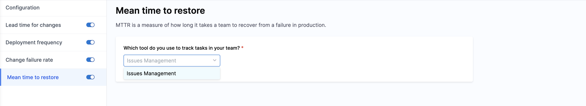

import Tabs from '@theme/Tabs';
import TabItem from '@theme/TabItem';

An Efficiency Profile defines how your team’s work is measured across each phase of the software delivery lifecycle. Once configured, these profiles power the core [DORA metrics](https://dora.dev/guides/dora-metrics-four-keys/) that help track delivery performance and maturity over time.

Efficiency Profiles allow you to:

- Define how Lead Time for Changes is measured across workflow stages
- Configure Deployment Frequency, Change Failure Rate, and MTTR
- Establish maturity levels that categorize performance into clear, consistent bands
- Control how sprint metrics are calculated and reported

Maturity levels are applied consistently across DORA metrics and sprint reporting, enabling teams to understand not just what their performance is, but how it compares to define delivery standards across the organization. 

## Prerequisites

Before you set up an Efficiency Profile in SEI 2.0, make sure the following are in place:

* The SEI 2.0 module is enabled for your Harness account.
* You must have the **SEI Admin** role to create or manage Efficiency Profiles.
* At least one Issue Management (like Jira or Azure Boards) or a Source Code Management (like GitHub or GitLab) integration should be present in the account.

:::info
If you’re not sure about your access or integration status, check with your Account Admin or reach out to [Harness Support](/docs/software-engineering-insights/sei-support).
:::

## Set up the profile

To create an Efficiency profile:

1. In your **Harness project**, navigate to **Software Engineering Insights** and click **Account Management**.
1. Under **Profiles**, select **Efficiency**.
1. To create a profile, click **Create**. To edit an existing profile, click the **Edit Profile** icon in the profiles list.
1. In the **Overview** tab, enter a name, add an optional description for the profile, and define your organization's maturity levels. 

   

   Maturity levels represent performance bands used to evaluate delivery efficiency across DORA metrics and sprints. By default, SEI 2.0 includes four maturity levels with different colors: **Elite**, **High**, **Medium**, and **Low**. 
   
   | Label      | Description                           |
   | ---------- | ------------------------------------- |
   | **Elite**  | Top-tier delivery performance.         |
   | **High**   | Strong, consistent performance.        |
   | **Medium** | Acceptable but improvable performance. |
   | **Low**    | Performance below expected thresholds. |

   These labels are configurable and are reused throughout Lead Time reporting, maturity assessments, and dashboards.
   
1. Navigate to the **DORA** and **Sprints** tabs to configure the individual metrics for the profile:

   * DORA metrics such as `Lead Time for Changes`, `Deployment Frequency`, `Change Failure Rate`, and `Mean Time to Restore`

     
  
   * Sprint-based delivery metrics, analysis, and reporting behavior

     

## Set up DORA metrics

### Lead Time for Changes

Lead Time for Changes (LTTC) measures how long it takes for work to move from development to production. In SEI 2.0, configuring LTTC in your Efficiency Profile involves defining global maturity thresholds, mapping workflow stages and events, and customizing stage-level maturity thresholds.

#### Configure workflow stages globally

You can define the default maturity model used across all enabled workflow stages in the **Configure Workflow Stages** section from the **Lead time for changes** view on the **DORA** tab. Choose how lead time is measured (in **Days**, **Hours**, or **Minutes**) and click **Restore to defaults** to reset thresholds to system defaults.

The **Maturity Ranges** table displays four color-coded performance bands. These defaults apply to all workflow stages unless overridden.

For example:

| Color | Label  | From | To | Unit |
| ----- | ------ | ---- | -- | ---- |
| Green    | **Elite**  | 0    | 1  | Days |
| Yellow    | **High**   | 1    | 7  | Days |
| Orange    | **Medium** | 7    | 30 | Days |
| Red    | **Low**    | 30   | ∞  | Days |

You can customize the `To` values for **Elite**, **High**, and **Medium** thresholds. **Low** is automatically inferred.

#### Configure workflow stages and events

Below the global maturity settings, SEI 2.0 displays the enabled workflow stages:

$$ Planning → Coding → Review → Build → Deployment $$

Each stage can be enabled or disabled as needed, and enabled stages include two tabs: **Configuration** and **Maturity Settings**.

<Tabs queryString="configuration-or-maturity">
<TabItem value="configuration" label="Configuration">

Define how SEI 2.0 detects the start and end in the **Configuration** tab for each workflow stage.

Each stage is configured with the following:

* A Start Event Source and a Start Event
* A End Event Source and an End Event

| Configuration          | Description                                                                                         | Examples                                                    |
| ---------------------- | --------------------------------------------------------------------------------------------------- | ----------------------------------------------------------- |
| **Start Event Source** | The system where the signal that starts the stage originates.                                       | `Issue Management`, `Source Code Management`, `Continuous Integration`, or `Continuous Deployment`            |
| **Start Event**        | The signal that marks the beginning of the stage.                                                   | `Issue Management: To Do / Proposed`   `Source Code Management: First Commit Created` |
| **End Event Source**   | The system where the signal that ends the stage is recorded. This can differ from the start source. | `Issue Management` or `Source Code Management`                     |
| **End Event**          | The signal that marks completion of the stage.                                                      | `Last PR Merged`   `Last PR Approval`       |

Event correlation (such as linking tickets to commits or builds) is automatically inferred by the Harness SEI correlation engine.

#### Default workflow stages

SEI 2.0 provides five default stages that reflect common delivery workflows which are customizable. 

<Tabs queryString="workflow-stage">
<TabItem value="planning" label="Planning">

Tracks how long it takes to move work from the idea stage to active development.

* **Start Event Source**: Issue Management (e.g., Jira)
* **Start Event**: Ticket transitions to `To Do` or `Proposed`
* **End Event Source**: Issue Management
* **End Event**: Ticket transitions to `In Progress`

</TabItem>
<TabItem value="coding" label="Coding">

Captures the time taken to start actual development work and make the code changes.

* **Start Event Source**: Issue Management
* **Start Event**: Ticket transitions to `In Progress`
* **End Event Source**: Source Code Management
* **End Event**: First commit pushed to a repository

</TabItem>
<TabItem value="review" label="Review">

Tracks the time between first code being committed and the code being approved and merged.

* **Start Event Source**: Source Code Management
* **Start Event**: First commit created
* **End Event Source**: Source Code Management
* **End Event**: Last pull request merged

</TabItem>
<TabItem value="build" label="Build">

Measures the time between PR merge and a successful CI build.

* **Start Event Source**: Source Code Management
* **Start Event**: Last pull request merged
* **End Event Source**: Continuous Integration
* **End Event**: Last CI pipeline execution completed

</TabItem>
<TabItem value="deployment" label="Deployment">

Captures time between successful build and deployment to production.

* **Start Event Source**: Continuous Integration
* **Start Event**: First CI build completed
* **End Event Source**: Continuous Deployment
* **End Event**: Last CD pipeline execution to production

</TabItem>
</Tabs>

:::info 
Event correlation such as linking tickets to commits or builds is automatically inferred and derived by the SEI Correlation Engine.
:::

</TabItem>
<TabItem value="maturity" label="Maturity Settings">

Each enabled workflow stage includes a **Maturity Settings** tab, which allows you to override the global maturity threshold for a specific stage. 

Stage-level maturity settings are useful when different parts of your delivery workflow have different performance expectations.

<Tabs queryString="workflow-stage">
<TabItem value="planning" label="Planning">

Configure the maturity thresholds used to classify **Planning** lead time. You can adjust the **Elite**, **High**, and **Medium** ranges to reflect how quickly work is expected to move from ideation into active development for your teams.

</TabItem>
<TabItem value="coding" label="Coding">

Configure the maturity thresholds used to classify **Coding** lead time. You can adjust the **Elite**, **High**, and **Medium** ranges to define what constitutes fast, acceptable, or slow development cycles based on your organization's coding practices.

</TabItem>
<TabItem value="review" label="Review">

Configure the maturity thresholds used to classify **Review** lead time. You can adjust the **Elite**, **High**, and **Medium** ranges to align with your expectations around code review responsiveness and approval turnaround.

</TabItem>
<TabItem value="build" label="Build">

Configure the maturity thresholds used to classify **Build** lead time. You can adjust the **Elite**, **High**, and **Medium** ranges to account for differences in CI complexity, build duration, and pipeline performance.

</TabItem>
<TabItem value="deployment" label="Deployment">

Configure the maturity thresholds used to classify **Deployment** lead time. You can adjust the **Elite**, **High**, and **Medium** ranges to reflect how quickly successfully built changes are expected to reach production.

</TabItem>
</Tabs>

</TabItem>
</Tabs>

#### Advanced configuration

You can customize how SEI 2.0 interprets workflow events when calculating Lead Time for Changes.

In the **Which work should be considered when calculating lead time** section: 

- Click **All Completed Work** to measure lead time for all work completed within the selected time range, regardless of whether it was deployed. 
- Click **Only Deployed Work** to measure lead time only for work that has been successfully deployed to production. 

In the **Workflow Settings** section: 

- Click **Enforce Workflow Order** to calculate lead time only when events follow the defined phase sequence. This option is recommended for accurate and consistent lead time tracking.
- Click **Allow Workflow Exceptions** to include work even if some events occur outside the defined sequence. This option is useful for capturing non-standard workflows or identifying anomalies in your delivery process.

### Deployment Frequency

Deployment Frequency measures how often code changes are successfully deployed to production. It helps you understand how quickly your teams are delivering value to users.

#### Select a deployment source

Choose a tool type that provides deployment signals. SEI 2.0 supports the following systems:

* **Continuous Deployment**: SEI detects all completed pipeline executions. No additional configuration is required.
* **Issue Management**: SEI counts all work items in Issue Management systems such as Jira. Selecting this enables `Consider Issue Management Releases`.
* **Source Code Management**: SEI counts only pull requests merged to your production branch with the labels defined in **Team Settings**. Selecting this enables `Pull Request Merged to Destination Branch`.

#### Configure the maturity model

You can classify your teams' deployment performance into four color-coded bands in the **Maturity Ranges** section. Customize thresholds for **Elite**, **High**, and **Medium** performance; the **Low** band is automatically inferred.

This unified setup ensures that deployment frequency is consistently classified while still reflecting the specifics of each team’s deployment workflow.

### Change Failure Rate

Change Failure Rate measures the percentage of deployments that result in a failure, such as a rollback, incident, or hotfix. Tracking this metric helps your teams understand deployment quality and identify areas that need improvement.

#### Select a failure detection source

Choose the system from which SEI will detect failure events related to deployments. You can measure change failures using one of the following sources:

* **Continuous Deployment**: SEI detects all pipeline executions that result in a failure, such as a rollback or job failure. No additional configuration is required.
* **Issue Management** (e.g., Jira): SEI counts all work items in Issue Management systems (e.g., Jira) that are marked as incidents, bugs, or failures caused by a deployment. Selecting this enables consideration of issue-based failure events.

#### Configure the maturity model

You can classify your teams' change failure performance into four color-coded bands in the **Maturity Ranges** section. Customize thresholds for **Elite**, **High**, and **Medium** performance; the **Low** band is automatically inferred.

This unified setup ensures that change failure rate is consistently classified while still reflecting each team’s operational realities and failure patterns.

### Mean Time to Restore

Mean Time to Restore (MTTR) measures the average time it takes for your teams to restore service after a failure or incident. This metric helps you understand how quickly your teams respond to and resolve production issues.

#### Select an Incident/Failure Detection Source

Harness SEI supports MTTR measurement using:

* **Issue Management** (e.g., Jira): SEI counts incidents or issues tracked in your Issue Management system that mark service downtime or failures. Selecting this enables Harness SEI to measure Mean Time to Restore based on issue resolution events.

#### Configure the maturity model

You can classify your teams' mean time to restore (MTTR) performance into four color-coded bands in the **Maturity Ranges** section. Customize thresholds for **Elite**, **High**, and **Medium** performance; the **Low** band is automatically inferred.

This unified setup ensures that MTTR is consistently classified while still reflecting each team’s incident response practices and recovery patterns.

## Set up Sprint metrics

:::tip
Sprint Metrics is in beta. To request access, contact [Harness Support](/docs/software-engineering-insights/sei-support).
:::

The **Sprints** tab lets you configure how sprint-based work is measured, analyzed, and displayed across SEI 2.0. Sprint configuration includes computation mode, summary cards, delivery analysis, and sprint boundary grace periods.

### Computation Mode

Choose how your team measures work in sprints. This setting determines the units used across sprint maturity definitions.

* **Story Points**: Measures work using story point estimates.
* **Work Item Count**: Measures work by counting work items or issues.

All sprint maturity thresholds are evaluated using the maturity levels defined in the **Overview** tab.

### Summary Cards

Summary Cards control which sprint metrics appear on the Sprint Metrics dashboard on the **Efficiency** tab on the **Insights** page. Each metric captures a specific aspect of sprint planning, execution, or predictability, and can be displayed using story points or work items.

You can enable or disable the entire section, enable or disable individual metrics, and customize the display name for each metric. 

:::tip
Harness recommends enabling the following metrics to get a strong baseline view of sprint health, delivery efficiency, and predictability: 

* **Work:** Average Sprint Size, Scope Creep
* **Delivery:** Work Delivered, Sprint Velocity, Total Delivered Work vs Committed Work
* **Analysis:** Churn Rate, Predictability (Delivery Consistency)
:::

#### Work

These metrics describe what went into the sprint and how the scope evolved.

| Metric                  | Description                                                                                                                                                                        | How it’s calculated                                                                        |
| ----------------------- | ---------------------------------------------------------------------------------------------------------------------------------------------------------------------------------- | ------------------------------------------------------------------------------------------ |
| **Sprint Commit**       | The total work the team committed to at the start of the sprint.    This establishes the baseline used to evaluate planning accuracy, predictability, and delivery reliability.       | $$\text{Sprint Commit} = \sum \text{Committed Work at Sprint Start}$$                      |
| **Sprint Creep**        | Unplanned work added after the sprint began.    High creep often signals unstable priorities, interruptions, or poor backlog readiness, all of which reduce focus and predictability. | $$\text{Sprint Creep} = \sum \text{Work Added Mid-Sprint}$$                                |
| **Sprint Size**         | The final scope of the sprint, reflecting the actual workload the team carried rather than what was originally planned.                                                            | $$\text{Sprint Size} = \text{Sprint Commit} + \text{Sprint Creep}$$                        |
| **Average Sprint Size** | The typical sprint workload over the selected period.    This helps teams identify trends in over-commitment or under-utilization and supports realistic capacity planning.           | $$\text{Average Sprint Size} = \frac{\sum \text{Sprint Sizes}}{\text{Number of Sprints}}$$ |
| **Scope Creep %**       | The degree to which sprint scope changed after the sprint started.    Higher values indicate reduced planning quality and increased delivery risk due to mid-sprint instability.      | $$\text{Scope Creep \%} = \frac{\text{Sprint Creep}}{\text{Sprint Commit}} \times 100$$ |

#### Delivery

These metrics explain how much work was completed and how well the team executed against planning.

| Metric                                     | Description                                                                                                                                                                           | How it’s calculated                                                                      |
| ------------------------------------------ | ------------------------------------------------------------------------------------------------------------------------------------------------------------------------------------- | ---------------------------------------------------------------------------------------- |
| **Delivered Commit**                       | The portion of originally committed work completed by sprint end.    This reflects how reliably the team delivers on what it plans, independent of mid-sprint changes.                   | $$\text{Delivered Commit} = \sum \text{Committed Work in Done}$$                         |
| **Missed Commit**                          | Committed work that was not completed within the sprint.    This highlights execution gaps and scope that spills into future sprints.                                                    | $$\text{Missed Commit} = \sum \text{Committed Work Not in Done}$$                        |
| **Delivered Creep**                        | Unplanned work added mid-sprint that was completed by sprint end.    This shows the team’s ability to absorb interruptions, though consistently high values may indicate unhealthy load. | $$\text{Delivered Creep} = \sum \text{Creep Work in Done}$$                              |
| **Missed Creep**                           | Unplanned work added during the sprint that was not completed.    This indicates how reactive work contributes to unfinished scope and future delivery pressure.                         | $$\text{Missed Creep} = \sum \text{Creep Work Not in Done}$$                             |
| **Work Delivered**                         | The total amount of work completed during the sprint, including both planned and unplanned work.    This represents true sprint throughput.                                              | $$\text{Work Delivered} = \text{Delivered Commit} + \text{Delivered Creep}$$             |
| **Sprint Velocity**                        | The average amount of work the team delivers across completed sprints.    This metric is useful for long-term forecasting and capacity planning when delivery is stable.                 | $$\text{Sprint Velocity} = \frac{\sum \text{Work Delivered}}{\text{Completed Sprints}}$$ |
| **Total Delivered Work vs Committed Work** | A comparison of how much work the team completed versus what it originally committed to.    This is one of the clearest indicators of planning accuracy and execution reliability.       | $$\text{Delivered vs Committed} = \frac{\text{Work Delivered}}{\text{Sprint Commit}}$$   |
| **% of Total Work Delivered**              | The percentage of all sprint work (planned plus added) that was completed by sprint end.    This reflects execution strength under real-world conditions.                                | $$\text{\% of Total Work Delivered} = \frac{\text{Work Delivered}}{\text{Sprint Size}} \times 100$$                          |
| **% of Committed Work Delivered**          | The percentage of originally committed work completed within the sprint.    This directly measures planning accuracy, independent of scope changes.                                      | $$\text{\% of Committed Work Delivered} = \frac{\text{Delivered Commit}}{\text{Sprint Commit}} \times 100$$                      |
| **% of Creep Work Delivered**              | The percentage of unplanned work completed during the sprint.    This helps assess how effectively the team absorbs interruptions without derailing delivery.                            | $$\text{\% of Creep Work Delivered} = \frac{\text{Delivered Creep}}{\text{Sprint Creep}} \times 100$$                        |

#### Analysis

These metrics focus on stability, predictability, and scope across sprints.

| Metric                                           | Description                                                                                                                                                                                                         | How it’s calculated                                                                                       |
| ------------------------------------------------ | ------------------------------------------------------------------------------------------------------------------------------------------------------------------------------------------------------------------- | --------------------------------------------------------------------------------------------------------- |
| **Churn Rate**                                   | The total amount of scope change after the sprint started, including work added, removed, or resized.    High churn indicates unstable scope and weaker sprint boundaries, which reduce predictability.                | $$\text{Churn Rate} = \frac{\text{Sprint Creep} + \text{Removed Work}}{\text{Sprint Commit}} \times 100$$ |
| **Predictability (Delivery Consistency)**        | How consistent the team’s delivery output is across sprints.    Lower variability indicates more predictable delivery, which improves planning confidence and stakeholder trust.                                       | $$\operatorname{STDEV}(\text{Work Delivered})$$                                                           |
| **Predictability % (Reliability of Commitment)** | How consistently the team delivers what it commits to, rather than how much it delivers overall.    This separates reliable teams from merely high-output teams.                                                       | $$\operatorname{STDEV}\left(\frac{\text{Delivered}}{\text{Committed}}\right)$$                           |
| **Work Removal Rate %**                          | The percentage of originally committed work that was removed before completion.    A high rate signals unstable planning or shifting priorities, while a low rate reflects realistic commitments and stable execution. | $$\text{Work Removal Rate} = \frac{\text{Removed Work}}{\text{Sprint Commit}} \times 100$$                |

### Delivery Analysis

Delivery Analysis controls how sprint delivery performance is evaluated. 

You can enable or disable the entire section or individual metrics, and customize the display names.

| Metric                           | Description                                                                                                                                                                                        | How it’s calculated                                                                                                                                                                         |
| -------------------------------- | -------------------------------------------------------------------------------------------------------------------------------------------------------------------------------------------------- | ------------------------------------------------------------------------------------------------------------------------------------------------------------------------------------------- |
| **Committed Work Delivered (%)** | The percentage of originally committed work that was completed within a sprint.    This isolates planning accuracy and execution reliability by ignoring any work added after the sprint began.     | $$\text{Committed Work Delivered (\%)} = \frac{\text{Delivered Commit}}{\text{Sprint Commit}} \times 100$$                                                                                   |
| **Creep Work Delivered (%)**     | The percentage of unplanned work added during a sprint that was completed by the end of a sprint.    This shows how effectively the team absorbs interruptions and scope changes without derailing delivery. | $$\text{Creep Work Delivered (\%)} = \frac{\text{Delivered Creep}}{\text{Total Creep}} \times 100$$                                                                                          |
| **Total Work Delivered (%)**     | The percentage of all sprint work (planned and unplanned) that was completed by the end of a sprint.    This reflects overall execution strength under real-world conditions rather than just initial planning. | $$\text{Total Work Delivered (\%)} = \frac{\text{Total Work Delivered}}{\text{Final Sprint Size}} \times 100$$  $$\text{Final Sprint Size} = \text{Sprint Commit} + \text{Sprint Creep}$$ |

### Sprint Boundary Grace Periods

Sprint Boundary Grace Periods define time buffers around sprint start and end dates.

A grace period allows you to include work completed slightly before the sprint starts or slightly after it ends. Define the number of days before a sprint starts in the **Sprint Start Grace Period** field. 

Work completed within this window is counted towards planned sprint work. For example, if you set the grace period to 2 days and the sprint starts on January 1, work completed on December 30-31 is included.

Once you have completed the DORA and Sprints configurations, click **Save** in the top right corner. A confirmation message appears when the profile is successfully created. 

## Configure team-level settings

Once you have created and configured an Efficiency Profile, you can configure [team-level settings](/docs/software-engineering-insights/harness-sei/setup-sei/setup-teams#configure-team-tool-settings) to calculate the DORA metrics enabled in the profile. Efficiency profiles define the organization-wide metric definitions, while **Team Settings** ensure that each team's tools and workflows are correctly connected to produce accurate metrics within that framework.